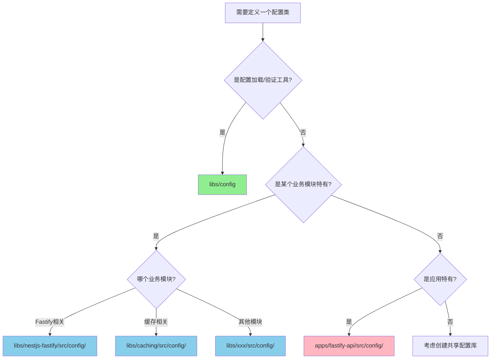

# 配置架构可视化指南

## 🎨 架构全景图

```
┌─────────────────────────────────────────────────────────────────────┐
│                        应用配置层                                     │
│                   apps/fastify-api/src/config/                      │
│                                                                       │
│   ┌──────────────────────────────────────────────────────────────┐ │
│   │  export class AppConfig {                                    │ │
│   │    NODE_ENV: string;                                         │ │
│   │    PORT: number;                                             │ │
│   │    logging: LoggingConfig;         // ← 从 nestjs-fastify   │ │
│   │    caching: CachingModuleConfig;   // ← 从 caching          │ │
│   │    metrics: MetricsModuleConfig;   // ← 从 nestjs-fastify   │ │
│   │  }                                                            │ │
│   └──────────────────────────────────────────────────────────────┘ │
│                               ↑                                       │
│                               │ 导入组合                              │
└───────────────────────────────┼───────────────────────────────────────┘
                                │
┌───────────────────────────────┼───────────────────────────────────────┐
│                               │ 业务库配置层                          │
│   ┌───────────────────────────┴─────────────────────────┐           │
│   │  libs/nestjs-fastify/src/config/                    │           │
│   │    - LoggingConfig                                  │           │
│   │    - MetricsModuleConfig                            │           │
│   │    - RateLimitModuleConfig                          │           │
│   └─────────────────────────────────────────────────────┘           │
│                                                                       │
│   ┌─────────────────────────────────────────────────────┐           │
│   │  libs/caching/src/config/                           │           │
│   │    - RedisConfig                                    │           │
│   │    - CachingModuleConfig                            │           │
│   └─────────────────────────────────────────────────────┘           │
│                               ↑                                       │
│                               │ 使用框架                              │
└───────────────────────────────┼───────────────────────────────────────┘
                                │
┌───────────────────────────────┼───────────────────────────────────────┐
│                               │ 配置框架层                            │
│   ┌───────────────────────────┴─────────────────────────┐           │
│   │  libs/config/                                       │           │
│   │    - TypedConfigModule       (配置模块)            │           │
│   │    - dotenvLoader            (加载器)              │           │
│   │    - fileLoader              (加载器)              │           │
│   │    - ConfigValidator         (验证器)              │           │
│   │                                                      │           │
│   │  不定义具体配置类，只提供工具                       │           │
│   └─────────────────────────────────────────────────────┘           │
└───────────────────────────────────────────────────────────────────────┘
```

---

## 🔄 配置流动过程

```
    .env 文件
       │
       ↓
┌─────────────────┐
│  dotenvLoader   │  ← libs/config 提供
└────────┬────────┘
         │
         ↓
┌─────────────────┐
│ class-transform │  ← libs/config 使用
└────────┬────────┘
         │
         ↓
┌─────────────────┐
│ class-validator │  ← libs/config 使用
└────────┬────────┘
         │
         ↓
    AppConfig 实例
         │
         ├─> logging: LoggingConfig          (from @hl8/nestjs-fastify)
         ├─> caching: CachingModuleConfig    (from @hl8/caching)
         └─> metrics: MetricsModuleConfig    (from @hl8/nestjs-fastify)
         │
         ↓
    注入到服务
```

---

## 📦 模块职责矩阵

| 功能                     | libs/config | libs/nestjs-fastify | libs/caching | apps/fastify-api |
| ------------------------ | ----------- | ------------------- | ------------ | ---------------- |
| 提供配置加载工具         | ✅          | ❌                  | ❌           | ❌               |
| 定义 LoggingConfig       | ❌          | ✅                  | ❌           | ❌               |
| 定义 CachingModuleConfig | ❌          | ❌                  | ✅           | ❌               |
| 定义 AppConfig           | ❌          | ❌                  | ❌           | ✅               |
| 组合使用配置             | ❌          | ❌                  | ❌           | ✅               |

---

## 🎯 配置类定义位置决策图



---

## 🏗️ 从底向上看架构

### 第一层：配置框架 (libs/config)

```
┌─────────────────────────────────────────┐
│          libs/config                    │
│  ┌─────────────────────────────────┐   │
│  │  TypedConfigModule              │   │
│  │    forRoot(options)             │   │
│  │    forRootAsync(options)        │   │
│  └─────────────────────────────────┘   │
│                                          │
│  ┌─────────────────────────────────┐   │
│  │  Loaders                        │   │
│  │    - dotenvLoader()             │   │
│  │    - fileLoader()               │   │
│  │    - remoteLoader()             │   │
│  └─────────────────────────────────┘   │
│                                          │
│  ┌─────────────────────────────────┐   │
│  │  Validators                     │   │
│  │    - ConfigValidator            │   │
│  └─────────────────────────────────┘   │
└─────────────────────────────────────────┘
              提供工具
```

### 第二层：业务库配置 (libs/\*/src/config/)

```
┌───────────────────────┐  ┌───────────────────────┐
│ libs/nestjs-fastify   │  │ libs/caching          │
│   /src/config/        │  │   /src/config/        │
│                       │  │                       │
│ LoggingConfig         │  │ RedisConfig           │
│ MetricsModuleConfig   │  │ CachingModuleConfig   │
│ RateLimitModuleConfig │  │                       │
└───────────────────────┘  └───────────────────────┘
         定义配置类                定义配置类
```

### 第三层：应用配置 (apps/fastify-api/src/config/)

```
┌─────────────────────────────────────────┐
│    apps/fastify-api/src/config/         │
│                                          │
│    AppConfig {                           │
│      logging: LoggingConfig       ←─────┼─ from nestjs-fastify
│      caching: CachingModuleConfig ←─────┼─ from caching
│      metrics: MetricsModuleConfig ←─────┼─ from nestjs-fastify
│    }                                     │
└─────────────────────────────────────────┘
              组合使用
```

---

## 🔀 对比：错误 vs 正确

### ❌ 错误架构（重复定义）

```
libs/caching/src/config/
  └── CachingModuleConfig ✓

apps/fastify-api/src/config/
  └── CachingModuleConfig ✗  ← 重复定义！

问题：
  ├─ 维护两份相同的代码
  ├─ 容易出现不一致
  └─ 违反 DRY 原则
```

### ✅ 正确架构（单一配置源）

```
libs/caching/src/config/
  └── CachingModuleConfig ✓  ← 单一定义

apps/fastify-api/src/config/
  └── import { CachingModuleConfig } ✓  ← 导入使用

优势：
  ├─ 单一真相源
  ├─ 零重复
  └─ 易于维护
```

---

## 📊 配置类生命周期

```
1. 定义阶段
   libs/caching/src/config/caching.config.ts
   ↓
   export class CachingModuleConfig { ... }

2. 导出阶段
   libs/caching/src/index.ts
   ↓
   export { CachingModuleConfig } from './config/...';

3. 导入阶段
   apps/fastify-api/src/config/app.config.ts
   ↓
   import { CachingModuleConfig } from '@hl8/caching';

4. 组合阶段
   export class AppConfig {
     caching: CachingModuleConfig = new CachingModuleConfig();
   }

5. 注册阶段
   app.module.ts
   ↓
   TypedConfigModule.forRoot({ schema: AppConfig })

6. 加载阶段
   .env → dotenvLoader → class-transformer → class-validator

7. 实例化阶段
   验证通过 → 创建 AppConfig 实例

8. 注入阶段
   constructor(private config: AppConfig) {}

9. 使用阶段
   const host = this.config.caching.redis.host;
```

---

## 🎭 角色类比

想象一个建筑项目：

| 角色              | 配置架构中的对应                      | 职责                            |
| ----------------- | ------------------------------------- | ------------------------------- |
| 🏗️ **工具制造商** | `libs/config`                         | 制造电钻、锤子等工具，不建房子  |
| 🏢 **建材供应商** | `libs/nestjs-fastify`, `libs/caching` | 生产标准化的建材（配置类）      |
| 🏠 **建筑公司**   | `apps/fastify-api`                    | 使用建材组装成房子（AppConfig） |

**关键点**：

- 工具制造商不生产建材
- 建筑公司不自己制造建材
- 每个角色做好自己的事

---

## 📝 代码示例对比

### 示例1：定义配置类

```typescript
// ❌ 错误：在 libs/config 中定义业务配置
// libs/config/src/lib/redis.config.ts
export class RedisConfig { ... }  // ❌ 不应该在这里！

// ✅ 正确：在业务库中定义
// libs/caching/src/config/caching.config.ts
export class RedisConfig { ... }  // ✅ 应该在这里！
```

### 示例2：使用配置类

```typescript
// ❌ 错误：在应用中重新定义
// apps/fastify-api/src/config/app.config.ts
export class RedisConfig { ... }  // ❌ 重复定义！
export class AppConfig {
  redis: RedisConfig;
}

// ✅ 正确：导入使用
// apps/fastify-api/src/config/app.config.ts
import { CachingModuleConfig } from '@hl8/caching';
export class AppConfig {
  caching: CachingModuleConfig;  // ✅ 导入使用！
}
```

---

## 🎯 记忆口诀

```
配置框架只提供工具
业务库定义可复用配置
应用层组合不重复定义
单一源头永远记心中
```

---

## 总结图

```
┌──────────────────────────────────────────────────────────┐
│                    配置架构三原则                          │
├──────────────────────────────────────────────────────────┤
│  1. 框架层：提供工具，不定义配置                          │
│  2. 业务层：定义配置，可复用                              │
│  3. 应用层：组合配置，不重复                              │
└──────────────────────────────────────────────────────────┘
```

遵循这三个原则，配置管理就会清晰、简单、易维护！
