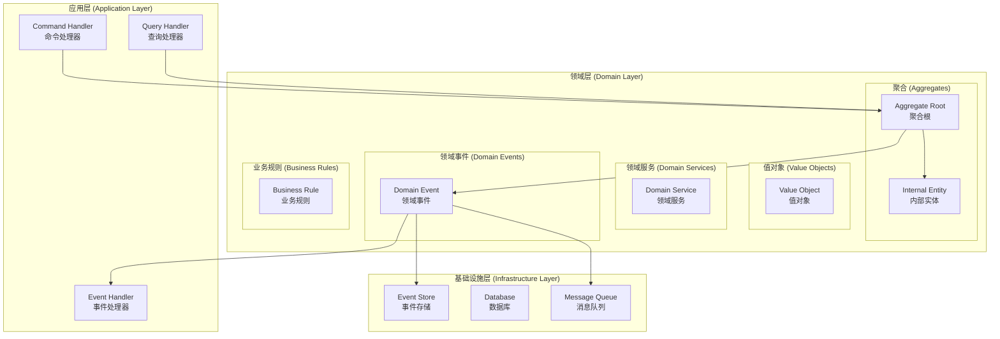
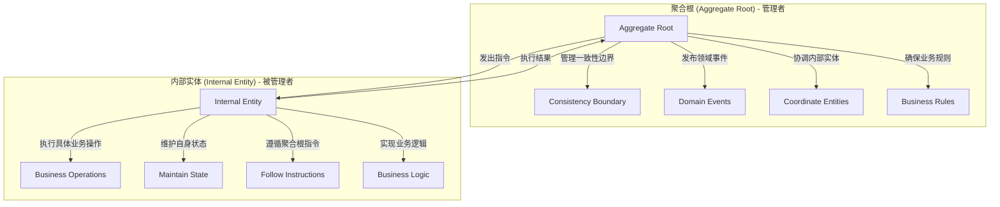
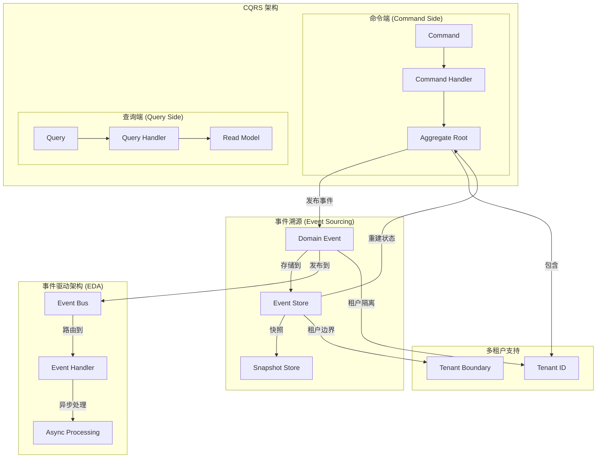
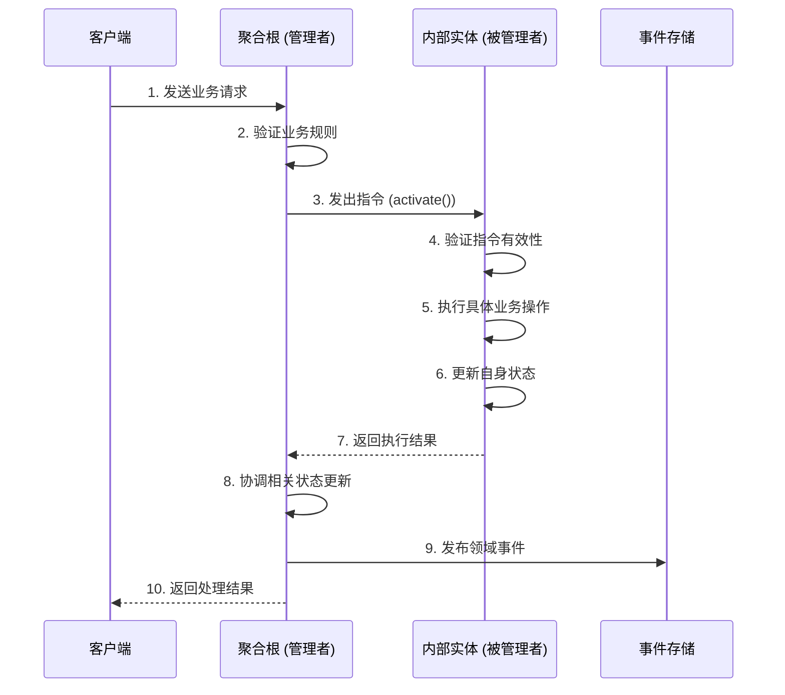
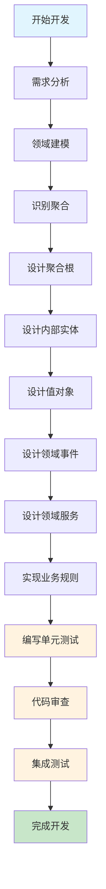

# 领域层开发指南

> **版本**: 1.0.0 | **创建日期**: 2025-01-27 | **模块**: packages/hybrid-archi

---

## 📋 目录

- [1. 领域层概述](#1-领域层概述)
- [2. 核心设计原则](#2-核心设计原则)
- [3. 实体与聚合根分离](#3-实体与聚合根分离)
- [4. 指令模式实现](#4-指令模式实现)
- [5. 开发实践](#5-开发实践)
- [6. 最佳实践](#6-最佳实践)
- [7. 常见问题](#7-常见问题)

---

## 1. 领域层概述

### 1.1 领域层定位

领域层是 Hybrid Architecture 的核心，包含业务逻辑和业务规则。领域层应该：

- **无外部依赖**: 不依赖任何外部框架或库
- **业务逻辑集中**: 所有业务逻辑都在领域层
- **规则清晰**: 业务规则明确且易于理解
- **可测试**: 可以独立进行单元测试

### 1.2 领域层组件

```
领域层 (Domain Layer)
├── 实体 (Entities)
│   ├── 聚合根 (Aggregate Roots)
│   └── 内部实体 (Internal Entities)
├── 值对象 (Value Objects)
├── 领域服务 (Domain Services)
├── 领域事件 (Domain Events)
└── 业务规则 (Business Rules)
```

### 1.3 CQRS + ES + EDA 架构对领域层的要求

为了满足 CQRS + ES + EDA 的架构要求，领域层必须提供以下核心功能：

#### 1.3.1 事件溯源支持

**聚合根必须支持事件溯源**:

- **事件发布**: 聚合根必须能够发布领域事件
- **状态重建**: 聚合根必须能够从事件流重建状态
- **事件版本**: 支持事件的版本管理和迁移
- **快照支持**: 支持聚合状态的快照机制

#### 1.3.2 事件驱动支持

**领域事件设计**:

- **事件定义**: 明确定义所有领域事件
- **事件数据**: 事件包含足够的数据用于重建状态
- **事件版本**: 支持事件版本演进
- **事件路由**: 支持事件的路由和分发

#### 1.3.3 多租户支持

**租户隔离**:

- **租户标识**: 聚合根必须包含租户标识
- **租户边界**: 确保租户数据的边界清晰
- **租户事件**: 支持租户特定的事件处理
- **跨租户隔离**: 防止跨租户的数据泄露

#### 1.3.4 业务规则集中

**规则管理**:

- **规则定义**: 业务规则在领域层明确定义
- **规则验证**: 聚合根负责业务规则验证
- **规则一致性**: 确保业务规则的一致性
- **规则演进**: 支持业务规则的演进

### 1.4 设计目标

- **业务逻辑集中**: 所有业务逻辑在领域层统一管理
- **规则清晰**: 业务规则明确且易于理解
- **职责分离**: 聚合根和实体职责明确分离
- **可维护性**: 代码结构清晰，易于维护
- **可测试性**: 每个组件都可以独立测试

---

## 2. 领域层架构图示

### 2.1 领域层整体架构



### 2.2 实体与聚合根分离架构



### 2.3 CQRS + ES + EDA 架构中的领域层



### 2.4 指令模式流程图



---

## 3. 领域层开发流程

### 3.1 开发流程概览



### 3.2 详细开发步骤

#### 3.2.1 需求分析阶段

**目标**: 深入理解业务需求，识别核心业务概念

**活动**:

1. **业务需求收集**
   - 与业务专家访谈
   - 收集业务规则和约束
   - 识别业务流程和用例

2. **领域概念识别**
   - 识别核心业务实体
   - 识别业务值对象
   - 识别业务服务

3. **业务规则梳理**
   - 整理业务规则列表
   - 识别规则优先级
   - 分析规则冲突

**输出**:

- 业务需求文档
- 领域概念清单
- 业务规则列表

#### 3.2.2 领域建模阶段

**目标**: 建立清晰的领域模型，识别聚合边界

**活动**:

1. **领域模型设计**

   ```typescript
   // 示例：用户管理领域模型
   export interface UserDomainModel {
     // 聚合根
     userAggregate: UserAggregate;
     
     // 内部实体
     user: User;
     userProfile: UserProfile;
     userPermission: UserPermission[];
     
     // 值对象
     email: Email;
     username: Username;
     password: Password;
     
     // 领域事件
     userCreated: UserCreatedEvent;
     userActivated: UserActivatedEvent;
     userPermissionAssigned: UserPermissionAssignedEvent;
   }
   ```

2. **聚合边界识别**
   - 识别聚合根
   - 确定聚合边界
   - 分析聚合间关系

3. **业务规则建模**
   - 将业务规则转化为代码
   - 设计规则验证机制
   - 处理规则冲突

**输出**:

- 领域模型图
- 聚合边界定义
- 业务规则模型

#### 3.2.3 聚合设计阶段

**目标**: 设计聚合根和内部实体，实现实体与聚合根分离

**活动**:

1. **聚合根设计**

   ```typescript
   // 聚合根设计模板
   export class UserAggregate extends BaseAggregateRoot {
     // 内部实体
     private _user: User;
     private _profile: UserProfile;
     private _permissions: UserPermission[];
     
     // 构造函数
     constructor(id: EntityId) {
       super(id);
     }
     
     // 业务方法 - 协调内部实体
     public createUser(email: Email, username: Username, profile: UserProfile): void {
       // 1. 创建内部实体
       this._user = User.create(EntityId.generate(), email, username, UserStatus.Pending);
       this._profile = profile;
       this._permissions = [];
       
       // 2. 验证业务规则
       this.validateUserCreation();
       
       // 3. 发布领域事件
       this.addDomainEvent(new UserCreatedEvent(this._id, email, username));
     }
     
     // 私有方法 - 验证业务规则
     private validateUserCreation(): void {
       if (!this._user || !this._profile) {
         throw new InvalidUserCreationException('用户和资料必须同时创建');
       }
     }
   }
   ```

2. **内部实体设计**

   ```typescript
   // 内部实体设计模板
   export class User extends BaseEntity {
     private _email: Email;
     private _username: Username;
     private _status: UserStatus;
     private _profile: UserProfile;
     private _activatedAt?: Date;
     
     // 构造函数
     private constructor(
       id: EntityId,
       email: Email,
       username: Username,
       status: UserStatus
     ) {
       super(id);
       this._email = email;
       this._username = username;
       this._status = status;
     }
     
     // 业务方法 - 激活用户
     public activate(): void {
       // 验证业务规则
       if (this._status !== UserStatus.Pending) {
         throw new UserNotPendingException('只有待激活状态的用户才能激活');
       }
       
       // 执行业务逻辑
       this._status = UserStatus.Active;
       this._activatedAt = new Date();
       this.updateTimestamp();
     }
     
     // 静态工厂方法
     public static create(
       id: EntityId,
       email: Email,
       username: Username,
       status: UserStatus = UserStatus.Pending
     ): User {
       return new User(id, email, username, status);
     }
   }
   ```

3. **指令模式实现**
   - 设计聚合根指令接口
   - 实现实体指令执行
   - 建立指令响应机制

**输出**:

- 聚合根实现
- 内部实体实现
- 指令模式实现

#### 3.2.4 值对象设计阶段

**目标**: 设计不可变的值对象，封装业务概念

**活动**:

1. **值对象识别**
   - 识别业务中的值概念
   - 确定值对象的边界
   - 分析值对象的生命周期

2. **值对象实现**

   ```typescript
   // 值对象实现模板
   export class Email extends BaseValueObject {
     private constructor(private readonly value: string) {
       super();
       this.validate();
     }
     
     // 验证逻辑
     private validate(): void {
       if (!this.value || this.value.trim().length === 0) {
         throw new InvalidEmailException('邮箱不能为空');
       }
       
       const emailRegex = /^[^\s@]+@[^\s@]+\.[^\s@]+$/;
       if (!emailRegex.test(this.value)) {
         throw new InvalidEmailException('邮箱格式不正确');
       }
     }
     
     // 业务方法
     public getValue(): string {
       return this.value;
     }
     
     public getDomain(): string {
       return this.value.split('@')[1];
     }
     
     // 相等性比较
     protected arePropertiesEqual(other: Email): boolean {
       return this.value.toLowerCase() === other.value.toLowerCase();
     }
     
     // 静态工厂方法
     public static create(value: string): Email {
       return new Email(value);
     }
   }
   ```

3. **值对象测试**
   - 编写值对象单元测试
   - 验证不可变性
   - 测试相等性逻辑

**输出**:

- 值对象实现
- 值对象测试用例
- 值对象文档

#### 3.2.5 领域事件设计阶段

**目标**: 设计领域事件，支持事件驱动架构

**活动**:

1. **领域事件识别**
   - 识别重要的业务变化
   - 确定事件的数据结构
   - 分析事件的生命周期

2. **领域事件实现**

   ```typescript
   // 领域事件实现模板
   export class UserCreatedEvent extends BaseDomainEvent {
     constructor(
       public readonly userId: EntityId,
       public readonly email: Email,
       public readonly username: Username,
       public readonly tenantId: EntityId,
       public readonly timestamp: Date = new Date()
     ) {
       super();
     }
   }
   
   export class UserActivatedEvent extends BaseDomainEvent {
     constructor(
       public readonly userId: EntityId,
       public readonly tenantId: EntityId,
       public readonly activatedAt: Date = new Date()
     ) {
       super();
     }
   }
   ```

3. **事件发布机制**
   - 在聚合根中发布事件
   - 设计事件路由机制
   - 实现事件版本管理

**输出**:

- 领域事件定义
- 事件发布机制
- 事件版本管理

#### 3.2.6 领域服务设计阶段

**目标**: 设计领域服务，处理跨聚合的业务逻辑

**活动**:

1. **领域服务识别**
   - 识别跨聚合的业务逻辑
   - 确定服务的职责边界
   - 分析服务的依赖关系

2. **领域服务实现**

   ```typescript
   // 领域服务实现模板
   export class UserDomainService {
     constructor(
       private readonly userRepository: IUserRepository,
       private readonly emailService: IEmailService
     ) {}
     
     // 跨聚合业务逻辑
     public async validateUserUniqueness(
       email: Email, 
       tenantId: EntityId
     ): Promise<boolean> {
       const existingUser = await this.userRepository.findByEmailAndTenant(email, tenantId);
       return existingUser === null;
     }
     
     // 复杂业务逻辑
     public async sendWelcomeEmail(user: User): Promise<void> {
       if (user.getStatus() !== UserStatus.Active) {
         throw new UserNotActiveException('只有活跃用户才能发送欢迎邮件');
       }
       
       await this.emailService.sendWelcomeEmail(user.getEmail());
     }
   }
   ```

3. **服务依赖管理**
   - 设计服务接口
   - 实现依赖注入
   - 管理服务生命周期

**输出**:

- 领域服务实现
- 服务接口定义
- 依赖管理机制

#### 3.2.7 业务规则实现阶段

**目标**: 实现业务规则，确保业务逻辑的正确性

**活动**:

1. **业务规则实现**

   ```typescript
   // 业务规则实现模板
   export class UserBusinessRules {
     // 约束规则
     static readonly EMAIL_MUST_BE_UNIQUE = "用户邮箱在租户内必须唯一";
     static readonly PASSWORD_MUST_BE_SECURE = "用户密码必须包含大小写字母、数字和特殊字符";
     
     // 计算规则
     static readonly AGE_CALCULATION = "用户年龄 = 当前日期 - 出生日期";
     
     // 验证规则
     static readonly STATUS_TRANSITION = "用户只能从待激活状态转换到激活状态";
     
     // 授权规则
     static readonly PERMISSION_INHERITANCE = "部门管理员继承组织管理员的权限";
   }
   
   // 业务规则验证器
   export class UserRuleValidator {
     public static validateEmailUniqueness(email: Email, tenantId: EntityId): boolean {
       // 实现邮箱唯一性验证
       return true;
     }
     
     public static validatePasswordSecurity(password: Password): boolean {
       // 实现密码安全性验证
       return true;
     }
     
     public static validateStatusTransition(currentStatus: UserStatus, newStatus: UserStatus): boolean {
       // 实现状态转换验证
       return true;
     }
   }
   ```

2. **规则测试**
   - 编写规则单元测试
   - 验证规则正确性
   - 测试规则冲突处理

**输出**:

- 业务规则实现
- 规则验证器
- 规则测试用例

#### 3.2.8 单元测试阶段

**目标**: 编写全面的单元测试，确保代码质量

**活动**:

1. **聚合根测试**

   ```typescript
   // 聚合根测试模板
   describe('UserAggregate', () => {
     let userAggregate: UserAggregate;
     let email: Email;
     let username: Username;
     let profile: UserProfile;
     
     beforeEach(() => {
       userAggregate = new UserAggregate(EntityId.generate());
       email = Email.create('test@example.com');
       username = Username.create('testuser');
       profile = UserProfile.create({ firstName: 'Test', lastName: 'User' });
     });
     
     it('should create user with valid data', () => {
       userAggregate.createUser(email, username, profile);
       
       expect(userAggregate.getUncommittedEvents()).toHaveLength(1);
       expect(userAggregate.getUncommittedEvents()[0]).toBeInstanceOf(UserCreatedEvent);
     });
     
     it('should activate user successfully', () => {
       userAggregate.createUser(email, username, profile);
       userAggregate.activateUser();
       
       expect(userAggregate.getUncommittedEvents()).toHaveLength(2);
       expect(userAggregate.getUncommittedEvents()[1]).toBeInstanceOf(UserActivatedEvent);
     });
   });
   ```

2. **实体测试**

   ```typescript
   // 实体测试模板
   describe('User', () => {
     let user: User;
     let email: Email;
     let username: Username;
     
     beforeEach(() => {
       email = Email.create('test@example.com');
       username = Username.create('testuser');
       user = User.create(EntityId.generate(), email, username, UserStatus.Pending);
     });
     
     it('should activate user when status is pending', () => {
       user.activate();
       
       expect(user.getStatus()).toBe(UserStatus.Active);
       expect(user.getActivatedAt()).toBeDefined();
     });
     
     it('should throw exception when activating non-pending user', () => {
       user.activate(); // 第一次激活
       
       expect(() => user.activate()).toThrow(UserNotPendingException);
     });
   });
   ```

3. **值对象测试**

   ```typescript
   // 值对象测试模板
   describe('Email', () => {
     it('should create valid email', () => {
       const email = Email.create('test@example.com');
       
       expect(email.getValue()).toBe('test@example.com');
       expect(email.getDomain()).toBe('example.com');
     });
     
     it('should throw exception for invalid email', () => {
       expect(() => Email.create('invalid-email')).toThrow(InvalidEmailException);
     });
     
     it('should be equal when values are same', () => {
       const email1 = Email.create('test@example.com');
       const email2 = Email.create('TEST@EXAMPLE.COM');
       
       expect(email1.equals(email2)).toBe(true);
     });
   });
   ```

**输出**:

- 聚合根测试用例
- 实体测试用例
- 值对象测试用例
- 领域服务测试用例

#### 3.2.9 代码审查阶段

**目标**: 通过代码审查确保代码质量和一致性

**活动**:

1. **代码质量检查**
   - 检查代码规范性
   - 验证设计模式应用
   - 确保业务逻辑正确性

2. **架构一致性检查**
   - 验证聚合边界
   - 检查依赖关系
   - 确保事件设计合理

3. **性能和安全检查**
   - 检查性能瓶颈
   - 验证安全措施
   - 确保资源管理

**输出**:

- 代码审查报告
- 改进建议
- 质量评估

#### 3.2.10 集成测试阶段

**目标**: 验证领域层与其他层的集成

**活动**:

1. **应用层集成测试**
   - 测试命令处理器集成
   - 验证查询处理器集成
   - 检查事件处理器集成

2. **基础设施层集成测试**
   - 测试事件存储集成
   - 验证数据库集成
   - 检查消息队列集成

3. **端到端测试**
   - 测试完整业务流程
   - 验证多租户支持
   - 检查性能表现

**输出**:

- 集成测试报告
- 性能测试报告
- 问题修复记录

### 3.3 开发流程检查清单

#### 3.3.1 需求分析检查清单

- [ ] 业务需求收集完整
- [ ] 领域概念识别清晰
- [ ] 业务规则梳理完整
- [ ] 需求文档编写完成

#### 3.3.2 领域建模检查清单

- [ ] 领域模型设计合理
- [ ] 聚合边界识别正确
- [ ] 业务规则建模完整
- [ ] 模型文档编写完成

#### 3.3.3 聚合设计检查清单

- [ ] 聚合根设计符合规范
- [ ] 内部实体设计合理
- [ ] 指令模式实现正确
- [ ] 职责分离清晰

#### 3.3.4 值对象设计检查清单

- [ ] 值对象识别准确
- [ ] 不可变性实现正确
- [ ] 相等性逻辑正确
- [ ] 验证逻辑完整

#### 3.3.5 领域事件设计检查清单

- [ ] 领域事件识别完整
- [ ] 事件数据结构合理
- [ ] 事件发布机制正确
- [ ] 事件版本管理完善

#### 3.3.6 领域服务设计检查清单

- [ ] 领域服务识别准确
- [ ] 服务职责边界清晰
- [ ] 依赖管理合理
- [ ] 服务接口设计完善

#### 3.3.7 业务规则实现检查清单

- [ ] 业务规则实现完整
- [ ] 规则验证器正确
- [ ] 规则测试覆盖全面
- [ ] 规则文档编写完成

#### 3.3.8 单元测试检查清单

- [ ] 聚合根测试覆盖全面
- [ ] 实体测试覆盖全面
- [ ] 值对象测试覆盖全面
- [ ] 领域服务测试覆盖全面
- [ ] 测试用例质量高

#### 3.3.9 代码审查检查清单

- [ ] 代码规范性检查通过
- [ ] 设计模式应用正确
- [ ] 业务逻辑正确性验证
- [ ] 架构一致性检查通过
- [ ] 性能和安全检查通过

#### 3.3.10 集成测试检查清单

- [ ] 应用层集成测试通过
- [ ] 基础设施层集成测试通过
- [ ] 端到端测试通过
- [ ] 性能测试通过
- [ ] 多租户支持验证通过

---

## 4. 核心设计原则

### 4.1 充血模型原则

**✅ 正确做法**:

```typescript
// 实体包含业务逻辑
export class User extends BaseEntity {
  public activate(): void {
    if (this.status !== UserStatus.Pending) {
      throw new UserNotPendingException('只有待激活状态的用户才能激活');
    }
    
    this.status = UserStatus.Active;
    this.activatedAt = new Date();
    this.updateTimestamp();
  }
}
```

**❌ 错误做法**:

```typescript
// ❌ 贫血模型 - 只有getter/setter
export class User {
  private _status: UserStatus;
  
  setStatus(status: UserStatus): void {
    this._status = status;
  }
  
  getStatus(): UserStatus {
    return this._status;
  }
}
```

### 4.2 聚合设计原则

**聚合边界**:

- 聚合根管理聚合内所有对象的一致性
- 聚合是事务的基本单位
- 聚合内对象通过聚合根访问

**一致性边界**:

- 聚合内数据必须保持一致
- 聚合间通过领域事件通信
- 避免跨聚合的直接引用

### 4.3 值对象原则

**不可变性**:

```typescript
export class Email extends BaseValueObject {
  private constructor(private readonly value: string) {
    super();
    this.validate();
  }

  // 值对象创建后不能修改
  public getValue(): string {
    return this.value;
  }
}
```

**相等性**:

```typescript
export class Money extends BaseValueObject {
  protected arePropertiesEqual(other: Money): boolean {
    return this.amount === other.amount && 
           this.currency === other.currency;
  }
}
```

---

## 3. 实体与聚合根分离

### 3.1 设计原则

#### 3.1.1 管理者模式 (Manager Pattern)

**聚合根作为管理者**:

- 管理聚合一致性边界
- 协调内部实体操作
- 发布领域事件
- 验证业务规则

**内部实体作为被管理者**:

- 执行具体业务操作
- 维护自身状态
- 遵循聚合根指令
- 实现业务逻辑

#### 3.1.2 职责分离

```typescript
// 聚合根 - 管理者职责
export class UserAggregate extends BaseAggregateRoot {
  // 管理者职责：协调用户创建
  public createUser(email: Email, username: Username, profile: UserProfile): void {
    // 1. 创建内部实体
    this._user = User.create(EntityId.generate(), email, username, UserStatus.Pending);
    this._profile = profile;
    this._permissions = [];

    // 2. 验证业务规则
    this.validateUserCreation();

    // 3. 发布领域事件
    this.addDomainEvent(new UserCreatedEvent(this._id, email, username));
  }

  // 管理者职责：协调用户激活
  public activateUser(): void {
    // 1. 委托给内部实体执行
    this._user.activate();
    
    // 2. 更新相关状态
    this._profile.setStatus(UserProfileStatus.Active);
    
    // 3. 发布领域事件
    this.addDomainEvent(new UserActivatedEvent(this._id));
  }
}

// 内部实体 - 被管理者职责
export class User extends BaseEntity {
  // 被管理者职责：执行具体业务操作
  public activate(): void {
    if (this.status !== UserStatus.Pending) {
      throw new UserNotPendingException('只有待激活状态的用户才能激活');
    }
    
    this.status = UserStatus.Active;
    this.activatedAt = new Date();
    this.updateTimestamp();
  }

  // 被管理者职责：维护自身状态
  public updateProfile(profile: UserProfile): void {
    if (!profile.getFirstName() || !profile.getLastName()) {
      throw new InvalidProfileException('用户资料必须包含姓名');
    }
    
    this._profile = profile;
    this.updateTimestamp();
  }
}
```

### 3.2 核心关系

#### 3.2.1 管理关系

```
聚合根 (Aggregate Root) - 管理者
├── 管理一致性边界
├── 发布领域事件
├── 协调内部实体
└── 确保业务规则

内部实体 (Internal Entity) - 被管理者
├── 执行具体业务操作
├── 维护自身状态
├── 遵循聚合根指令
└── 实现业务逻辑
```

#### 3.2.2 通信模式

```typescript
// 聚合根 → 实体：指令模式
export class UserAggregate extends BaseAggregateRoot {
  public updateUserProfile(newProfile: UserProfile): void {
    // 指令：请更新用户资料
    this._user.updateProfile(newProfile);
    
    // 指令：请验证资料完整性
    this._profile.validate();
    
    // 指令：请更新时间戳
    this._user.updateTimestamp();
  }
}

// 实体 → 聚合根：状态报告
export class User extends BaseEntity {
  public updateProfile(profile: UserProfile): void {
    // 执行聚合根指令
    this._profile = profile;
    this.updateTimestamp();
    
    // 状态报告：资料已更新
    // (通过方法返回值或异常报告状态)
  }
}
```

---

## 4. 指令模式实现

### 4.1 指令模式概述

**指令模式 (Command Pattern)** 是实体与聚合根分离的核心实现机制：

```
聚合根发出指令 → 实体执行指令 → 返回执行结果
```

### 4.2 指令类型

#### 4.2.1 方法调用指令

```typescript
// 聚合根发出方法调用指令
export class OrderAggregate extends BaseAggregateRoot {
  public processPayment(paymentData: PaymentData): void {
    // 指令1：请处理支付
    this._payment.processPayment(paymentData);
    
    // 指令2：请标记订单为已支付
    this._order.markAsPaid();
    
    // 指令3：请更新订单项状态
    this._orderItems.forEach(item => item.markAsPaid());
  }
}

// 实体执行方法调用指令
export class Payment extends BaseEntity {
  public processPayment(paymentData: PaymentData): void {
    // 执行聚合根的"处理支付"指令
    this.validatePaymentData(paymentData);
    this.amount = paymentData.amount;
    this.paymentMethod = paymentData.method;
    this.status = PaymentStatus.Processing;
    this.processedAt = new Date();
    this.updateTimestamp();
  }
}
```

#### 4.2.2 状态变更指令

```typescript
// 聚合根发出状态变更指令
export class UserAggregate extends BaseAggregateRoot {
  public activateUser(): void {
    // 指令：请激活用户
    this._user.activate();
    
    // 指令：请更新资料状态
    this._profile.setStatus(UserProfileStatus.Active);
    
    // 指令：请激活所有权限
    this._permissions.forEach(permission => permission.activate());
  }
}

// 实体执行状态变更指令
export class User extends BaseEntity {
  public activate(): void {
    // 执行聚合根的"激活用户"指令
    if (this.status !== UserStatus.Pending) {
      throw new UserNotPendingException('只有待激活状态的用户才能激活');
    }
    
    this.status = UserStatus.Active;
    this.activatedAt = new Date();
    this.updateTimestamp();
  }
}
```

#### 4.2.3 业务规则验证指令

```typescript
// 聚合根发出验证指令
export class UserAggregate extends BaseAggregateRoot {
  public assignPermission(permission: Permission): void {
    // 指令：请验证用户状态
    this._user.validateActiveStatus();
    
    // 指令：请检查权限是否已存在
    this._permissions.forEach(p => p.validateNotDuplicate(permission));
    
    // 指令：请添加新权限
    this._permissions.push(UserPermission.create(permission));
    
    // 发布事件
    this.addDomainEvent(new UserPermissionAssignedEvent(this._id, permission));
  }
}

// 实体执行验证指令
export class User extends BaseEntity {
  public validateActiveStatus(): void {
    // 执行聚合根的"验证用户状态"指令
    if (this.status !== UserStatus.Active) {
      throw new UserNotActiveException('只有活跃用户才能分配权限');
    }
  }
}
```

### 4.3 指令执行流程

#### 4.3.1 指令接收

```typescript
// 实体接收聚合根的指令
export class User extends BaseEntity {
  // 接收指令：激活用户
  public activate(): void {
    // 1. 接收聚合根的指令
    // 2. 验证指令的有效性
    // 3. 执行指令要求的具体操作
    // 4. 更新自身状态
    // 5. 返回执行结果
  }
}
```

#### 4.3.2 指令验证

```typescript
// 实体在执行指令前进行验证
export class Order extends BaseEntity {
  public markAsPaid(): void {
    // 验证指令的有效性
    if (this.status !== OrderStatus.Pending) {
      throw new OrderNotPendingException('只有待支付状态的订单才能标记为已支付');
    }
    
    // 执行指令
    this.status = OrderStatus.Paid;
    this.paidAt = new Date();
    this.updateTimestamp();
  }
}
```

#### 4.3.3 指令执行

```typescript
// 实体执行聚合根的指令
export class Payment extends BaseEntity {
  public processPayment(paymentData: PaymentData): void {
    // 1. 验证支付数据
    this.validatePaymentData(paymentData);
    
    // 2. 处理支付逻辑
    this.amount = paymentData.amount;
    this.paymentMethod = paymentData.method;
    this.status = PaymentStatus.Processing;
    
    // 3. 更新状态
    this.processedAt = new Date();
    this.updateTimestamp();
  }
}
```

### 4.4 指令的层次结构

#### 4.4.1 高层指令

```typescript
// 聚合根发出高层业务指令
export class UserAggregate extends BaseAggregateRoot {
  public createUser(userData: CreateUserData): void {
    // 高层指令：创建用户
    this._user = User.create(userData);
    
    // 高层指令：创建用户资料
    this._profile = UserProfile.create(userData.profile);
    
    // 高层指令：初始化权限
    this._permissions = [];
  }
}
```

#### 4.4.2 中层指令

```typescript
// 聚合根发出中层协调指令
export class UserAggregate extends BaseAggregateRoot {
  public activateUser(): void {
    // 中层指令：协调用户激活
    this._user.activate();
    this._profile.setStatus(UserProfileStatus.Active);
    this._permissions.forEach(p => p.activate());
  }
}
```

#### 4.4.3 底层指令

```typescript
// 实体执行底层具体指令
export class User extends BaseEntity {
  public activate(): void {
    // 底层指令：执行具体的激活逻辑
    if (this.status !== UserStatus.Pending) {
      throw new UserNotPendingException();
    }
    
    this.status = UserStatus.Active;
    this.activatedAt = new Date();
    this.updateTimestamp();
  }
}
```

### 4.5 指令的响应机制

#### 4.5.1 同步响应

```typescript
// 实体同步响应聚合根指令
export class User extends BaseEntity {
  public updateProfile(profile: UserProfile): boolean {
    // 同步执行指令
    this._profile = profile;
    this.updateTimestamp();
    
    // 同步返回结果
    return true;
  }
}
```

#### 4.5.2 异步响应

```typescript
// 实体异步响应聚合根指令
export class User extends BaseEntity {
  public async sendWelcomeEmail(): Promise<void> {
    // 异步执行指令
    await this.emailService.sendWelcomeEmail(this.email);
    
    // 异步更新状态
    this.welcomeEmailSent = true;
    this.updateTimestamp();
  }
}
```

#### 4.5.3 异常响应

```typescript
// 实体通过异常响应聚合根指令
export class User extends BaseEntity {
  public activate(): void {
    // 验证指令有效性
    if (this.status !== UserStatus.Pending) {
      // 通过异常响应指令无效
      throw new UserNotPendingException('只有待激活状态的用户才能激活');
    }
    
    // 执行指令
    this.status = UserStatus.Active;
    this.updateTimestamp();
  }
}
```

---

## 5. 开发实践

### 5.1 聚合根开发

#### 5.1.1 聚合根设计

```typescript
// 聚合根设计模板
export class UserAggregate extends BaseAggregateRoot {
  // 内部实体
  private _user: User;
  private _profile: UserProfile;
  private _permissions: UserPermission[];

  // 构造函数
  constructor(id: EntityId) {
    super(id);
  }

  // 业务方法 - 协调内部实体
  public createUser(email: Email, username: Username, profile: UserProfile): void {
    // 1. 创建内部实体
    this._user = User.create(EntityId.generate(), email, username, UserStatus.Pending);
    this._profile = profile;
    this._permissions = [];

    // 2. 验证业务规则
    this.validateUserCreation();

    // 3. 发布领域事件
    this.addDomainEvent(new UserCreatedEvent(this._id, email, username));
  }

  // 业务方法 - 协调用户激活
  public activateUser(): void {
    // 1. 委托给内部实体执行
    this._user.activate();
    
    // 2. 更新相关状态
    this._profile.setStatus(UserProfileStatus.Active);
    
    // 3. 发布领域事件
    this.addDomainEvent(new UserActivatedEvent(this._id));
  }

  // 私有方法 - 验证业务规则
  private validateUserCreation(): void {
    if (!this._user || !this._profile) {
      throw new InvalidUserCreationException('用户和资料必须同时创建');
    }
  }
}
```

#### 5.1.2 聚合根职责

**✅ 聚合根应该做的**:

- 管理聚合一致性边界
- 协调内部实体操作
- 发布领域事件
- 验证业务规则
- 处理跨实体的业务逻辑

**❌ 聚合根不应该做的**:

- 包含具体的业务逻辑实现
- 直接操作数据库
- 处理外部服务调用
- 包含技术实现细节

### 5.2 实体开发

#### 5.2.1 实体设计

```typescript
// 实体设计模板
export class User extends BaseEntity {
  private _email: Email;
  private _username: Username;
  private _status: UserStatus;
  private _profile: UserProfile;
  private _activatedAt?: Date;

  // 构造函数
  private constructor(
    id: EntityId,
    email: Email,
    username: Username,
    status: UserStatus
  ) {
    super(id);
    this._email = email;
    this._username = username;
    this._status = status;
  }

  // 业务方法 - 激活用户
  public activate(): void {
    // 验证业务规则
    if (this._status !== UserStatus.Pending) {
      throw new UserNotPendingException('只有待激活状态的用户才能激活');
    }
    
    // 执行业务逻辑
    this._status = UserStatus.Active;
    this._activatedAt = new Date();
    this.updateTimestamp();
  }

  // 业务方法 - 更新资料
  public updateProfile(profile: UserProfile): void {
    // 验证业务规则
    if (!profile.getFirstName() || !profile.getLastName()) {
      throw new InvalidProfileException('用户资料必须包含姓名');
    }
    
    // 执行业务逻辑
    this._profile = profile;
    this.updateTimestamp();
  }

  // 静态工厂方法
  public static create(
    id: EntityId,
    email: Email,
    username: Username,
    status: UserStatus = UserStatus.Pending
  ): User {
    return new User(id, email, username, status);
  }
}
```

#### 5.2.2 实体职责

**✅ 实体应该做的**:

- 执行具体业务操作
- 维护自身状态
- 实现业务逻辑
- 验证业务规则
- 遵循聚合根指令

**❌ 实体不应该做的**:

- 发布领域事件
- 管理聚合一致性
- 处理跨实体的业务逻辑
- 直接访问外部服务

### 5.3 值对象开发

#### 5.3.1 值对象设计

```typescript
// 值对象设计模板
export class Email extends BaseValueObject {
  private constructor(private readonly value: string) {
    super();
    this.validate();
  }

  // 验证逻辑
  private validate(): void {
    if (!this.value || this.value.trim().length === 0) {
      throw new InvalidEmailException('邮箱不能为空');
    }

    const emailRegex = /^[^\s@]+@[^\s@]+\.[^\s@]+$/;
    if (!emailRegex.test(this.value)) {
      throw new InvalidEmailException('邮箱格式不正确');
    }
  }

  // 业务方法
  public getValue(): string {
    return this.value;
  }

  public getDomain(): string {
    return this.value.split('@')[1];
  }

  public getLocalPart(): string {
    return this.value.split('@')[0];
  }

  // 相等性比较
  protected arePropertiesEqual(other: Email): boolean {
    return this.value.toLowerCase() === other.value.toLowerCase();
  }

  // 静态工厂方法
  public static create(value: string): Email {
    return new Email(value);
  }
}
```

#### 5.3.2 值对象特点

**不可变性**:

- 值对象创建后不能修改
- 所有属性都是只读的
- 状态变更通过创建新实例实现

**相等性**:

- 基于属性值比较相等性
- 实现 `arePropertiesEqual` 方法
- 不依赖标识符

### 5.4 领域事件开发

#### 5.4.1 领域事件设计

```typescript
// 领域事件设计模板
export class UserCreatedEvent extends BaseDomainEvent {
  constructor(
    public readonly userId: EntityId,
    public readonly email: Email,
    public readonly username: Username,
    public readonly timestamp: Date = new Date()
  ) {
    super();
  }
}

export class UserActivatedEvent extends BaseDomainEvent {
  constructor(
    public readonly userId: EntityId,
    public readonly activatedAt: Date = new Date()
  ) {
    super();
  }
}
```

#### 5.4.2 事件发布

```typescript
// 聚合根发布事件
export class UserAggregate extends BaseAggregateRoot {
  public createUser(email: Email, username: Username): void {
    // 业务逻辑
    this._user = User.create(EntityId.generate(), email, username);
    
    // 发布事件
    this.addDomainEvent(new UserCreatedEvent(this._id, email, username));
  }
}
```

---

## 6. 最佳实践

### 6.1 聚合根最佳实践

#### 6.1.1 职责清晰

```typescript
// ✅ 正确：聚合根专注于管理职责
export class UserAggregate extends BaseAggregateRoot {
  public activateUser(): void {
    // 1. 委托给内部实体执行
    this._user.activate();
    
    // 2. 协调相关状态更新
    this._profile.setStatus(UserProfileStatus.Active);
    
    // 3. 发布领域事件
    this.addDomainEvent(new UserActivatedEvent(this._id));
  }
}
```

```typescript
// ❌ 错误：聚合根包含具体业务逻辑
export class UserAggregate extends BaseAggregateRoot {
  public activateUser(): void {
    // ❌ 具体业务逻辑应该在实体中
    if (this._user.getStatus() !== UserStatus.Pending) {
      throw new UserNotPendingException();
    }
    this._user.setStatus(UserStatus.Active);
    this._user.setActivatedAt(new Date());
  }
}
```

#### 6.1.2 事件管理

```typescript
// ✅ 正确：聚合根负责事件管理
export class UserAggregate extends BaseAggregateRoot {
  public createUser(email: Email, username: Username): void {
    this._user = User.create(EntityId.generate(), email, username);
    
    // 聚合根发布事件
    this.addDomainEvent(new UserCreatedEvent(this._id, email, username));
  }
}
```

```typescript
// ❌ 错误：实体不应该发布事件
export class User extends BaseEntity {
  public activate(): void {
    this.status = UserStatus.Active;
    // ❌ 实体不应该发布事件
    this.addDomainEvent(new UserActivatedEvent(this.id));
  }
}
```

### 6.2 实体最佳实践

#### 6.2.1 业务逻辑集中

```typescript
// ✅ 正确：实体包含业务逻辑
export class User extends BaseEntity {
  public activate(): void {
    // 业务逻辑在实体内
    if (this.status !== UserStatus.Pending) {
      throw new UserNotPendingException('只有待激活状态的用户才能激活');
    }
    
    this.status = UserStatus.Active;
    this.activatedAt = new Date();
    this.updateTimestamp();
  }
}
```

```typescript
// ❌ 错误：贫血模型
export class User extends BaseEntity {
  // ❌ 只有getter/setter，没有业务逻辑
  setStatus(status: UserStatus): void {
    this.status = status;
  }
  
  getStatus(): UserStatus {
    return this.status;
  }
}
```

#### 6.2.2 状态管理

```typescript
// ✅ 正确：实体管理自身状态
export class User extends BaseEntity {
  public updateProfile(profile: UserProfile): void {
    // 验证业务规则
    if (!profile.getFirstName() || !profile.getLastName()) {
      throw new InvalidProfileException('用户资料必须包含姓名');
    }
    
    // 更新状态
    this._profile = profile;
    this.updateTimestamp();
  }
}
```

### 6.3 值对象最佳实践

#### 6.3.1 不可变性

```typescript
// ✅ 正确：值对象不可变
export class Money extends BaseValueObject {
  private constructor(
    private readonly amount: number,
    private readonly currency: string
  ) {
    super();
    this.validate();
  }

  public getAmount(): number {
    return this.amount;
  }

  public getCurrency(): string {
    return this.currency;
  }

  // 创建新实例而不是修改现有实例
  public add(other: Money): Money {
    if (this.currency !== other.currency) {
      throw new CurrencyMismatchException('货币类型不匹配');
    }
    
    return new Money(this.amount + other.amount, this.currency);
  }
}
```

#### 6.3.2 验证逻辑

```typescript
// ✅ 正确：值对象包含验证逻辑
export class Email extends BaseValueObject {
  private constructor(private readonly value: string) {
    super();
    this.validate();
  }

  private validate(): void {
    if (!this.value || this.value.trim().length === 0) {
      throw new InvalidEmailException('邮箱不能为空');
    }

    const emailRegex = /^[^\s@]+@[^\s@]+\.[^\s@]+$/;
    if (!emailRegex.test(this.value)) {
      throw new InvalidEmailException('邮箱格式不正确');
    }
  }
}
```

---

## 7. 常见问题

### 7.1 聚合根与实体的职责混淆

**问题**: 聚合根和实体的职责不清晰，导致代码混乱。

**解决方案**:

```typescript
// ✅ 正确：职责清晰
export class UserAggregate extends BaseAggregateRoot {
  // 聚合根：协调和管理
  public activateUser(): void {
    this._user.activate(); // 委托给实体
    this.addDomainEvent(new UserActivatedEvent(this._id));
  }
}

export class User extends BaseEntity {
  // 实体：具体业务逻辑
  public activate(): void {
    if (this.status !== UserStatus.Pending) {
      throw new UserNotPendingException();
    }
    this.status = UserStatus.Active;
  }
}
```

### 7.2 领域事件发布位置错误

**问题**: 实体发布领域事件，导致职责混乱。

**解决方案**:

```typescript
// ✅ 正确：聚合根发布事件
export class UserAggregate extends BaseAggregateRoot {
  public activateUser(): void {
    this._user.activate();
    this.addDomainEvent(new UserActivatedEvent(this._id));
  }
}

// ❌ 错误：实体发布事件
export class User extends BaseEntity {
  public activate(): void {
    this.status = UserStatus.Active;
    this.addDomainEvent(new UserActivatedEvent(this.id)); // ❌ 错误
  }
}
```

### 7.3 业务逻辑分散

**问题**: 业务逻辑分散在多个地方，难以维护。

**解决方案**:

```typescript
// ✅ 正确：业务逻辑集中在实体
export class User extends BaseEntity {
  public activate(): void {
    // 所有激活相关的业务逻辑都在这里
    this.validateActivation();
    this.status = UserStatus.Active;
    this.activatedAt = new Date();
    this.updateTimestamp();
  }

  private validateActivation(): void {
    if (this.status !== UserStatus.Pending) {
      throw new UserNotPendingException();
    }
  }
}
```

### 7.4 聚合边界不清晰

**问题**: 聚合边界不清晰，导致数据一致性问题。

**解决方案**:

```typescript
// ✅ 正确：清晰的聚合边界
export class UserAggregate extends BaseAggregateRoot {
  private _user: User;
  private _profile: UserProfile;
  private _permissions: UserPermission[];

  // 聚合内所有对象通过聚合根访问
  public getUser(): User {
    return this._user;
  }

  public getProfile(): UserProfile {
    return this._profile;
  }
}
```

---

## 🎯 总结

领域层开发指南提供了：

1. **核心设计原则**: 充血模型、聚合设计、值对象原则
2. **实体与聚合根分离**: 管理者-被管理者模式
3. **指令模式实现**: 聚合根发出指令，实体执行指令
4. **开发实践**: 具体的开发方法和技巧
5. **最佳实践**: 正确做法和错误做法的对比
6. **常见问题**: 常见问题的解决方案

通过遵循这个指南，可以确保领域层的代码质量，提高系统的可维护性和可测试性。

---

**相关文档**:

- [术语解释](./definition-of-terms.md)
- [技术设计总览](./01-HYBRID_ARCHITECTURE_OVERVIEW.md)
- [架构模式详细设计](./02-ARCHITECTURE_PATTERNS_DETAIL.md)
- [应用指南](./03-APPLICATION_GUIDE.md)
- [用户管理模块应用示例](./04-USER_MANAGEMENT_EXAMPLE.md)
- [最佳实践和故障排除](./05-BEST_PRACTICES_TROUBLESHOOTING.md)
