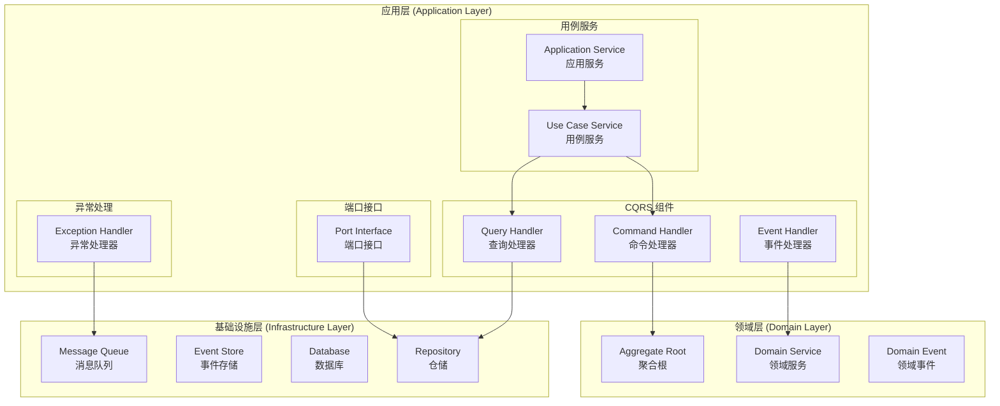
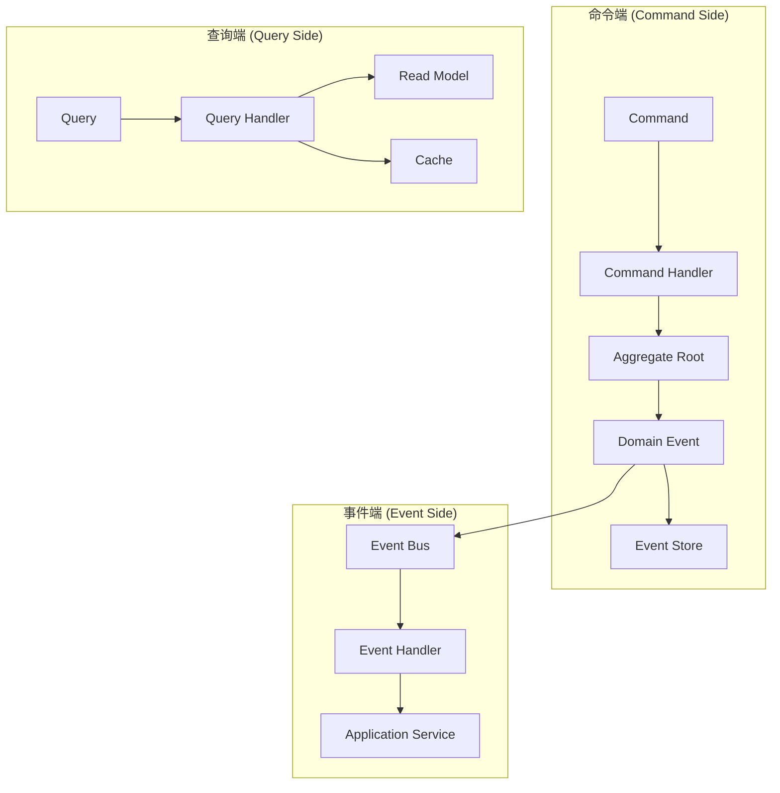
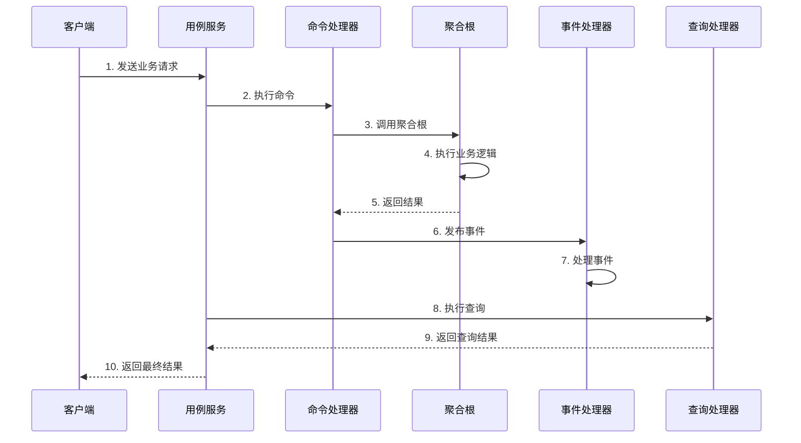
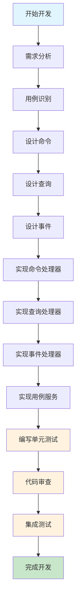

# 应用层开发指南

> **版本**: 1.0.0 | **创建日期**: 2025-01-27 | **模块**: packages/hybrid-archi

---

## 📋 目录

- [1. 应用层概述](#1-应用层概述)
- [2. 应用层架构图示](#2-应用层架构图示)
- [3. 应用层开发流程](#3-应用层开发流程)
- [4. 核心设计原则](#4-核心设计原则)
- [5. 命令处理器开发](#5-命令处理器开发)
- [6. 查询处理器开发](#6-查询处理器开发)
- [7. 事件处理器开发](#7-事件处理器开发)
- [8. 用例服务开发](#8-用例服务开发)
- [9. 最佳实践](#9-最佳实践)
- [10. 常见问题](#10-常见问题)

---

## 1. 应用层概述

### 1.1 应用层定位

应用层是 Hybrid Architecture 的协调层，负责协调领域对象完成特定的业务用例。应用层应该：

- **用例为中心**: 以业务用例为核心，每个用例对应一个应用服务
- **用例逻辑**: 应用层的关注点是用例的逻辑，即协调领域对象完成业务场景的流程
- **无业务逻辑**: 不包含具体的业务逻辑，只负责协调
- **用例驱动**: 每个应用服务对应一个或多个业务用例
- **事务边界**: 管理事务边界和一致性
- **依赖注入**: 通过依赖注入管理组件依赖

### 1.1.1 用例为中心的第一原则

**Clean Architecture 应用层的核心原则是以用例为中心**，这是应用层开发的第一原则：

#### 用例（Use-Case）是 Clean Architecture 的重要概念

**用例（Use-Case）不仅仅是命名偏好，更是一种设计承诺**：

1. **设计承诺**: 使用 `XxxUseCase` 命名是对单一职责原则的承诺
2. **业务场景专注**: 每个用例类只关注一个具体的业务场景
3. **代码清晰**: 用例命名直接反映业务意图，代码更加清晰
4. **可维护性**: 单一职责使得代码更容易维护和修改
5. **可测试性**: 每个用例可以独立测试，测试更加精确

#### 用例为中心的含义

1. **用例是应用层的核心**: 应用层的所有组件都应该围绕业务用例来组织
2. **用例驱动设计**: 从业务用例出发，设计应用层的结构和组件
3. **用例边界清晰**: 每个用例都有明确的输入、输出和边界
4. **用例独立**: 用例之间相互独立，可以独立开发、测试和部署

#### 用例命名的设计承诺

```typescript
// ✅ 正确：用例命名体现设计承诺
export class CreateUserUseCase {
  // 承诺：只处理创建用户的业务场景
  async execute(request: CreateUserRequest): Promise<CreateUserResponse> {
    // 单一职责：只关注用户创建
  }
}

export class UpdateUserProfileUseCase {
  // 承诺：只处理更新用户资料的业务场景
  async execute(request: UpdateUserProfileRequest): Promise<UpdateUserProfileResponse> {
    // 单一职责：只关注用户资料更新
  }
}

export class AuthenticateUserUseCase {
  // 承诺：只处理用户认证的业务场景
  async execute(request: AuthenticateUserRequest): Promise<AuthenticateUserResponse> {
    // 单一职责：只关注用户认证
  }
}

// ❌ 错误：违反设计承诺
export class UserService {
  // ❌ 违反承诺：处理多个业务场景
  async createUser(): Promise<void> { }
  async updateUser(): Promise<void> { }
  async deleteUser(): Promise<void> { }
  async authenticateUser(): Promise<void> { }
}
```

#### 用例为中心的架构

```
应用层 (Application Layer) - 用例为中心
├── 用例服务 (Use Case Services) - 核心组件
│   ├── 创建用户用例 (CreateUserUseCase)
│   ├── 激活用户用例 (ActivateUserUseCase)
│   ├── 查询用户用例 (GetUserUseCase)
│   └── 用户列表用例 (GetUserListUseCase)
├── 命令处理器 (Command Handlers) - 用例实现
├── 查询处理器 (Query Handlers) - 用例实现
├── 事件处理器 (Event Handlers) - 用例实现
└── 应用服务 (Application Services) - 用例协调
```

#### 用例为中心的开发流程

1. **识别业务用例**: 从业务需求中识别出具体的用例
2. **设计用例接口**: 为每个用例设计清晰的接口
3. **实现用例逻辑**: 实现用例的逻辑，即协调领域对象完成业务场景的流程
4. **协调领域对象**: 通过用例服务协调领域对象
5. **管理事务边界**: 在用例层面管理事务边界

#### 用例逻辑 vs 业务逻辑

**重要区别**：

- **用例逻辑**: 应用层的关注点，协调领域对象完成业务场景的流程
- **业务逻辑**: 领域层的关注点，实现业务规则的具体算法和流程

**代码示例**：

```typescript
// 应用层 - 用例逻辑（协调流程）
export class CreateUserUseCase {
  async execute(input: CreateUserInput): Promise<CreateUserOutput> {
    // 用例逻辑：协调各个组件完成业务场景
    const user = UserAggregate.create(input.email, input.username);
    
    // 委托给领域对象执行业务逻辑
    user.register(input.email, input.username, input.password);
    
    // 协调基础设施服务
    await this.userRepository.save(user);
    await this.eventBus.publishAll(user.getUncommittedEvents());
    
    return new CreateUserOutput(user.getId());
  }
}

// 领域层 - 业务逻辑（具体实现）
export class User extends BaseEntity {
  // 业务逻辑：用户注册的具体实现
  public register(email: Email, username: Username, password: Password): void {
    // 业务规则：用户状态转换
    if (this._status !== UserStatus.Pending) {
      throw new UserNotPendingException('只有待激活状态的用户才能注册');
    }
    
    // 业务逻辑：注册的具体实现
    this._email = email;
    this._username = username;
    this._password = password;
    this._status = UserStatus.Active;
    this.updateTimestamp();
  }
}
```

### 1.2 应用层组件

```
应用层 (Application Layer)
├── 命令处理器 (Command Handlers)
├── 查询处理器 (Query Handlers)
├── 事件处理器 (Event Handlers)
├── 用例服务 (Use Case Services)
├── 应用服务 (Application Services)
├── 端口接口 (Port Interfaces)
└── 异常处理 (Exception Handling)
```

### 1.3 CQRS + ES + EDA 架构对应用层的要求

为了满足 CQRS + ES + EDA 的架构要求，应用层必须提供以下核心功能：

#### 1.3.1 CQRS 支持

**命令端支持**:

- **命令处理**: 处理用户意图改变系统状态
- **事务管理**: 管理命令执行的事务边界
- **并发控制**: 处理并发冲突和乐观锁
- **事件发布**: 发布命令执行产生的领域事件

**查询端支持**:

- **查询处理**: 处理用户查询请求
- **读模型优化**: 使用优化的读模型提升查询性能
- **缓存管理**: 管理查询结果的缓存
- **权限控制**: 控制数据访问权限

#### 1.3.2 事件驱动支持

**事件处理**:

- **事件订阅**: 订阅和处理领域事件
- **异步处理**: 支持事件的异步处理
- **重试机制**: 实现事件处理的重试机制
- **死信队列**: 处理失败的事件

**事件路由**:

- **事件分发**: 将事件分发给相应的处理器
- **事件过滤**: 根据条件过滤事件
- **事件转换**: 转换事件格式和内容

#### 1.3.3 多租户支持

**租户隔离**:

- **租户上下文**: 管理租户上下文信息
- **数据隔离**: 确保租户数据隔离
- **权限控制**: 基于租户的权限控制
- **资源限制**: 基于租户的资源限制

### 1.4 设计目标

- **用例协调**: 协调领域对象完成业务用例
- **事务管理**: 管理事务边界和一致性
- **性能优化**: 优化查询和命令执行性能
- **可测试性**: 每个组件都可以独立测试
- **可维护性**: 代码结构清晰，易于维护

---

## 2. 应用层架构图示

### 2.1 应用层整体架构



### 2.2 CQRS 架构中的应用层



### 2.3 应用层组件交互图



---

## 3. 应用层开发流程

### 3.1 开发流程概览



### 3.2 详细开发步骤

#### 3.2.1 需求分析阶段

**目标**: 分析业务需求，识别应用层需要支持的用例

**活动**:

1. **业务用例识别** (核心活动)
   - 识别用户操作和业务流程
   - 分析命令和查询需求
   - 确定事件处理需求
   - **重点**: 以用例为中心，每个用例都有明确的业务价值

2. **用例边界定义**
   - 定义每个用例的输入和输出
   - 确定用例的前置条件和后置条件
   - 识别用例的异常情况
   - **重点**: 用例边界清晰，职责单一

3. **用例优先级排序**
   - 根据业务价值排序用例
   - 识别核心用例和辅助用例
   - 确定用例的依赖关系
   - **重点**: 用例独立，可以独立开发

4. **接口设计**
   - 设计用例接口
   - 设计命令接口
   - 设计查询接口
   - 设计事件接口

5. **依赖分析**
   - 识别领域层依赖
   - 识别基础设施层依赖
   - 设计端口接口

**输出**:

- 业务用例文档 (核心输出)
- 用例边界定义
- 用例优先级排序
- 接口设计文档
- 依赖关系图

#### 3.2.2 用例识别阶段

**目标**: 将业务需求转化为具体的用例

**活动**:

1. **命令用例识别**

   ```typescript
   // 示例：用户管理命令用例
   export interface UserCommandUseCases {
     // 创建用户
     createUser: CreateUserCommand;
     // 激活用户
     activateUser: ActivateUserCommand;
     // 更新用户信息
     updateUser: UpdateUserCommand;
     // 删除用户
     deleteUser: DeleteUserCommand;
   }
   ```

2. **查询用例识别**

   ```typescript
   // 示例：用户管理查询用例
   export interface UserQueryUseCases {
     // 获取用户详情
     getUser: GetUserQuery;
     // 获取用户列表
     getUserList: GetUserListQuery;
     // 搜索用户
     searchUsers: SearchUsersQuery;
   }
   ```

3. **事件用例识别**

   ```typescript
   // 示例：用户管理事件用例
   export interface UserEventUseCases {
     // 用户创建事件
     userCreated: UserCreatedEvent;
     // 用户激活事件
     userActivated: UserActivatedEvent;
     // 用户更新事件
     userUpdated: UserUpdatedEvent;
   }
   ```

**输出**:

- 命令用例列表
- 查询用例列表
- 事件用例列表

#### 3.2.3 命令设计阶段

**目标**: 设计命令对象，表示用户意图改变系统状态

**活动**:

1. **命令对象设计**

   ```typescript
   // 命令设计模板
   export class CreateUserCommand implements ICommand {
     constructor(
       public readonly email: string,
       public readonly username: string,
       public readonly password: string,
       public readonly profile: UserProfileData,
       public readonly tenantId: string
     ) {}
   }
   
   export class ActivateUserCommand implements ICommand {
     constructor(
       public readonly userId: string,
       public readonly tenantId: string
     ) {}
   }
   ```

2. **命令验证设计**

   ```typescript
   // 命令验证器
   export class CreateUserCommandValidator implements ICommandValidator<CreateUserCommand> {
     async validate(command: CreateUserCommand): Promise<ICommandValidationResult> {
       const errors: Array<{field: string; message: string; code: string}> = [];
       
       // 验证邮箱格式
       if (!this.isValidEmail(command.email)) {
         errors.push({
           field: 'email',
           message: '邮箱格式不正确',
           code: 'INVALID_EMAIL'
         });
       }
       
       // 验证用户名
       if (!command.username || command.username.length < 3) {
         errors.push({
           field: 'username',
           message: '用户名长度不能少于3个字符',
           code: 'INVALID_USERNAME'
         });
       }
       
       return {
         isValid: errors.length === 0,
         errors,
         warnings: [],
         context: {}
       };
     }
   }
   ```

3. **命令结果设计**

   ```typescript
   // 命令执行结果
   export class CreateUserResult {
     constructor(
       public readonly userId: string,
       public readonly email: string,
       public readonly username: string,
       public readonly createdAt: Date
     ) {}
   }
   ```

**输出**:

- 命令对象定义
- 命令验证器
- 命令执行结果

#### 3.2.4 查询设计阶段

**目标**: 设计查询对象，表示用户查询意图

**活动**:

1. **查询对象设计**

   ```typescript
   // 查询设计模板
   export class GetUserQuery implements IQuery {
     constructor(
       public readonly userId: string,
       public readonly tenantId: string
     ) {}
   }
   
   export class GetUserListQuery implements IQuery {
     constructor(
       public readonly tenantId: string,
       public readonly page: number = 1,
       public readonly limit: number = 10,
       public readonly filters?: UserFilters
     ) {}
   }
   ```

2. **查询结果设计**

   ```typescript
   // 查询结果
   export class GetUserResult {
     constructor(
       public readonly user: UserReadModel
     ) {}
   }
   
   export class GetUserListResult {
     constructor(
       public readonly users: UserReadModel[],
       public readonly total: number,
       public readonly page: number,
       public readonly limit: number
     ) {}
   }
   ```

3. **读模型设计**

   ```typescript
   // 读模型
   export class UserReadModel {
     constructor(
       public readonly id: string,
       public readonly email: string,
       public readonly username: string,
       public readonly status: string,
       public readonly createdAt: Date,
       public readonly updatedAt: Date
     ) {}
   }
   ```

**输出**:

- 查询对象定义
- 查询结果定义
- 读模型定义

#### 3.2.5 事件设计阶段

**目标**: 设计事件处理器，处理领域事件

**活动**:

1. **事件处理器设计**

   ```typescript
   // 事件处理器设计模板
   @EventsHandler(UserCreatedEvent)
   export class UserCreatedEventHandler implements IEventHandler<UserCreatedEvent> {
     constructor(
       private readonly emailService: IEmailService,
       private readonly auditService: IAuditService
     ) {}
     
     async handle(event: UserCreatedEvent): Promise<void> {
       // 发送欢迎邮件
       await this.emailService.sendWelcomeEmail(event.email, event.username);
       
       // 记录审计日志
       await this.auditService.logUserCreation(event);
     }
   }
   ```

2. **事件处理逻辑**

   ```typescript
   // 事件处理逻辑
   export class UserActivatedEventHandler implements IEventHandler<UserActivatedEvent> {
     async handle(event: UserActivatedEvent): Promise<void> {
       // 更新用户状态
       await this.userService.updateUserStatus(event.userId, 'active');
       
       // 发送激活通知
       await this.notificationService.sendActivationNotification(event.userId);
     }
   }
   ```

**输出**:

- 事件处理器定义
- 事件处理逻辑
- 事件处理配置

---

## 4. 核心设计原则

### 4.1 用例为中心原则 (第一原则)

**Clean Architecture 应用层的核心原则是以用例为中心**，这是应用层开发的第一原则：

#### 4.1.1 用例（Use-Case）的设计承诺

**用例（Use-Case）是 Clean Architecture 的重要概念，从代码角度来说，它是一个服务类，以 `XxxUseCase` 形式命名**：

**设计承诺的核心**：

- **命名承诺**: `XxxUseCase` 命名是对单一职责原则的承诺
- **业务专注**: 每个用例类只关注一个具体的业务场景
- **职责清晰**: 用例类严格遵守单一职责原则
- **用例逻辑**: 应用层的关注点是用例的逻辑，即协调领域对象完成业务场景的流程
- **可维护性**: 单一职责使得代码更容易维护和修改
- **可测试性**: 每个用例可以独立测试，测试更加精确

#### 4.1.2 用例为中心的设计

**✅ 正确做法**:

```typescript
// 以用例为中心的设计 - 体现设计承诺
export class CreateUserUseCase {
  constructor(
    private readonly userRepository: IUserRepository,
    private readonly eventBus: IEventBus
  ) {}
  
  // 设计承诺：只处理创建用户的业务场景
  async execute(input: CreateUserInput): Promise<CreateUserOutput> {
    // 用例的完整业务流程
    const user = UserAggregate.create(input.email, input.username);
    await this.userRepository.save(user);
    await this.eventBus.publishAll(user.getUncommittedEvents());
    return new CreateUserOutput(user.getId());
  }
}

// 设计承诺：只处理更新用户资料的业务场景
export class UpdateUserProfileUseCase {
  constructor(
    private readonly userRepository: IUserRepository,
    private readonly eventBus: IEventBus
  ) {}
  
  async execute(input: UpdateUserProfileInput): Promise<UpdateUserProfileOutput> {
    // 只关注用户资料更新的业务逻辑
    const user = await this.userRepository.findById(input.userId);
    user.updateProfile(input.profile);
    await this.userRepository.save(user);
    return new UpdateUserProfileOutput(user.getId());
  }
}

// 设计承诺：只处理用户认证的业务场景
export class AuthenticateUserUseCase {
  constructor(
    private readonly userRepository: IUserRepository,
    private readonly eventBus: IEventBus
  ) {}
  
  async execute(input: AuthenticateUserInput): Promise<AuthenticateUserOutput> {
    // 只关注用户认证的业务逻辑
    const user = await this.userRepository.findByEmail(input.email);
    const isValid = user.authenticate(input.password);
    return new AuthenticateUserOutput(isValid, user.getId());
  }
}

// 用例接口定义
export interface ICreateUserUseCase {
  execute(input: CreateUserInput): Promise<CreateUserOutput>;
}

// 用例输入
export class CreateUserInput {
  constructor(
    public readonly email: string,
    public readonly username: string,
    public readonly password: string
  ) {}
}

// 用例输出
export class CreateUserOutput {
  constructor(
    public readonly userId: string,
    public readonly email: string
  ) {}
}
```

**❌ 错误做法**:

```typescript
// ❌ 不以用例为中心的设计
export class UserService {
  async createUser(email: string, username: string): Promise<void> {
    // 没有明确的用例边界
  }
  
  async updateUser(id: string, data: any): Promise<void> {
    // 多个用例混在一起
  }
  
  async deleteUser(id: string): Promise<void> {
    // 没有明确的输入输出
  }
}
```

#### 4.1.2 用例边界清晰

**✅ 正确做法**:

```typescript
// 每个用例都有清晰的边界
export class ActivateUserUseCase {
  async execute(input: ActivateUserInput): Promise<ActivateUserOutput> {
    // 明确的输入
    const user = await this.userRepository.findById(input.userId);
    if (!user) {
      throw new UserNotFoundException();
    }
    
    // 明确的业务逻辑
    user.activate();
    await this.userRepository.save(user);
    
    // 明确的输出
    return new ActivateUserOutput(user.getId(), user.getStatus());
  }
}

export class GetUserUseCase {
  async execute(input: GetUserInput): Promise<GetUserOutput> {
    // 查询用例的清晰边界
    const user = await this.userReadRepository.findById(input.userId);
    return new GetUserOutput(user);
  }
}
```

#### 4.1.3 用例独立

**✅ 正确做法**:

```typescript
// 用例之间相互独立
export class CreateUserUseCase {
  async execute(input: CreateUserInput): Promise<CreateUserOutput> {
    // 独立的创建用户用例
  }
}

export class UpdateUserUseCase {
  async execute(input: UpdateUserInput): Promise<UpdateUserOutput> {
    // 独立的更新用户用例
  }
}

export class DeleteUserUseCase {
  async execute(input: DeleteUserInput): Promise<DeleteUserOutput> {
    // 独立的删除用户用例
  }
}
```

#### 4.1.4 用例驱动设计

**✅ 正确做法**:

```typescript
// 从用例出发设计应用层
export class UserApplicationService {
  constructor(
    private readonly createUserUseCase: ICreateUserUseCase,
    private readonly updateUserUseCase: IUpdateUserUseCase,
    private readonly getUserUseCase: IGetUserUseCase
  ) {}
  
  async createUser(data: CreateUserData): Promise<CreateUserResult> {
    // 委托给用例服务
    const input = new CreateUserInput(data.email, data.username, data.password);
    const output = await this.createUserUseCase.execute(input);
    return new CreateUserResult(output.userId, output.email);
  }
  
  async updateUser(userId: string, data: UpdateUserData): Promise<UpdateUserResult> {
    // 委托给用例服务
    const input = new UpdateUserInput(userId, data);
    const output = await this.updateUserUseCase.execute(input);
    return new UpdateUserResult(output.userId);
  }
}
```

### 4.2 单一职责原则

**✅ 正确做法**:

```typescript
// 每个处理器只处理一种类型的命令
@CommandHandler(CreateUserCommand)
export class CreateUserCommandHandler implements ICommandHandler<CreateUserCommand, CreateUserResult> {
  async handle(command: CreateUserCommand): Promise<CreateUserResult> {
    // 只处理创建用户的逻辑
  }
}
```

**❌ 错误做法**:

```typescript
// ❌ 一个处理器处理多种命令
export class UserCommandHandler {
  async handleCreateUser(command: CreateUserCommand): Promise<CreateUserResult> {
    // 创建用户逻辑
  }
  
  async handleUpdateUser(command: UpdateUserCommand): Promise<UpdateUserResult> {
    // 更新用户逻辑
  }
}
```

### 4.2 依赖倒置原则

**✅ 正确做法**:

```typescript
// 依赖抽象接口
export class CreateUserCommandHandler {
  constructor(
    private readonly userRepository: IUserRepository, // 抽象接口
    private readonly eventBus: IEventBus // 抽象接口
  ) {}
}
```

**❌ 错误做法**:

```typescript
// ❌ 依赖具体实现
export class CreateUserCommandHandler {
  constructor(
    private readonly userRepository: UserRepository, // 具体实现
    private readonly eventBus: EventBus // 具体实现
  ) {}
}
```

### 4.3 开闭原则

**✅ 正确做法**:

```typescript
// 通过接口扩展功能
export interface IUserEventHandler {
  handle(event: UserEvent): Promise<void>;
}

export class EmailNotificationHandler implements IUserEventHandler {
  async handle(event: UserEvent): Promise<void> {
    // 邮件通知逻辑
  }
}

export class SmsNotificationHandler implements IUserEventHandler {
  async handle(event: UserEvent): Promise<void> {
    // 短信通知逻辑
  }
}
```

---

## 5. 命令处理器开发

### 5.1 命令处理器设计

**基本结构**:

```typescript
@CommandHandler(CreateUserCommand)
export class CreateUserCommandHandler implements ICommandHandler<CreateUserCommand, CreateUserResult> {
  constructor(
    private readonly userRepository: IUserRepository,
    private readonly eventBus: IEventBus,
    private readonly validator: ICommandValidator<CreateUserCommand>
  ) {}
  
  async handle(command: CreateUserCommand): Promise<CreateUserResult> {
    // 1. 验证命令
    await this.validateCommand(command);
    
    // 2. 执行业务逻辑
    const user = await this.createUser(command);
    
    // 3. 保存聚合根
    await this.userRepository.save(user);
    
    // 4. 发布事件
    await this.publishEvents(user);
    
    // 5. 返回结果
    return new CreateUserResult(user.getId(), user.getEmail(), user.getUsername());
  }
  
  private async validateCommand(command: CreateUserCommand): Promise<void> {
    const result = await this.validator.validate(command);
    if (!result.isValid) {
      throw new CommandValidationError(result.errors);
    }
  }
  
  private async createUser(command: CreateUserCommand): Promise<UserAggregate> {
    const user = UserAggregate.create(
      EntityId.generate(),
      Email.create(command.email),
      Username.create(command.username),
      Password.create(command.password),
      UserProfile.create(command.profile)
    );
    
    return user;
  }
  
  private async publishEvents(user: UserAggregate): Promise<void> {
    const events = user.getUncommittedEvents();
    await this.eventBus.publishAll(events);
    user.clearEvents();
  }
}
```

### 5.2 命令处理器最佳实践

#### 5.2.1 事务管理

```typescript
export class CreateUserCommandHandler {
  constructor(
    private readonly transactionManager: ITransactionManager
  ) {}
  
  async handle(command: CreateUserCommand): Promise<CreateUserResult> {
    return await this.transactionManager.execute(async () => {
      // 在事务中执行所有操作
      const user = await this.createUser(command);
      await this.userRepository.save(user);
      await this.publishEvents(user);
      return new CreateUserResult(user.getId());
    });
  }
}
```

#### 5.2.2 并发控制

```typescript
export class UpdateUserCommandHandler {
  async handle(command: UpdateUserCommand): Promise<UpdateUserResult> {
    const user = await this.userRepository.findById(command.userId);
    if (!user) {
      throw new UserNotFoundException();
    }
    
    // 检查版本号
    if (user.getVersion() !== command.expectedVersion) {
      throw new ConcurrencyConflictError('用户数据已被其他操作修改');
    }
    
    // 更新用户
    user.updateProfile(command.profile);
    await this.userRepository.save(user);
    
    return new UpdateUserResult(user.getId());
  }
}
```

#### 5.2.3 错误处理

```typescript
export class CreateUserCommandHandler {
  async handle(command: CreateUserCommand): Promise<CreateUserResult> {
    try {
      // 执行业务逻辑
      const user = await this.createUser(command);
      await this.userRepository.save(user);
      return new CreateUserResult(user.getId());
    } catch (error) {
      // 记录错误日志
      this.logger.error('Failed to create user', error);
      
      // 根据错误类型处理
      if (error instanceof BusinessRuleViolationError) {
        throw new CommandExecutionError('业务规则验证失败', error);
      } else if (error instanceof ConcurrencyConflictError) {
        throw new CommandExecutionError('并发冲突', error);
      } else {
        throw new CommandExecutionError('创建用户失败', error);
      }
    }
  }
}
```

---

## 6. 查询处理器开发

### 6.1 查询处理器设计

**基本结构**:

```typescript
@QueryHandler(GetUserQuery)
export class GetUserQueryHandler implements IQueryHandler<GetUserQuery, GetUserResult> {
  constructor(
    private readonly userReadRepository: IUserReadRepository,
    private readonly cache: IApplicationCache
  ) {}
  
  async handle(query: GetUserQuery): Promise<GetUserResult> {
    // 1. 验证查询
    this.validateQuery(query);
    
    // 2. 检查缓存
    const cached = await this.getFromCache(query);
    if (cached) return cached;
    
    // 3. 执行查询
    const user = await this.userReadRepository.findById(query.userId);
    if (!user) {
      throw new UserNotFoundException();
    }
    
    // 4. 构建结果
    const result = new GetUserResult(user);
    
    // 5. 缓存结果
    await this.cacheResult(query, result);
    
    return result;
  }
  
  private validateQuery(query: GetUserQuery): void {
    if (!query.userId) {
      throw new QueryValidationError('用户ID不能为空');
    }
  }
  
  private async getFromCache(query: GetUserQuery): Promise<GetUserResult | null> {
    const cacheKey = this.getCacheKey(query);
    return await this.cache.get(cacheKey);
  }
  
  private async cacheResult(query: GetUserQuery, result: GetUserResult): Promise<void> {
    const cacheKey = this.getCacheKey(query);
    await this.cache.set(cacheKey, result, 300); // 5分钟缓存
  }
  
  private getCacheKey(query: GetUserQuery): string {
    return `user:${query.userId}:${query.tenantId}`;
  }
}
```

### 6.2 查询处理器最佳实践

#### 6.2.1 分页查询

```typescript
@QueryHandler(GetUserListQuery)
export class GetUserListQueryHandler implements IQueryHandler<GetUserListQuery, GetUserListResult> {
  async handle(query: GetUserListQuery): Promise<GetUserListResult> {
    // 验证分页参数
    const page = Math.max(1, query.page);
    const limit = Math.min(100, Math.max(1, query.limit));
    const offset = (page - 1) * limit;
    
    // 执行查询
    const [users, total] = await Promise.all([
      this.userReadRepository.findByTenant(query.tenantId, offset, limit, query.filters),
      this.userReadRepository.countByTenant(query.tenantId, query.filters)
    ]);
    
    return new GetUserListResult(users, total, page, limit);
  }
}
```

#### 6.2.2 权限控制

```typescript
export class GetUserQueryHandler {
  async handle(query: GetUserQuery): Promise<GetUserResult> {
    // 检查权限
    await this.checkPermission(query);
    
    // 执行查询
    const user = await this.userReadRepository.findById(query.userId);
    return new GetUserResult(user);
  }
  
  private async checkPermission(query: GetUserQuery): Promise<void> {
    const hasPermission = await this.permissionService.checkUserAccess(
      query.requestingUserId,
      query.userId,
      'READ_USER'
    );
    
    if (!hasPermission) {
      throw new AccessDeniedError('没有权限访问该用户信息');
    }
  }
}
```

#### 6.2.3 性能优化

```typescript
export class GetUserListQueryHandler {
  async handle(query: GetUserListQuery): Promise<GetUserListResult> {
    // 使用索引优化查询
    const users = await this.userReadRepository.findByTenantWithIndex(
      query.tenantId,
      query.filters,
      query.sortBy,
      query.sortOrder
    );
    
    // 使用投影减少数据传输
    const projectedUsers = users.map(user => ({
      id: user.id,
      email: user.email,
      username: user.username,
      status: user.status
    }));
    
    return new GetUserListResult(projectedUsers);
  }
}
```

---

## 7. 事件处理器开发

### 7.1 事件处理器设计

**基本结构**:

```typescript
@EventsHandler(UserCreatedEvent)
export class UserCreatedEventHandler implements IEventHandler<UserCreatedEvent> {
  constructor(
    private readonly emailService: IEmailService,
    private readonly auditService: IAuditService
  ) {}
  
  async handle(event: UserCreatedEvent): Promise<void> {
    try {
      // 1. 验证事件
      this.validateEvent(event);
      
      // 2. 检查是否已处理
      if (await this.isEventProcessed(event)) {
        return;
      }
      
      // 3. 处理事件
      await this.processEvent(event);
      
      // 4. 标记为已处理
      await this.markEventAsProcessed(event);
    } catch (error) {
      // 5. 处理失败
      await this.handleFailure(event, error);
      throw error;
    }
  }
  
  private validateEvent(event: UserCreatedEvent): void {
    if (!event.userId || !event.email) {
      throw new InvalidEventError('事件数据不完整');
    }
  }
  
  private async processEvent(event: UserCreatedEvent): Promise<void> {
    // 发送欢迎邮件
    await this.emailService.sendWelcomeEmail(event.email, event.username);
    
    // 记录审计日志
    await this.auditService.logUserCreation(event);
  }
  
  async isEventProcessed(event: UserCreatedEvent): Promise<boolean> {
    return await this.eventStore.isEventProcessed(event.id);
  }
  
  async markEventAsProcessed(event: UserCreatedEvent): Promise<void> {
    await this.eventStore.markEventAsProcessed(event.id);
  }
  
  async handleFailure(event: UserCreatedEvent, error: Error): Promise<void> {
    this.logger.error('Failed to handle UserCreatedEvent', error);
    await this.deadLetterQueue.send(event, error);
  }
}
```

### 7.2 事件处理器最佳实践

#### 7.2.1 幂等性处理

```typescript
export class UserActivatedEventHandler {
  async handle(event: UserActivatedEvent): Promise<void> {
    // 检查是否已处理
    const processed = await this.eventStore.isEventProcessed(event.id);
    if (processed) {
      this.logger.info('Event already processed', { eventId: event.id });
      return;
    }
    
    // 处理事件
    await this.updateUserStatus(event.userId, 'active');
    
    // 标记为已处理
    await this.eventStore.markEventAsProcessed(event.id);
  }
}
```

#### 7.2.2 重试机制

```typescript
export class UserCreatedEventHandler {
  async handle(event: UserCreatedEvent): Promise<void> {
    const maxRetries = this.getMaxRetries(event);
    let retryCount = 0;
    
    while (retryCount <= maxRetries) {
      try {
        await this.processEvent(event);
        return;
      } catch (error) {
        retryCount++;
        if (retryCount > maxRetries) {
          await this.handleFailure(event, error);
          throw error;
        }
        
        // 等待重试
        const delay = this.getRetryDelay(event, retryCount);
        await this.sleep(delay);
      }
    }
  }
  
  getMaxRetries(event: UserCreatedEvent): number {
    return 3;
  }
  
  getRetryDelay(event: UserCreatedEvent, retryCount: number): number {
    return Math.pow(2, retryCount) * 1000; // 指数退避
  }
}
```

#### 7.2.3 批量处理

```typescript
export class UserBatchEventHandler {
  async handleBatch(events: UserEvent[]): Promise<void> {
    // 按类型分组
    const groupedEvents = this.groupEventsByType(events);
    
    // 批量处理
    for (const [eventType, eventList] of groupedEvents) {
      await this.processBatch(eventType, eventList);
    }
  }
  
  private async processBatch(eventType: string, events: UserEvent[]): Promise<void> {
    switch (eventType) {
      case 'UserCreated':
        await this.batchCreateUsers(events as UserCreatedEvent[]);
        break;
      case 'UserActivated':
        await this.batchActivateUsers(events as UserActivatedEvent[]);
        break;
    }
  }
}
```

---

## 8. 用例服务开发

### 8.1 用例服务设计 (用例为中心)

**用例服务是应用层的核心组件，每个用例服务对应一个具体的业务用例**：

#### 8.1.0 用例（Use-Case）的设计承诺

**在 Clean Architecture 的语境下，使用 `XxxUseCase` 这个命名不仅仅是命名偏好，它更是一种设计承诺**：

**设计承诺的具体体现**：

- **单一职责承诺**: 承诺这个类将严格遵守单一职责原则，只关注一个具体的业务场景
- **业务场景承诺**: 承诺每个用例类只处理一个完整的业务场景
- **用例逻辑承诺**: 承诺应用层的关注点是用例的逻辑，即协调领域对象完成业务场景的流程
- **代码清晰承诺**: 承诺代码结构清晰，职责明确
- **可维护性承诺**: 承诺代码易于维护和修改
- **可测试性承诺**: 承诺每个用例可以独立测试

**命名规范的设计承诺**：

```typescript
// ✅ 正确：体现设计承诺的命名
export class CreateUserUseCase {
  // 承诺：只处理创建用户的业务场景
}

export class UpdateUserProfileUseCase {
  // 承诺：只处理更新用户资料的业务场景
}

export class AuthenticateUserUseCase {
  // 承诺：只处理用户认证的业务场景
}

export class DeleteUserUseCase {
  // 承诺：只处理删除用户的业务场景
}

// ❌ 错误：违反设计承诺的命名
export class UserService {
  // ❌ 违反承诺：处理多个业务场景
}

export class UserManager {
  // ❌ 违反承诺：职责不明确
}

export class UserHandler {
  // ❌ 违反承诺：命名不体现业务场景
}
```

#### 8.1.1 用例服务的基本结构

```typescript
// 用例服务接口定义
export interface ICreateUserUseCase {
  execute(input: CreateUserInput): Promise<CreateUserOutput>;
}

// 用例服务实现
@Injectable()
export class CreateUserUseCase implements ICreateUserUseCase {
  constructor(
    private readonly userRepository: IUserRepository,
    private readonly eventBus: IEventBus,
    private readonly transactionManager: ITransactionManager
  ) {}
  
  async execute(input: CreateUserInput): Promise<CreateUserOutput> {
    return await this.transactionManager.execute(async () => {
      // 1. 验证输入
      this.validateInput(input);
      
      // 2. 执行业务逻辑
      const user = await this.createUser(input);
      
      // 3. 保存聚合根
      await this.userRepository.save(user);
      
      // 4. 发布事件
      await this.publishEvents(user);
      
      // 5. 返回输出
      return new CreateUserOutput(user.getId(), user.getEmail());
    });
  }
  
  private validateInput(input: CreateUserInput): void {
    if (!input.email || !input.username) {
      throw new InvalidInputError('邮箱和用户名不能为空');
    }
  }
  
  private async createUser(input: CreateUserInput): Promise<UserAggregate> {
    const user = UserAggregate.create(
      EntityId.generate(),
      Email.create(input.email),
      Username.create(input.username),
      Password.create(input.password)
    );
    
    return user;
  }
  
  private async publishEvents(user: UserAggregate): Promise<void> {
    const events = user.getUncommittedEvents();
    await this.eventBus.publishAll(events);
    user.clearEvents();
  }
}

// 用例输入
export class CreateUserInput {
  constructor(
    public readonly email: string,
    public readonly username: string,
    public readonly password: string,
    public readonly tenantId: string
  ) {}
}

// 用例输出
export class CreateUserOutput {
  constructor(
    public readonly userId: string,
    public readonly email: string,
    public readonly createdAt: Date = new Date()
  ) {}
}
```

#### 8.1.2 用例服务的组织方式

```typescript
// 用户管理用例服务集合
export class UserUseCaseServices {
  constructor(
    private readonly createUserUseCase: ICreateUserUseCase,
    private readonly updateUserUseCase: IUpdateUserUseCase,
    private readonly deleteUserUseCase: IDeleteUserUseCase,
    private readonly activateUserUseCase: IActivateUserUseCase,
    private readonly getUserUseCase: IGetUserUseCase,
    private readonly getUserListUseCase: IGetUserListUseCase
  ) {}
  
  // 委托给具体的用例服务
  async createUser(data: CreateUserData): Promise<CreateUserResult> {
    const input = new CreateUserInput(data.email, data.username, data.password, data.tenantId);
    const output = await this.createUserUseCase.execute(input);
    return new CreateUserResult(output.userId, output.email);
  }
  
  async updateUser(userId: string, data: UpdateUserData): Promise<UpdateUserResult> {
    const input = new UpdateUserInput(userId, data);
    const output = await this.updateUserUseCase.execute(input);
    return new UpdateUserResult(output.userId);
  }
  
  async getUser(userId: string, tenantId: string): Promise<GetUserResult> {
    const input = new GetUserInput(userId, tenantId);
    const output = await this.getUserUseCase.execute(input);
    return new GetUserResult(output.user);
  }
}
```

#### 8.1.3 用例服务的依赖注入

```typescript
// 用例服务模块
@Module({
  providers: [
    // 用例服务
    CreateUserUseCase,
    UpdateUserUseCase,
    DeleteUserUseCase,
    ActivateUserUseCase,
    GetUserUseCase,
    GetUserListUseCase,
    
    // 用例服务集合
    UserUseCaseServices,
    
    // 依赖服务
    {
      provide: 'IUserRepository',
      useClass: UserRepository
    },
    {
      provide: 'IEventBus',
      useClass: EventBus
    },
    {
      provide: 'ITransactionManager',
      useClass: TransactionManager
    }
  ],
  exports: [UserUseCaseServices]
})
export class UserUseCaseModule {}
```

### 8.2 用例服务最佳实践

#### 8.2.1 事务管理

```typescript
export class UserUseCaseService {
  constructor(
    private readonly transactionManager: ITransactionManager
  ) {}
  
  async createUserWithProfile(data: CreateUserData): Promise<CreateUserResult> {
    return await this.transactionManager.execute(async () => {
      // 1. 创建用户
      const createCommand = new CreateUserCommand(data.email, data.username, data.password);
      const userResult = await this.commandBus.execute(createCommand);
      
      // 2. 创建用户资料
      const profileCommand = new CreateUserProfileCommand(userResult.userId, data.profile);
      await this.commandBus.execute(profileCommand);
      
      return userResult;
    });
  }
}
```

#### 8.2.2 权限控制

```typescript
export class UserUseCaseService {
  async createUser(data: CreateUserData, requestingUser: UserContext): Promise<CreateUserResult> {
    // 检查权限
    await this.checkPermission(requestingUser, 'CREATE_USER', data.tenantId);
    
    // 执行命令
    const command = new CreateUserCommand(data.email, data.username, data.password);
    return await this.commandBus.execute(command);
  }
  
  private async checkPermission(user: UserContext, action: string, tenantId: string): Promise<void> {
    const hasPermission = await this.permissionService.checkPermission(user.id, action, tenantId);
    if (!hasPermission) {
      throw new AccessDeniedError(`用户没有执行 ${action} 的权限`);
    }
  }
}
```

#### 8.2.3 缓存管理

```typescript
export class UserUseCaseService {
  constructor(
    private readonly cache: IApplicationCache
  ) {}
  
  async getUser(userId: string, tenantId: string): Promise<GetUserResult> {
    // 检查缓存
    const cacheKey = `user:${userId}:${tenantId}`;
    const cached = await this.cache.get(cacheKey);
    if (cached) {
      return cached;
    }
    
    // 执行查询
    const query = new GetUserQuery(userId, tenantId);
    const result = await this.queryBus.execute(query);
    
    // 缓存结果
    await this.cache.set(cacheKey, result, 300);
    
    return result;
  }
}
```

---

## 9. 最佳实践

### 9.1 用例（Use-Case）设计承诺最佳实践

#### 9.1.1 用例命名的设计承诺

**✅ 正确做法**:

```typescript
// 体现设计承诺的用例命名
export class CreateUserUseCase {
  // 承诺：只处理创建用户的业务场景
  async execute(input: CreateUserInput): Promise<CreateUserOutput> {
    // 单一职责：只关注用户创建
  }
}

export class UpdateUserProfileUseCase {
  // 承诺：只处理更新用户资料的业务场景
  async execute(input: UpdateUserProfileInput): Promise<UpdateUserProfileOutput> {
    // 单一职责：只关注用户资料更新
  }
}

export class AuthenticateUserUseCase {
  // 承诺：只处理用户认证的业务场景
  async execute(input: AuthenticateUserInput): Promise<AuthenticateUserOutput> {
    // 单一职责：只关注用户认证
  }
}
```

**❌ 错误做法**:

```typescript
// ❌ 违反设计承诺的命名
export class UserService {
  // ❌ 违反承诺：处理多个业务场景
  async createUser(): Promise<void> { }
  async updateUser(): Promise<void> { }
  async deleteUser(): Promise<void> { }
  async authenticateUser(): Promise<void> { }
}

export class UserManager {
  // ❌ 违反承诺：职责不明确
  async handleUserOperations(): Promise<void> { }
}

export class UserHandler {
  // ❌ 违反承诺：命名不体现业务场景
  async processUserRequest(): Promise<void> { }
}
```

#### 9.1.2 用例职责的设计承诺

**✅ 正确做法**:

```typescript
// 每个用例只处理一个业务场景
export class CreateUserUseCase {
  async execute(input: CreateUserInput): Promise<CreateUserOutput> {
    // 只处理用户创建的业务逻辑
    const user = UserAggregate.create(input.email, input.username);
    await this.userRepository.save(user);
    return new CreateUserOutput(user.getId());
  }
}

export class UpdateUserProfileUseCase {
  async execute(input: UpdateUserProfileInput): Promise<UpdateUserProfileOutput> {
    // 只处理用户资料更新的业务逻辑
    const user = await this.userRepository.findById(input.userId);
    user.updateProfile(input.profile);
    await this.userRepository.save(user);
    return new UpdateUserProfileOutput(user.getId());
  }
}
```

**❌ 错误做法**:

```typescript
// ❌ 违反设计承诺：一个用例处理多个业务场景
export class UserManagementUseCase {
  async execute(input: UserManagementInput): Promise<UserManagementOutput> {
    // ❌ 违反承诺：处理多个业务场景
    if (input.operation === 'create') {
      // 创建用户逻辑
    } else if (input.operation === 'update') {
      // 更新用户逻辑
    } else if (input.operation === 'delete') {
      // 删除用户逻辑
    }
  }
}
```

#### 9.1.3 用例测试的设计承诺

**✅ 正确做法**:

```typescript
// 每个用例可以独立测试
describe('CreateUserUseCase', () => {
  it('should create user successfully', async () => {
    const useCase = new CreateUserUseCase(mockUserRepository, mockEventBus);
    const input = new CreateUserInput('test@example.com', 'testuser', 'password');
    
    const result = await useCase.execute(input);
    
    expect(result.userId).toBeDefined();
    expect(mockUserRepository.save).toHaveBeenCalled();
  });
});

describe('UpdateUserProfileUseCase', () => {
  it('should update user profile successfully', async () => {
    const useCase = new UpdateUserProfileUseCase(mockUserRepository, mockEventBus);
    const input = new UpdateUserProfileInput('user-id', newProfile);
    
    const result = await useCase.execute(input);
    
    expect(result.userId).toBe('user-id');
    expect(mockUserRepository.save).toHaveBeenCalled();
  });
});
```

### 9.2 命令处理器最佳实践

#### 9.1.1 职责清晰

```typescript
// ✅ 正确：职责清晰
@CommandHandler(CreateUserCommand)
export class CreateUserCommandHandler {
  async handle(command: CreateUserCommand): Promise<CreateUserResult> {
    // 只处理创建用户的逻辑
    const user = await this.createUser(command);
    await this.userRepository.save(user);
    return new CreateUserResult(user.getId());
  }
}
```

```typescript
// ❌ 错误：职责混乱
export class UserCommandHandler {
  async handleCreateUser(command: CreateUserCommand): Promise<CreateUserResult> {
    // 创建用户逻辑
  }
  
  async handleUpdateUser(command: UpdateUserCommand): Promise<UpdateUserResult> {
    // 更新用户逻辑
  }
}
```

#### 9.1.2 事务管理

```typescript
// ✅ 正确：事务管理
export class CreateUserCommandHandler {
  async handle(command: CreateUserCommand): Promise<CreateUserResult> {
    return await this.transactionManager.execute(async () => {
      const user = await this.createUser(command);
      await this.userRepository.save(user);
      await this.publishEvents(user);
      return new CreateUserResult(user.getId());
    });
  }
}
```

### 9.2 查询处理器最佳实践

#### 9.2.1 性能优化

```typescript
// ✅ 正确：性能优化
export class GetUserListQueryHandler {
  async handle(query: GetUserListQuery): Promise<GetUserListResult> {
    // 使用索引查询
    const users = await this.userReadRepository.findByTenantWithIndex(
      query.tenantId,
      query.filters,
      query.sortBy,
      query.sortOrder
    );
    
    // 使用投影
    const projectedUsers = users.map(user => ({
      id: user.id,
      email: user.email,
      username: user.username
    }));
    
    return new GetUserListResult(projectedUsers);
  }
}
```

#### 9.2.2 缓存策略

```typescript
// ✅ 正确：缓存策略
export class GetUserQueryHandler {
  async handle(query: GetUserQuery): Promise<GetUserResult> {
    const cacheKey = this.getCacheKey(query);
    const cached = await this.cache.get(cacheKey);
    if (cached) return cached;
    
    const user = await this.userReadRepository.findById(query.userId);
    const result = new GetUserResult(user);
    
    await this.cache.set(cacheKey, result, 300);
    return result;
  }
}
```

### 9.3 事件处理器最佳实践

#### 9.3.1 幂等性

```typescript
// ✅ 正确：幂等性处理
export class UserCreatedEventHandler {
  async handle(event: UserCreatedEvent): Promise<void> {
    if (await this.isEventProcessed(event)) {
      return;
    }
    
    await this.processEvent(event);
    await this.markEventAsProcessed(event);
  }
}
```

#### 9.3.2 错误处理

```typescript
// ✅ 正确：错误处理
export class UserCreatedEventHandler {
  async handle(event: UserCreatedEvent): Promise<void> {
    try {
      await this.processEvent(event);
    } catch (error) {
      await this.handleFailure(event, error);
      throw error;
    }
  }
  
  async handleFailure(event: UserCreatedEvent, error: Error): Promise<void> {
    this.logger.error('Failed to handle UserCreatedEvent', error);
    await this.deadLetterQueue.send(event, error);
  }
}
```

---

## 10. 常见问题

### 10.1 命令处理器常见问题

#### 10.1.1 事务边界不清晰

**问题**: 命令处理器的事务边界不清晰，导致数据不一致。

**解决方案**:

```typescript
// ✅ 正确：清晰的事务边界
export class CreateUserCommandHandler {
  async handle(command: CreateUserCommand): Promise<CreateUserResult> {
    return await this.transactionManager.execute(async () => {
      const user = await this.createUser(command);
      await this.userRepository.save(user);
      await this.publishEvents(user);
      return new CreateUserResult(user.getId());
    });
  }
}
```

#### 10.1.2 并发冲突处理

**问题**: 没有处理并发冲突，导致数据覆盖。

**解决方案**:

```typescript
// ✅ 正确：并发冲突处理
export class UpdateUserCommandHandler {
  async handle(command: UpdateUserCommand): Promise<UpdateUserResult> {
    const user = await this.userRepository.findById(command.userId);
    if (user.getVersion() !== command.expectedVersion) {
      throw new ConcurrencyConflictError('数据已被其他操作修改');
    }
    
    user.updateProfile(command.profile);
    await this.userRepository.save(user);
    return new UpdateUserResult(user.getId());
  }
}
```

### 10.2 查询处理器常见问题

#### 10.2.1 N+1 查询问题

**问题**: 查询处理器存在 N+1 查询问题，性能低下。

**解决方案**:

```typescript
// ✅ 正确：批量查询
export class GetUserListQueryHandler {
  async handle(query: GetUserListQuery): Promise<GetUserListResult> {
    // 一次性查询所有数据
    const users = await this.userReadRepository.findByTenantWithProfiles(
      query.tenantId,
      query.filters
    );
    
    return new GetUserListResult(users);
  }
}
```

#### 10.2.2 缓存失效

**问题**: 缓存没有及时失效，导致数据不一致。

**解决方案**:

```typescript
// ✅ 正确：缓存失效
export class UpdateUserCommandHandler {
  async handle(command: UpdateUserCommand): Promise<UpdateUserResult> {
    const user = await this.updateUser(command);
    await this.userRepository.save(user);
    
    // 清除相关缓存
    await this.cache.delete(`user:${user.getId()}`);
    await this.cache.delete(`user:${user.getEmail()}`);
    
    return new UpdateUserResult(user.getId());
  }
}
```

### 10.3 事件处理器常见问题

#### 10.3.1 事件重复处理

**问题**: 事件被重复处理，导致副作用重复执行。

**解决方案**:

```typescript
// ✅ 正确：幂等性处理
export class UserCreatedEventHandler {
  async handle(event: UserCreatedEvent): Promise<void> {
    if (await this.isEventProcessed(event)) {
      this.logger.info('Event already processed', { eventId: event.id });
      return;
    }
    
    await this.processEvent(event);
    await this.markEventAsProcessed(event);
  }
}
```

#### 10.3.2 事件处理失败

**问题**: 事件处理失败后没有重试机制。

**解决方案**:

```typescript
// ✅ 正确：重试机制
export class UserCreatedEventHandler {
  async handle(event: UserCreatedEvent): Promise<void> {
    const maxRetries = 3;
    let retryCount = 0;
    
    while (retryCount <= maxRetries) {
      try {
        await this.processEvent(event);
        return;
      } catch (error) {
        retryCount++;
        if (retryCount > maxRetries) {
          await this.handleFailure(event, error);
          throw error;
        }
        
        await this.sleep(Math.pow(2, retryCount) * 1000);
      }
    }
  }
}
```

---

## 🎯 总结

应用层开发指南提供了：

1. **用例为中心的第一原则**: Clean Architecture 应用层的核心原则，所有组件都围绕业务用例组织
2. **完整的开发流程**: 从需求分析到完成开发的详细步骤，以用例识别为核心
3. **核心设计原则**: 用例为中心、单一职责、依赖倒置、开闭原则
4. **具体实现指导**: 用例服务、命令处理器、查询处理器、事件处理器的实现方法
5. **最佳实践**: 事务管理、性能优化、错误处理
6. **常见问题**: 实际开发中的问题解决方案

### 关键要点

**用例为中心是应用层开发的第一原则**：

- **用例是应用层的核心**: 所有组件都应该围绕业务用例来组织
- **用例驱动设计**: 从业务用例出发，设计应用层的结构和组件
- **用例边界清晰**: 每个用例都有明确的输入、输出和边界
- **用例独立**: 用例之间相互独立，可以独立开发、测试和部署

### 用例（Use-Case）的设计承诺

**在 Clean Architecture 的语境下，使用 `XxxUseCase` 这个命名不仅仅是命名偏好，它更是一种设计承诺**：

- **单一职责承诺**: 承诺这个类将严格遵守单一职责原则，只关注一个具体的业务场景
- **业务场景承诺**: 承诺每个用例类只处理一个完整的业务场景
- **用例逻辑承诺**: 承诺应用层的关注点是用例的逻辑，即协调领域对象完成业务场景的流程
- **代码清晰承诺**: 承诺代码结构清晰，职责明确
- **可维护性承诺**: 承诺代码易于维护和修改
- **可测试性承诺**: 承诺每个用例可以独立测试

**设计承诺的具体体现**：

```typescript
// ✅ 正确：体现设计承诺
export class CreateUserUseCase {
  // 承诺：只处理创建用户的业务场景
}

export class UpdateUserProfileUseCase {
  // 承诺：只处理更新用户资料的业务场景
}

// ❌ 错误：违反设计承诺
export class UserService {
  // ❌ 违反承诺：处理多个业务场景
}
```

通过遵循这个指南，特别是用例为中心的第一原则和用例的设计承诺，可以确保应用层的代码质量，提高系统的可维护性和可测试性。

---

**相关文档**:

- [术语解释](./definition-of-terms.md)
- [领域层开发指南](./06-DOMAIN_LAYER_DEVELOPMENT_GUIDE.md)
- [技术设计总览](./01-HYBRID_ARCHITECTURE_OVERVIEW.md)
- [架构模式详细设计](./02-ARCHITECTURE_PATTERNS_DETAIL.md)
- [应用指南](./03-APPLICATION_GUIDE.md)
- [用户管理模块应用示例](./04-USER_MANAGEMENT_EXAMPLE.md)
- [最佳实践和故障排除](./05-BEST_PRACTICES_TROUBLESHOOTING.md)
