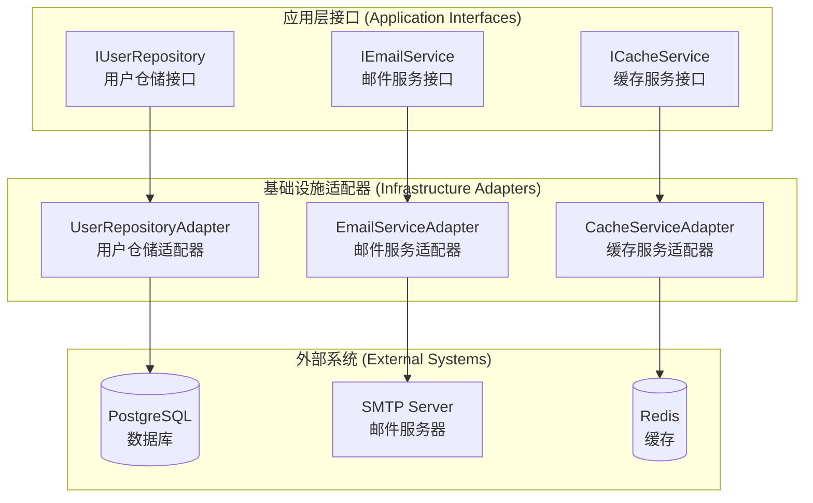

# 基础设施层开发指南

> **版本**: 1.0.0 | **创建日期**: 2025-01-27 | **模块**: packages/hybrid-archi

---

## 📋 目录

- [1. 基础设施层概述](#1-基础设施层概述)
- [2. 核心设计原则](#2-核心设计原则)
- [3. 适配器模式实现](#3-适配器模式实现)
- [4. 事件溯源与事件驱动架构](#4-事件溯源与事件驱动架构)
- [5. 开发实践](#5-开发实践)
- [6. 最佳实践](#6-最佳实践)
- [7. 常见问题](#7-常见问题)

---

## 1. 基础设施层概述

### 1.1 基础设施层定位

基础设施层是 Hybrid Architecture 的技术实现层，负责提供技术服务和外部系统集成。基础设施层应该：

- **技术实现集中**: 所有技术实现都在基础设施层
- **外部依赖隔离**: 隔离外部系统依赖
- **适配器模式**: 使用适配器模式实现接口适配
- **可替换性**: 支持技术实现的替换

### 1.2 基础设施层组件

```
基础设施层 (Infrastructure Layer)
├── 适配器 (Adapters)
│   ├── 端口适配器 (Port Adapters)
│   ├── 仓储适配器 (Repository Adapters)
│   ├── 服务适配器 (Service Adapters)
│   └── 事件存储适配器 (Event Store Adapters)
├── 事件溯源 (Event Sourcing)
│   ├── 事件存储实现 (Event Store Implementation)
│   └── 快照存储实现 (Snapshot Store Implementation)
├── 事件驱动架构 (Event-Driven Architecture)
│   ├── 死信队列 (Dead Letter Queue)
│   └── 事件监控 (Event Monitor)
├── 工厂 (Factories)
│   ├── 基础设施工厂 (Infrastructure Factory)
│   └── 基础设施管理器 (Infrastructure Manager)
└── 映射器 (Mappers)
    ├── 领域映射器 (Domain Mappers)
    └── DTO映射器 (DTO Mappers)
```

### 1.3 CQRS + ES + EDA 架构对基础设施层的要求

为了满足 CQRS + ES + EDA 的架构要求，基础设施层必须提供以下核心功能：

#### 1.3.1 事件溯源支持

**事件存储实现**:

- **事件持久化**: 支持事件的持久化存储
- **事件检索**: 支持事件的查询和检索
- **快照管理**: 支持聚合状态的快照机制
- **并发控制**: 支持乐观并发控制

#### 1.3.2 事件驱动支持

**消息队列实现**:

- **事件发布**: 支持事件的异步发布
- **事件订阅**: 支持事件的订阅和处理
- **死信队列**: 支持失败事件的处理
- **事件监控**: 支持事件的监控和统计

#### 1.3.3 多租户支持

**租户隔离**:

- **数据隔离**: 确保租户数据的物理隔离
- **缓存隔离**: 支持租户级别的缓存隔离
- **消息隔离**: 支持租户级别的消息隔离
- **监控隔离**: 支持租户级别的监控隔离

### 1.4 设计目标

- **技术实现集中**: 所有技术实现在基础设施层统一管理
- **接口适配**: 使用适配器模式实现接口适配
- **可替换性**: 支持技术实现的替换和升级
- **可维护性**: 代码结构清晰，易于维护
- **可测试性**: 每个组件都可以独立测试

---

## 2. 基础设施层架构图示

### 2.1 基础设施层整体架构

```mermaid
graph TB
    subgraph "基础设施层 (Infrastructure Layer)"
        subgraph "适配器 (Adapters)"
            PA[Port Adapters<br/>端口适配器]
            RA[Repository Adapters<br/>仓储适配器]
            SA[Service Adapters<br/>服务适配器]
            EA[Event Store Adapters<br/>事件存储适配器]
        end

        subgraph "事件溯源 (Event Sourcing)"
            ES[Event Store<br/>事件存储]
            SS[Snapshot Store<br/>快照存储]
        end

        subgraph "事件驱动架构 (EDA)"
            DLQ[Dead Letter Queue<br/>死信队列]
            EM[Event Monitor<br/>事件监控]
        end

        subgraph "工厂 (Factories)"
            IF[Infrastructure Factory<br/>基础设施工厂]
            IM[Infrastructure Manager<br/>基础设施管理器]
        end

        subgraph "映射器 (Mappers)"
            DM[Domain Mappers<br/>领域映射器]
            DTO[DTO Mappers<br/>DTO映射器]
        end
    end

    subgraph "应用层 (Application Layer)"
        CH[Command Handler<br/>命令处理器]
        QH[Query Handler<br/>查询处理器]
        EH[Event Handler<br/>事件处理器]
    end

    subgraph "领域层 (Domain Layer)"
        AR[Aggregate Root<br/>聚合根]
        DE[Domain Event<br/>领域事件]
    end

    subgraph "外部系统 (External Systems)"
        DB[Database<br/>数据库]
        MQ[Message Queue<br/>消息队列]
        CACHE[Cache<br/>缓存]
    end

    CH --> PA
    QH --> RA
    EH --> SA
    AR --> EA
    EA --> ES
    ES --> SS
    DE --> DLQ
    DE --> EM
    IF --> IM
    PA --> DB
    RA --> DB
    SA --> MQ
    EA --> CACHE
```



### 2.2 适配器模式架构



---

## 3. 适配器模式实现

### 3.1 适配器模式概述

**适配器模式 (Adapter Pattern)** 是基础设施层的核心实现机制：

```
应用层接口 → 基础设施适配器 → 外部系统
```

### 3.2 端口适配器实现

#### 3.2.1 日志端口适配器

```typescript
/**
 * 日志端口适配器
 *
 * @description 实现应用层日志接口，适配外部日志系统
 * @since 1.0.0
 */
@Injectable()
export class LoggerPortAdapter implements ILogger {
  constructor(
    private readonly pinoLogger: PinoLogger,
    private readonly config: LoggerConfig,
  ) {}

  /**
   * 记录调试日志
   *
   * @description 记录调试级别的日志信息
   * @param message - 日志消息
   * @param context - 日志上下文
   */
  debug(message: string, context?: any): void {
    this.pinoLogger.debug(message, context);
  }

  /**
   * 记录信息日志
   *
   * @description 记录信息级别的日志信息
   * @param message - 日志消息
   * @param context - 日志上下文
   */
  info(message: string, context?: any): void {
    this.pinoLogger.info(message, context);
  }

  /**
   * 记录警告日志
   *
   * @description 记录警告级别的日志信息
   * @param message - 日志消息
   * @param context - 日志上下文
   */
  warn(message: string, context?: any): void {
    this.pinoLogger.warn(message, context);
  }

  /**
   * 记录错误日志
   *
   * @description 记录错误级别的日志信息
   * @param message - 日志消息
   * @param error - 错误对象
   * @param context - 日志上下文
   */
  error(message: string, error?: Error, context?: any): void {
    this.pinoLogger.error(error, message, context);
  }
}
```

#### 3.2.2 ID生成器端口适配器

```typescript
/**
 * ID生成器端口适配器
 *
 * @description 实现应用层ID生成接口，适配外部ID生成系统
 * @since 1.0.0
 */
@Injectable()
export class IdGeneratorPortAdapter implements IIdGenerator {
  constructor(
    private readonly ulidGenerator: ULID,
    private readonly config: IdGeneratorConfig,
  ) {}

  /**
   * 生成唯一ID
   *
   * @description 生成全局唯一的标识符
   * @returns 唯一ID
   */
  generate(): string {
    return this.ulidGenerator.generate();
  }

  /**
   * 生成带前缀的ID
   *
   * @description 生成带指定前缀的唯一标识符
   * @param prefix - ID前缀
   * @returns 带前缀的唯一ID
   */
  generateWithPrefix(prefix: string): string {
    return `${prefix}_${this.generate()}`;
  }

  /**
   * 验证ID格式
   *
   * @description 验证ID是否符合格式要求
   * @param id - 待验证的ID
   * @returns 是否有效
   */
  isValid(id: string): boolean {
    return this.ulidGenerator.isValid(id);
  }
}
```

### 3.3 仓储适配器实现

#### 3.3.1 用户仓储适配器

```typescript
/**
 * 用户仓储适配器
 *
 * @description 实现领域层用户仓储接口，适配数据库存储
 * @since 1.0.0
 */
@Injectable()
export class UserRepositoryAdapter implements IUserRepository {
  constructor(
    private readonly databaseService: DatabaseService,
    private readonly mapper: UserMapper,
    private readonly logger: PinoLogger,
  ) {}

  /**
   * 保存用户
   *
   * @description 保存用户聚合到数据库
   * @param user - 用户聚合
   */
  async save(user: UserAggregate): Promise<void> {
    try {
      const userData = this.mapper.toPersistence(user);
      await this.databaseService.save("users", userData);

      this.logger.info("用户保存成功", { userId: user.getId() });
    } catch (error) {
      this.logger.error("用户保存失败", error, { userId: user.getId() });
      throw error;
    }
  }

  /**
   * 根据ID查找用户
   *
   * @description 从数据库查找指定ID的用户
   * @param id - 用户ID
   * @returns 用户聚合
   */
  async findById(id: EntityId): Promise<UserAggregate | null> {
    try {
      const userData = await this.databaseService.findById(
        "users",
        id.getValue(),
      );
      if (!userData) {
        return null;
      }

      return this.mapper.toDomain(userData);
    } catch (error) {
      this.logger.error("用户查找失败", error, { userId: id.getValue() });
      throw error;
    }
  }

  /**
   * 根据邮箱查找用户
   *
   * @description 从数据库查找指定邮箱的用户
   * @param email - 用户邮箱
   * @param tenantId - 租户ID
   * @returns 用户聚合
   */
  async findByEmail(
    email: Email,
    tenantId: EntityId,
  ): Promise<UserAggregate | null> {
    try {
      const userData = await this.databaseService.findOne("users", {
        email: email.getValue(),
        tenantId: tenantId.getValue(),
      });

      if (!userData) {
        return null;
      }

      return this.mapper.toDomain(userData);
    } catch (error) {
      this.logger.error("用户查找失败", error, {
        email: email.getValue(),
        tenantId: tenantId.getValue(),
      });
      throw error;
    }
  }
}
```

---

## 4. 事件溯源与事件驱动架构

### 4.1 事件存储实现

#### 4.1.1 事件存储适配器

```typescript
/**
 * 事件存储适配器
 *
 * @description 实现事件存储接口，支持事件溯源
 * @since 1.0.0
 */
@Injectable()
export class EventStoreAdapter implements IEventStore {
  constructor(
    private readonly eventStoreImplementation: EventStoreImplementation,
    private readonly logger: PinoLogger,
  ) {}

  /**
   * 保存事件
   *
   * @description 保存聚合的所有未提交事件
   * @param aggregateId - 聚合ID
   * @param events - 事件列表
   * @param expectedVersion - 期望的聚合版本号
   */
  async saveEvents(
    aggregateId: string,
    events: BaseDomainEvent[],
    expectedVersion: number,
  ): Promise<void> {
    try {
      await this.eventStoreImplementation.saveEvents(
        aggregateId,
        events,
        expectedVersion,
      );

      this.logger.info("事件保存成功", {
        aggregateId,
        eventCount: events.length,
        expectedVersion,
      });
    } catch (error) {
      this.logger.error("事件保存失败", error, {
        aggregateId,
        eventCount: events.length,
        expectedVersion,
      });
      throw error;
    }
  }

  /**
   * 获取聚合的所有事件
   *
   * @description 获取指定聚合的所有事件
   * @param aggregateId - 聚合ID
   * @returns 事件列表
   */
  async getEvents(aggregateId: string): Promise<BaseDomainEvent[]> {
    try {
      const events = await this.eventStoreImplementation.getEvents(aggregateId);

      this.logger.debug("事件获取成功", {
        aggregateId,
        eventCount: events.length,
      });

      return events;
    } catch (error) {
      this.logger.error("事件获取失败", error, { aggregateId });
      throw error;
    }
  }
}
```

### 4.2 事件驱动架构实现

#### 4.2.1 消息队列适配器

```typescript
/**
 * 消息队列适配器
 *
 * @description 实现消息队列接口，支持事件驱动架构
 * @since 1.0.0
 */
@Injectable()
export class MessageQueueAdapter implements IMessageQueue {
  constructor(
    private readonly messagingService: MessagingService,
    private readonly logger: PinoLogger,
  ) {}

  /**
   * 发布事件
   *
   * @description 发布领域事件到消息队列
   * @param event - 领域事件
   * @param options - 发布选项
   */
  async publishEvent(
    event: BaseDomainEvent,
    options?: PublishOptions,
  ): Promise<void> {
    try {
      await this.messagingService.publish(event.eventType, event, options);

      this.logger.info("事件发布成功", {
        eventType: event.eventType,
        eventId: event.eventId,
        aggregateId: event.aggregateId,
      });
    } catch (error) {
      this.logger.error("事件发布失败", error, {
        eventType: event.eventType,
        eventId: event.eventId,
        aggregateId: event.aggregateId,
      });
      throw error;
    }
  }

  /**
   * 订阅事件
   *
   * @description 订阅指定类型的事件
   * @param eventType - 事件类型
   * @param handler - 事件处理器
   */
  async subscribeEvent(
    eventType: string,
    handler: (event: BaseDomainEvent) => Promise<void>,
  ): Promise<void> {
    try {
      await this.messagingService.subscribe(eventType, handler);

      this.logger.info("事件订阅成功", { eventType });
    } catch (error) {
      this.logger.error("事件订阅失败", error, { eventType });
      throw error;
    }
  }
}
```

---

## 5. 开发实践

### 5.1 适配器开发

#### 5.1.1 适配器设计原则

**✅ 适配器应该做的**:

- 实现应用层或领域层接口
- 适配外部系统接口
- 处理技术实现细节
- 提供错误处理和重试机制
- 记录操作日志

**❌ 适配器不应该做的**:

- 包含业务逻辑
- 直接调用领域服务
- 发布领域事件
- 包含业务规则验证

#### 5.1.2 适配器实现模板

```typescript
/**
 * {功能}适配器
 *
 * @description 实现{接口}，适配{外部系统}
 * @since 1.0.0
 */
@Injectable()
export class {Function}Adapter implements I{Interface} {
  constructor(
    private readonly {externalService}: {ExternalService},
    private readonly logger: PinoLogger,
    private readonly config: {Config}
  ) {}

  /**
   * {方法描述}
   *
   * @description {详细描述}
   * @param {参数} - {参数说明}
   * @returns {返回值说明}
   */
  async {methodName}({parameters}): Promise<{returnType}> {
    try {
      // 1. 参数验证
      this.validateParameters({parameters});

      // 2. 调用外部服务
      const result = await this.{externalService}.{method}({parameters});

      // 3. 结果处理
      const processedResult = this.processResult(result);

      // 4. 记录日志
      this.logger.info('{操作}成功', { {parameters} });

      return processedResult;
    } catch (error) {
      // 错误处理
      this.logger.error('{操作}失败', error, { {parameters} });
      throw this.handleError(error);
    }
  }

  // 私有方法
  private validateParameters({parameters}): void {
    // 参数验证逻辑
  }

  private processResult(result: any): {returnType} {
    // 结果处理逻辑
  }

  private handleError(error: Error): Error {
    // 错误处理逻辑
  }
}
```

### 5.2 事件存储开发

#### 5.2.1 事件存储设计原则

**✅ 事件存储应该做的**:

- 持久化领域事件
- 支持事件查询和检索
- 提供并发控制
- 支持快照机制
- 提供统计信息

**❌ 事件存储不应该做的**:

- 修改事件内容
- 包含业务逻辑
- 直接处理领域事件
- 发布新的事件

#### 5.2.2 事件存储实现模板

```typescript
/**
 * 事件存储实现
 *
 * @description 提供完整的事件存储功能
 * @since 1.0.0
 */
@Injectable()
export class EventStoreImplementation implements IEventStore {
  constructor(
    private readonly databaseService: DatabaseService,
    private readonly cacheService: CacheService,
    private readonly logger: PinoLogger,
    private readonly config: EventStoreConfig,
  ) {}

  /**
   * 保存事件
   *
   * @description 保存聚合的所有未提交事件
   * @param aggregateId - 聚合ID
   * @param events - 事件列表
   * @param expectedVersion - 期望的聚合版本号
   */
  async saveEvents(
    aggregateId: string,
    events: BaseDomainEvent[],
    expectedVersion: number,
  ): Promise<void> {
    try {
      // 1. 验证事件
      this.validateEvents(events);

      // 2. 检查并发冲突
      await this.checkConcurrencyConflict(aggregateId, expectedVersion);

      // 3. 保存事件到数据库
      await this.saveEventsToDatabase(aggregateId, events, expectedVersion);

      // 4. 更新统计信息
      this.updateStats(events);

      // 5. 清理缓存
      await this.invalidateCache(aggregateId);

      this.logger.info("事件保存成功", {
        aggregateId,
        eventCount: events.length,
        expectedVersion,
      });
    } catch (error) {
      this.logger.error("事件保存失败", error, {
        aggregateId,
        eventCount: events.length,
        expectedVersion,
      });
      throw error;
    }
  }

  // 私有方法实现
  private validateEvents(events: BaseDomainEvent[]): void {
    // 事件验证逻辑
  }

  private async checkConcurrencyConflict(
    aggregateId: string,
    expectedVersion: number,
  ): Promise<void> {
    // 并发冲突检查逻辑
  }

  private async saveEventsToDatabase(
    aggregateId: string,
    events: BaseDomainEvent[],
    expectedVersion: number,
  ): Promise<void> {
    // 数据库保存逻辑
  }

  private updateStats(events: BaseDomainEvent[]): void {
    // 统计信息更新逻辑
  }

  private async invalidateCache(aggregateId: string): Promise<void> {
    // 缓存失效逻辑
  }
}
```

---

## 6. 最佳实践

### 6.1 适配器最佳实践

#### 6.1.1 接口适配

```typescript
// ✅ 正确：实现应用层接口
@Injectable()
export class UserRepositoryAdapter implements IUserRepository {
  async save(user: UserAggregate): Promise<void> {
    // 适配数据库存储
  }
}

// ❌ 错误：直接使用外部系统接口
@Injectable()
export class UserService {
  constructor(private readonly databaseService: DatabaseService) {}

  async saveUser(userData: any): Promise<void> {
    // ❌ 直接使用数据库服务，没有适配
    await this.databaseService.save("users", userData);
  }
}
```

#### 6.1.2 错误处理

```typescript
// ✅ 正确：统一的错误处理
@Injectable()
export class EmailServiceAdapter implements IEmailService {
  async sendEmail(email: Email): Promise<void> {
    try {
      await this.smtpService.send(email);
    } catch (error) {
      this.logger.error("邮件发送失败", error, { email: email.getValue() });
      throw new EmailSendFailedException("邮件发送失败", error);
    }
  }
}

// ❌ 错误：不处理异常
@Injectable()
export class EmailServiceAdapter implements IEmailService {
  async sendEmail(email: Email): Promise<void> {
    // ❌ 不处理异常，直接抛出
    await this.smtpService.send(email);
  }
}
```

### 6.2 事件存储最佳实践

#### 6.2.1 并发控制

```typescript
// ✅ 正确：乐观并发控制
@Injectable()
export class EventStoreImplementation implements IEventStore {
  async saveEvents(
    aggregateId: string,
    events: BaseDomainEvent[],
    expectedVersion: number,
  ): Promise<void> {
    // 检查版本冲突
    const currentVersion = await this.getAggregateVersion(aggregateId);
    if (currentVersion !== expectedVersion) {
      throw new ConcurrencyConflictException(
        `聚合 ${aggregateId} 版本冲突: 期望版本 ${expectedVersion}, 实际版本 ${currentVersion}`,
      );
    }

    // 保存事件
    await this.saveEventsToDatabase(aggregateId, events, expectedVersion);
  }
}
```

#### 6.2.2 性能优化

```typescript
// ✅ 正确：使用缓存优化性能
@Injectable()
export class EventStoreImplementation implements IEventStore {
  async getEvents(aggregateId: string): Promise<BaseDomainEvent[]> {
    // 1. 检查缓存
    const cachedEvents = await this.getCachedEvents(aggregateId);
    if (cachedEvents) {
      return cachedEvents;
    }

    // 2. 从数据库获取
    const events = await this.getEventsFromDatabase(aggregateId);

    // 3. 缓存结果
    await this.cacheEvents(aggregateId, events);

    return events;
  }
}
```

---

## 7. 常见问题

### 7.1 适配器接口不匹配

**问题**: 外部系统接口与应用层接口不匹配。

**解决方案**:

```typescript
// ✅ 正确：使用适配器模式
@Injectable()
export class UserRepositoryAdapter implements IUserRepository {
  constructor(private readonly databaseService: DatabaseService) {}

  async save(user: UserAggregate): Promise<void> {
    // 适配数据库接口到应用层接口
    const userData = this.mapToDatabaseFormat(user);
    await this.databaseService.save("users", userData);
  }

  private mapToDatabaseFormat(user: UserAggregate): any {
    // 映射逻辑
    return {
      id: user.getId().getValue(),
      email: user.getEmail().getValue(),
      // ... 其他字段映射
    };
  }
}
```

### 7.2 事件存储性能问题

**问题**: 事件存储查询性能差，影响系统性能。

**解决方案**:

```typescript
// ✅ 正确：使用快照和缓存优化
@Injectable()
export class EventStoreImplementation implements IEventStore {
  async getEvents(aggregateId: string): Promise<BaseDomainEvent[]> {
    // 1. 检查快照
    const snapshot = await this.getSnapshot(aggregateId);
    if (snapshot) {
      // 从快照版本开始获取事件
      return await this.getEventsFromVersion(aggregateId, snapshot.version);
    }

    // 2. 检查缓存
    const cachedEvents = await this.getCachedEvents(aggregateId);
    if (cachedEvents) {
      return cachedEvents;
    }

    // 3. 从数据库获取
    const events = await this.getEventsFromDatabase(aggregateId);
    await this.cacheEvents(aggregateId, events);

    return events;
  }
}
```

### 7.3 外部系统依赖问题

**问题**: 外部系统不可用导致整个系统不可用。

**解决方案**:

```typescript
// ✅ 正确：使用断路器模式
@Injectable()
export class EmailServiceAdapter implements IEmailService {
  constructor(
    private readonly smtpService: SmtpService,
    private readonly circuitBreaker: CircuitBreaker,
  ) {}

  async sendEmail(email: Email): Promise<void> {
    return this.circuitBreaker.execute(async () => {
      await this.smtpService.send(email);
    });
  }
}
```

---

## 🎯 总结

基础设施层开发指南提供了：

1. **核心设计原则**: 适配器模式、事件溯源、事件驱动架构
2. **适配器模式实现**: 端口适配器、仓储适配器、服务适配器
3. **事件溯源与事件驱动**: 事件存储、消息队列、死信队列
4. **开发实践**: 具体的开发方法和技巧
5. **最佳实践**: 正确做法和错误做法的对比
6. **常见问题**: 常见问题的解决方案

通过遵循这个指南，可以确保基础设施层的代码质量，提高系统的可维护性和可扩展性。

---

**相关文档**:

- [术语解释](./definition-of-terms.md)
- [技术设计总览](./01-HYBRID_ARCHITECTURE_OVERVIEW.md)
- [架构模式详细设计](./02-ARCHITECTURE_PATTERNS_DETAIL.md)
- [应用指南](./03-APPLICATION_GUIDE.md)
- [用户管理模块应用示例](./04-USER_MANAGEMENT_EXAMPLE.md)
- [最佳实践和故障排除](./05-BEST_PRACTICES_TROUBLESHOOTING.md)
- [领域层开发指南](./06-DOMAIN_LAYER_DEVELOPMENT_GUIDE.md)
- [应用层开发指南](./07-APPLICATION_LAYER_DEVELOPMENT_GUIDE.md)
