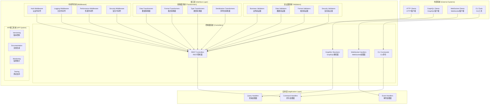
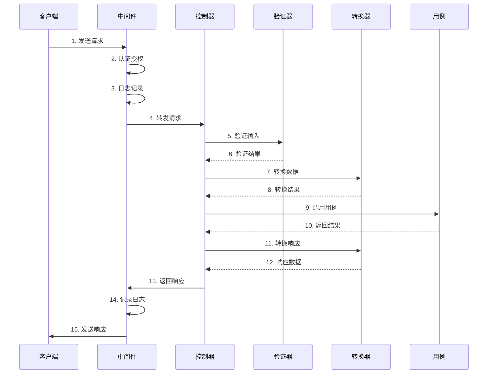

# 接口层开发指南

> **版本**: 1.0.0 | **创建日期**: 2025-01-27 | **模块**: packages/hybrid-archi

---

## 📋 目录

- [1. 接口层概述](#1-接口层概述)
- [2. 核心设计原则](#2-核心设计原则)
- [3. 控制器系统](#3-控制器系统)
- [4. API接口系统](#4-api接口系统)
- [5. GraphQL系统](#5-graphql系统)
- [6. WebSocket系统](#6-websocket系统)
- [7. 验证器和转换器](#7-验证器和转换器)
- [8. 开发实践](#8-开发实践)
- [9. 最佳实践](#9-最佳实践)
- [10. 常见问题](#10-常见问题)

---

## 1. 接口层概述

### 1.1 接口层定位

接口层是 Hybrid Architecture 的用户交互层，负责处理外部请求和响应。接口层应该：

- **协议适配**: 适配不同的通信协议（HTTP、GraphQL、WebSocket等）
- **请求处理**: 处理用户请求并转换为应用层可理解的格式
- **响应格式化**: 将应用层结果格式化为用户可理解的响应
- **安全控制**: 提供认证、授权、输入验证等安全功能

### 1.2 接口层组件

```
接口层 (Interface Layer)
├── 控制器系统 (Controllers)
│   ├── REST控制器 (REST Controllers)
│   ├── GraphQL解析器 (GraphQL Resolvers)
│   ├── WebSocket处理器 (WebSocket Handlers)
│   └── CLI命令 (CLI Commands)
├── API接口系统 (API System)
│   ├── 版本控制 (Versioning)
│   ├── 文档生成 (Documentation)
│   ├── 监控统计 (Monitoring)
│   └── 测试支持 (Testing)
├── 验证器系统 (Validators)
│   ├── 业务验证器 (Business Validators)
│   ├── 数据验证器 (Data Validators)
│   ├── 格式验证器 (Format Validators)
│   └── 安全验证器 (Security Validators)
├── 转换器系统 (Transformers)
│   ├── 数据转换器 (Data Transformers)
│   ├── 格式转换器 (Format Transformers)
│   ├── 类型转换器 (Type Transformers)
│   └── 序列化转换器 (Serialization Transformers)
├── 中间件系统 (Middleware)
│   ├── 认证中间件 (Auth Middleware)
│   ├── 日志中间件 (Logging Middleware)
│   ├── 性能中间件 (Performance Middleware)
│   └── 安全中间件 (Security Middleware)
└── 装饰器系统 (Decorators)
    ├── 验证装饰器 (Validation Decorators)
    ├── 缓存装饰器 (Cache Decorators)
    ├── 权限装饰器 (Permission Decorators)
    └── 监控装饰器 (Monitoring Decorators)
```

### 1.3 CQRS + ES + EDA 架构对接口层的要求

为了满足 CQRS + ES + EDA 的架构要求，接口层必须提供以下核心功能：

#### 1.3.1 命令查询分离支持

**接口分离**:

- **命令接口**: 处理写操作，返回命令执行结果
- **查询接口**: 处理读操作，返回查询结果
- **事件接口**: 处理事件订阅和推送

#### 1.3.2 多协议支持

**协议适配**:

- **REST API**: 支持标准的RESTful接口
- **GraphQL**: 支持灵活的查询和变更
- **WebSocket**: 支持实时通信和事件推送
- **CLI**: 支持命令行工具和脚本

#### 1.3.3 多租户支持

**租户隔离**:

- **租户识别**: 从请求中识别租户信息
- **数据隔离**: 确保租户数据的安全隔离
- **权限控制**: 基于租户的权限验证

### 1.4 设计目标

- **协议无关**: 支持多种通信协议
- **安全可靠**: 提供完整的安全保障
- **高性能**: 优化请求处理性能
- **可扩展**: 支持新协议和功能的扩展
- **可维护**: 代码结构清晰，易于维护

---

## 2. 接口层架构图示

### 2.1 接口层整体架构



### 2.2 请求处理流程



---

## 3. 控制器系统

### 3.1 基础控制器

#### 3.1.1 BaseController 设计

```typescript
/**
 * 基础REST控制器
 *
 * @description 为所有REST控制器提供通用功能和基础结构
 * 遵循"协议适配服务业务用例"的核心原则，专注于HTTP协议适配
 *
 * ## 业务规则
 *
 * ### 协议适配规则
 * - 控制器只负责HTTP协议适配，不处理业务逻辑
 * - 通过DTO转换实现协议与业务用例的解耦
 * - 统一的请求/响应格式和错误处理
 *
 * ### 安全规则
 * - 所有控制器默认启用认证和授权
 * - 支持租户隔离和数据权限控制
 * - 统一的输入验证和安全过滤
 *
 * ### 性能规则
 * - 支持缓存控制和性能监控
 * - 统一的日志记录和指标统计
 * - 请求追踪和性能分析
 *
 * @example
 * ```typescript
 * @Controller('users')
 * @UseGuards(JwtAuthGuard, TenantIsolationGuard)
 * @UseInterceptors(LoggingInterceptor, PerformanceInterceptor)
 * export class UserController extends BaseController {
 *   constructor(
 *     private readonly registerUserUseCase: RegisterUserUseCase,
 *     private readonly logger: ILoggerService
 *   ) {
 *     super(logger);
 *   }
 *
 *   @Post()
 *   async createUser(@Body() createUserDto: CreateUserDto): Promise<UserResponseDto> {
 *     return this.handleRequest(
 *       createUserDto,
 *       (dto) => this.registerUserUseCase.execute(dto.toUseCaseRequest(this.getRequestContext()))
 *     );
 *   }
 * }
 * ```
 *
 * @since 1.0.0
 */
export abstract class BaseController {
  protected readonly requestId: string;
  protected readonly correlationId: string;
  protected readonly startTime: number;

  constructor(
    protected readonly logger: ILoggerService,
    protected readonly metricsService?: IMetricsService
  ) {
    this.requestId = this.generateRequestId();
    this.correlationId = this.generateCorrelationId();
    this.startTime = Date.now();
  }

  /**
   * 统一请求处理
   *
   * @description 为所有控制器方法提供统一的请求处理流程
   * 包括日志记录、性能监控、错误处理等横切关注点
   *
   * @param input - 输入数据
   * @param useCaseExecutor - 用例执行器
   * @param operationName - 操作名称（用于日志和监控）
   * @returns 处理结果
   */
  protected async handleRequest<TInput, TOutput>(
    input: TInput,
    useCaseExecutor: (input: TInput) => Promise<TOutput>,
    operationName = 'unknown'
  ): Promise<TOutput> {
    this.getRequestContext();

    this.logger.info(`开始处理${operationName}请求`, {
      requestId: this.requestId,
      correlationId: this.correlationId,
      operation: operationName,
      input: this.sanitizeInput(input),
    });

    try {
      // 执行用例
      const result = await useCaseExecutor(input);

      // 记录成功日志和指标
      this.logSuccess(operationName, result);

      return result;
    } catch (error) {
      // 记录错误日志和指标
      this.logError(operationName, error);

      throw error;
    }
  }

  /**
   * 获取请求上下文
   *
   * @description 获取当前请求的上下文信息
   * 包括用户信息、租户信息、追踪信息等
   *
   * @returns 请求上下文
   */
  protected getRequestContext(): RequestContext {
    // 这里应该从请求中提取上下文信息
    // 实际实现中会从装饰器或中间件中获取
    return {
      requestId: this.requestId,
      correlationId: this.correlationId,
      userId: 'current-user-id',
      tenantId: 'current-tenant-id',
      timestamp: new Date(),
    };
  }

  // 其他方法实现...
}
```

#### 3.1.2 控制器实现示例

```typescript
/**
 * 用户控制器
 *
 * @description 处理用户相关的HTTP请求
 * @since 1.0.0
 */
@Controller('users')
@UseGuards(JwtAuthGuard, TenantIsolationGuard)
@UseInterceptors(LoggingInterceptor, PerformanceInterceptor)
export class UserController extends BaseController {
  constructor(
    private readonly registerUserUseCase: RegisterUserUseCase,
    private readonly updateUserProfileUseCase: UpdateUserProfileUseCase,
    private readonly getUserProfileUseCase: GetUserProfileUseCase,
    private readonly logger: ILoggerService,
    private readonly metricsService: IMetricsService
  ) {
    super(logger, metricsService);
  }

  /**
   * 创建用户
   *
   * @description 处理用户注册请求
   * @param createUserDto - 创建用户DTO
   * @returns 用户响应DTO
   */
  @Post()
  @UsePipes(ValidationPipe)
  async createUser(@Body() createUserDto: CreateUserDto): Promise<UserResponseDto> {
    return this.handleRequest(
      createUserDto,
      (dto) => this.registerUserUseCase.execute(dto.toUseCaseRequest(this.getRequestContext())),
      'createUser'
    );
  }

  /**
   * 更新用户资料
   *
   * @description 处理用户资料更新请求
   * @param id - 用户ID
   * @param updateUserDto - 更新用户DTO
   * @returns 用户响应DTO
   */
  @Put(':id')
  @UsePipes(ValidationPipe)
  async updateUser(
    @Param('id') id: string,
    @Body() updateUserDto: UpdateUserDto
  ): Promise<UserResponseDto> {
    return this.handleRequest(
      { id, ...updateUserDto },
      (input) => this.updateUserProfileUseCase.execute(input.toUseCaseRequest(this.getRequestContext())),
      'updateUser'
    );
  }

  /**
   * 获取用户资料
   *
   * @description 处理用户资料查询请求
   * @param id - 用户ID
   * @returns 用户响应DTO
   */
  @Get(':id')
  async getUser(@Param('id') id: string): Promise<UserResponseDto> {
    return this.handleRequest(
      { id },
      (input) => this.getUserProfileUseCase.execute(input.toUseCaseRequest(this.getRequestContext())),
      'getUser'
    );
  }
}
```

---

## 4. API接口系统

### 4.1 API版本控制

#### 4.1.1 版本控制策略

```typescript
/**
 * API版本控制
 *
 * @description 提供API版本管理功能
 * @since 1.0.0
 */
@Injectable()
export class ApiVersioningService {
  /**
   * 获取API版本
   *
   * @description 从请求中提取API版本信息
   * @param request - HTTP请求
   * @returns API版本
   */
  getVersion(request: Request): string {
    // 从Header中获取版本
    const headerVersion = request.headers['api-version'];
    if (headerVersion) {
      return headerVersion as string;
    }

    // 从URL路径中获取版本
    const pathVersion = request.url.match(/\/v(\d+)\//);
    if (pathVersion) {
      return `v${pathVersion[1]}`;
    }

    // 从查询参数中获取版本
    const queryVersion = request.query['version'];
    if (queryVersion) {
      return queryVersion as string;
    }

    // 返回默认版本
    return 'v1';
  }

  /**
   * 验证版本兼容性
   *
   * @description 验证请求版本是否兼容
   * @param requestedVersion - 请求的版本
   * @param supportedVersions - 支持的版本列表
   * @returns 是否兼容
   */
  isVersionCompatible(requestedVersion: string, supportedVersions: string[]): boolean {
    return supportedVersions.includes(requestedVersion);
  }
}
```

### 4.2 API文档生成

#### 4.2.1 文档生成服务

```typescript
/**
 * API文档生成服务
 *
 * @description 自动生成API文档
 * @since 1.0.0
 */
@Injectable()
export class ApiDocumentationService {
  /**
   * 生成OpenAPI文档
   *
   * @description 生成OpenAPI 3.0规范的API文档
   * @param controllers - 控制器列表
   * @returns OpenAPI文档
   */
  generateOpenAPIDocument(controllers: any[]): OpenAPIDocument {
    const document: OpenAPIDocument = {
      openapi: '3.0.0',
      info: {
        title: 'Hybrid Architecture API',
        version: '1.0.0',
        description: 'Hybrid Architecture API Documentation',
      },
      paths: {},
      components: {
        schemas: {},
        securitySchemes: {
          bearerAuth: {
            type: 'http',
            scheme: 'bearer',
            bearerFormat: 'JWT',
          },
        },
      },
    };

    // 处理每个控制器
    controllers.forEach(controller => {
      this.processController(controller, document);
    });

    return document;
  }

  /**
   * 处理控制器
   *
   * @description 处理单个控制器的文档生成
   * @param controller - 控制器实例
   * @param document - OpenAPI文档
   */
  private processController(controller: any, document: OpenAPIDocument): void {
    // 实现控制器处理方法
    // 提取路由、参数、响应等信息
  }
}
```

---

## 5. GraphQL系统

### 5.1 GraphQL解析器

#### 5.1.1 基础解析器

```typescript
/**
 * 基础GraphQL解析器
 *
 * @description 为所有GraphQL解析器提供通用功能
 * @since 1.0.0
 */
export abstract class BaseResolver {
  protected readonly requestId: string;
  protected readonly correlationId: string;

  constructor(
    protected readonly logger: ILoggerService,
    protected readonly metricsService?: IMetricsService
  ) {
    this.requestId = this.generateRequestId();
    this.correlationId = this.generateCorrelationId();
  }

  /**
   * 统一解析器处理
   *
   * @description 为所有解析器方法提供统一的处理流程
   * @param args - 解析器参数
   * @param context - GraphQL上下文
   * @param info - GraphQL信息
   * @param resolver - 解析器函数
   * @param operationName - 操作名称
   * @returns 解析结果
   */
  protected async handleResolver<TArgs, TOutput>(
    args: TArgs,
    context: IGraphQLContext,
    info: GraphQLResolveInfo,
    resolver: (args: TArgs, context: IGraphQLContext) => Promise<TOutput>,
    operationName: string
  ): Promise<TOutput> {
    this.logger.info(`开始处理GraphQL ${operationName}操作`, {
      requestId: this.requestId,
      correlationId: this.correlationId,
      operation: operationName,
      args: this.sanitizeArgs(args),
    });

    try {
      const result = await resolver(args, context);

      this.logger.info(`GraphQL ${operationName}操作成功`, {
        requestId: this.requestId,
        correlationId: this.correlationId,
        operation: operationName,
      });

      return result;
    } catch (error) {
      this.logger.error(`GraphQL ${operationName}操作失败`, {
        requestId: this.requestId,
        correlationId: this.correlationId,
        operation: operationName,
        error: error instanceof Error ? error.message : String(error),
      });

      throw error;
    }
  }

  // 其他方法实现...
}
```

#### 5.1.2 用户解析器示例

```typescript
/**
 * 用户GraphQL解析器
 *
 * @description 处理用户相关的GraphQL查询和变更
 * @since 1.0.0
 */
@Resolver(() => User)
export class UserResolver extends BaseResolver {
  constructor(
    private readonly registerUserUseCase: RegisterUserUseCase,
    private readonly getUserProfileUseCase: GetUserProfileUseCase,
    logger: ILoggerService,
    metricsService: IMetricsService
  ) {
    super(logger, metricsService);
  }

  /**
   * 创建用户
   *
   * @description 处理用户创建变更
   * @param args - 创建用户参数
   * @param context - GraphQL上下文
   * @returns 用户对象
   */
  @Mutation(() => User)
  async createUser(
    @Args('input') args: CreateUserInput,
    @Context() context: IGraphQLContext
  ): Promise<User> {
    return this.handleResolver(
      args,
      context,
      {} as GraphQLResolveInfo,
      (input, ctx) => this.registerUserUseCase.execute(input.toUseCaseRequest(ctx)),
      'createUser'
    );
  }

  /**
   * 获取用户
   *
   * @description 处理用户查询
   * @param id - 用户ID
   * @param context - GraphQL上下文
   * @returns 用户对象
   */
  @Query(() => User)
  async user(
    @Args('id') id: string,
    @Context() context: IGraphQLContext
  ): Promise<User> {
    return this.handleResolver(
      { id },
      context,
      {} as GraphQLResolveInfo,
      (input, ctx) => this.getUserProfileUseCase.execute(input.toUseCaseRequest(ctx)),
      'getUser'
    );
  }
}
```

---

## 6. WebSocket系统

### 6.1 WebSocket处理器

#### 6.1.1 基础WebSocket处理器

```typescript
/**
 * 基础WebSocket处理器
 *
 * @description 为所有WebSocket处理器提供通用功能
 * @since 1.0.0
 */
export abstract class BaseWebSocketHandler {
  protected readonly connectionId: string;
  protected readonly startTime: number;

  constructor(
    protected readonly logger: ILoggerService,
    protected readonly metricsService?: IMetricsService
  ) {
    this.connectionId = this.generateConnectionId();
    this.startTime = Date.now();
  }

  /**
   * 统一消息处理
   *
   * @description 为所有WebSocket消息提供统一的处理流程
   * @param message - WebSocket消息
   * @param context - WebSocket上下文
   * @param handler - 消息处理器
   * @param messageType - 消息类型
   * @returns 处理结果
   */
  protected async handleMessage<TMessage, TOutput>(
    message: TMessage,
    context: IWebSocketContext,
    handler: (message: TMessage, context: IWebSocketContext) => Promise<TOutput>,
    messageType: string
  ): Promise<TOutput> {
    this.logger.info(`开始处理WebSocket ${messageType}消息`, {
      connectionId: this.connectionId,
      messageType,
      context: this.sanitizeContext(context),
    });

    try {
      const result = await handler(message, context);

      this.logger.info(`WebSocket ${messageType}消息处理成功`, {
        connectionId: this.connectionId,
        messageType,
      });

      return result;
    } catch (error) {
      this.logger.error(`WebSocket ${messageType}消息处理失败`, {
        connectionId: this.connectionId,
        messageType,
        error: error instanceof Error ? error.message : String(error),
      });

      throw error;
    }
  }

  // 其他方法实现...
}
```

---

## 7. 验证器和转换器

### 7.1 数据转换器

#### 7.1.1 DataTransformer 实现

```typescript
/**
 * 数据转换器
 *
 * @description 为接口层提供数据转换功能
 * 支持DTO转换、类型转换、格式转换等
 *
 * @since 1.0.0
 */
export class DataTransformer {
  /**
   * 转换为DTO
   *
   * @description 将领域对象转换为DTO对象
   *
   * @param domainObject - 领域对象
   * @param dtoClass - DTO类
   * @returns DTO对象
   */
  static toDTO<TDomain, TDTO extends object>(
    domainObject: TDomain,
    dtoClass: new () => TDTO
  ): TDTO {
    const dto = new dtoClass();

    // 复制属性
    Object.keys(domainObject as any).forEach((key) => {
      if (key in dto) {
        (dto as any)[key] = (domainObject as any)[key];
      }
    });

    return dto;
  }

  /**
   * 转换为领域对象
   *
   * @description 将DTO对象转换为领域对象
   *
   * @param dto - DTO对象
   * @param domainClass - 领域类
   * @returns 领域对象
   */
  static toDomain<TDTO, TDomain>(
    dto: TDTO,
    domainClass: new (...args: any[]) => TDomain
  ): TDomain {
    // 这里应该根据具体的领域类构造函数进行转换
    // 实际实现中会调用领域类的工厂方法
    return new domainClass();
  }

  /**
   * 转换为JSON
   *
   * @description 将对象转换为JSON字符串
   *
   * @param obj - 要转换的对象
   * @param pretty - 是否格式化
   * @returns JSON字符串
   */
  static toJSON(obj: any, pretty = false): string {
    return pretty ? JSON.stringify(obj, null, 2) : JSON.stringify(obj);
  }

  /**
   * 从JSON转换
   *
   * @description 将JSON字符串转换为对象
   *
   * @param json - JSON字符串
   * @param targetClass - 目标类
   * @returns 转换后的对象
   */
  static fromJSON<T extends object>(
    json: string,
    targetClass?: new () => T
  ): T | any {
    const obj = JSON.parse(json);

    if (targetClass) {
      return Object.assign(new targetClass(), obj);
    }

    return obj;
  }

  /**
   * 转换为查询参数
   *
   * @description 将对象转换为URL查询参数
   *
   * @param obj - 要转换的对象
   * @returns 查询参数字符串
   */
  static toQueryString(obj: Record<string, any>): string {
    const params = new URLSearchParams();

    Object.keys(obj).forEach((key) => {
      const value = obj[key];
      if (value !== null && value !== undefined) {
        params.append(key, String(value));
      }
    });

    return params.toString();
  }

  /**
   * 从查询参数转换
   *
   * @description 将URL查询参数转换为对象
   *
   * @param queryString - 查询参数字符串
   * @returns 转换后的对象
   */
  static fromQueryString(queryString: string): Record<string, string> {
    const params = new URLSearchParams(queryString);
    const obj: Record<string, string> = {};

    params.forEach((value, key) => {
      obj[key] = value;
    });

    return obj;
  }
}
```

---

## 8. 开发实践

### 8.1 控制器开发

#### 8.1.1 控制器设计原则

**✅ 控制器应该做的**:

- 处理HTTP协议适配
- 验证输入参数
- 转换请求和响应数据
- 调用应用层用例
- 处理异常和错误

**❌ 控制器不应该做的**:

- 包含业务逻辑
- 直接访问数据库
- 处理复杂的业务规则
- 发布领域事件

#### 8.1.2 控制器实现模板

```typescript
/**
 * {功能}控制器
 *
 * @description 处理{功能}相关的HTTP请求
 * @since 1.0.0
 */
@Controller('{resource}')
@UseGuards(JwtAuthGuard, TenantIsolationGuard)
@UseInterceptors(LoggingInterceptor, PerformanceInterceptor)
export class {Function}Controller extends BaseController {
  constructor(
    private readonly {useCase}: {UseCase},
    private readonly logger: ILoggerService,
    private readonly metricsService: IMetricsService
  ) {
    super(logger, metricsService);
  }

  /**
   * {方法描述}
   *
   * @description {详细描述}
   * @param {参数} - {参数说明}
   * @returns {返回值说明}
   */
  @{HttpMethod}('{path}')
  @UsePipes(ValidationPipe)
  async {methodName}(@Body() {dto}: {Dto}): Promise<{ResponseDto}> {
    return this.handleRequest(
      {dto},
      (input) => this.{useCase}.execute(input.toUseCaseRequest(this.getRequestContext())),
      '{operationName}'
    );
  }
}
```

### 8.2 GraphQL开发

#### 8.2.1 GraphQL解析器设计原则

**✅ 解析器应该做的**:

- 处理GraphQL查询和变更
- 验证输入参数
- 调用应用层用例
- 处理GraphQL特定的错误

**❌ 解析器不应该做的**:

- 包含业务逻辑
- 直接访问数据库
- 处理HTTP特定的功能

#### 8.2.2 GraphQL解析器实现模板

```typescript
/**
 * {功能}GraphQL解析器
 *
 * @description 处理{功能}相关的GraphQL查询和变更
 * @since 1.0.0
 */
@Resolver(() => {Type})
export class {Function}Resolver extends BaseResolver {
  constructor(
    private readonly {useCase}: {UseCase},
    logger: ILoggerService,
    metricsService: IMetricsService
  ) {
    super(logger, metricsService);
  }

  /**
   * {方法描述}
   *
   * @description {详细描述}
   * @param args - {参数说明}
   * @param context - GraphQL上下文
   * @returns {返回值说明}
   */
  @{Operation}(() => {ReturnType})
  async {methodName}(
    @Args('input') args: {InputType},
    @Context() context: IGraphQLContext
  ): Promise<{ReturnType}> {
    return this.handleResolver(
      args,
      context,
      {} as GraphQLResolveInfo,
      (input, ctx) => this.{useCase}.execute(input.toUseCaseRequest(ctx)),
      '{operationName}'
    );
  }
}
```

---

## 9. 最佳实践

### 9.1 控制器最佳实践

#### 9.1.1 统一请求处理

```typescript
// ✅ 正确：使用统一的请求处理
@Controller('users')
export class UserController extends BaseController {
  @Post()
  async createUser(@Body() createUserDto: CreateUserDto): Promise<UserResponseDto> {
    return this.handleRequest(
      createUserDto,
      (dto) => this.registerUserUseCase.execute(dto.toUseCaseRequest(this.getRequestContext())),
      'createUser'
    );
  }
}

// ❌ 错误：直接处理请求
@Controller('users')
export class UserController {
  @Post()
  async createUser(@Body() createUserDto: CreateUserDto): Promise<UserResponseDto> {
    // ❌ 没有统一的错误处理和日志记录
    const result = await this.registerUserUseCase.execute(createUserDto);
    return result;
  }
}
```

#### 9.1.2 输入验证

```typescript
// ✅ 正确：使用验证管道
@Controller('users')
export class UserController extends BaseController {
  @Post()
  @UsePipes(ValidationPipe)
  async createUser(@Body() createUserDto: CreateUserDto): Promise<UserResponseDto> {
    return this.handleRequest(
      createUserDto,
      (dto) => this.registerUserUseCase.execute(dto.toUseCaseRequest(this.getRequestContext())),
      'createUser'
    );
  }
}

// ❌ 错误：没有输入验证
@Controller('users')
export class UserController extends BaseController {
  @Post()
  async createUser(@Body() createUserDto: any): Promise<UserResponseDto> {
    // ❌ 没有验证输入数据
    return this.handleRequest(
      createUserDto,
      (dto) => this.registerUserUseCase.execute(dto),
      'createUser'
    );
  }
}
```

### 9.2 GraphQL最佳实践

#### 9.2.1 类型安全

```typescript
// ✅ 正确：使用强类型
@Resolver(() => User)
export class UserResolver extends BaseResolver {
  @Query(() => User)
  async user(
    @Args('id', { type: () => String }) id: string,
    @Context() context: IGraphQLContext
  ): Promise<User> {
    return this.handleResolver(
      { id },
      context,
      {} as GraphQLResolveInfo,
      (input, ctx) => this.getUserProfileUseCase.execute(input.toUseCaseRequest(ctx)),
      'getUser'
    );
  }
}

// ❌ 错误：使用弱类型
@Resolver(() => User)
export class UserResolver extends BaseResolver {
  @Query(() => User)
  async user(
    @Args('id') id: any, // ❌ 使用any类型
    @Context() context: any // ❌ 使用any类型
  ): Promise<any> { // ❌ 使用any类型
    return this.getUserProfileUseCase.execute({ id });
  }
}
```

---

## 10. 常见问题

### 10.1 控制器职责不清

**问题**: 控制器包含业务逻辑，职责不清晰。

**解决方案**:

```typescript
// ✅ 正确：控制器只负责协议适配
@Controller('users')
export class UserController extends BaseController {
  @Post()
  async createUser(@Body() createUserDto: CreateUserDto): Promise<UserResponseDto> {
    return this.handleRequest(
      createUserDto,
      (dto) => this.registerUserUseCase.execute(dto.toUseCaseRequest(this.getRequestContext())),
      'createUser'
    );
  }
}

// ❌ 错误：控制器包含业务逻辑
@Controller('users')
export class UserController extends BaseController {
  @Post()
  async createUser(@Body() createUserDto: CreateUserDto): Promise<UserResponseDto> {
    // ❌ 业务逻辑应该在用例中
    if (createUserDto.email.includes('@')) {
      const user = await this.userRepository.save(createUserDto);
      return new UserResponseDto(user);
    }
    throw new Error('Invalid email');
  }
}
```

### 10.2 输入验证不完整

**问题**: 输入验证不完整，存在安全风险。

**解决方案**:

```typescript
// ✅ 正确：完整的输入验证
@Controller('users')
export class UserController extends BaseController {
  @Post()
  @UsePipes(ValidationPipe)
  async createUser(@Body() createUserDto: CreateUserDto): Promise<UserResponseDto> {
    return this.handleRequest(
      createUserDto,
      (dto) => this.registerUserUseCase.execute(dto.toUseCaseRequest(this.getRequestContext())),
      'createUser'
    );
  }
}

// DTO验证
export class CreateUserDto {
  @IsEmail()
  @IsNotEmpty()
  email: string;

  @IsString()
  @MinLength(8)
  @MaxLength(50)
  password: string;

  @IsString()
  @IsNotEmpty()
  name: string;
}
```

### 10.3 错误处理不统一

**问题**: 错误处理不统一，用户体验差。

**解决方案**:

```typescript
// ✅ 正确：统一的错误处理
@Controller('users')
export class UserController extends BaseController {
  @Post()
  async createUser(@Body() createUserDto: CreateUserDto): Promise<UserResponseDto> {
    return this.handleRequest(
      createUserDto,
      (dto) => this.registerUserUseCase.execute(dto.toUseCaseRequest(this.getRequestContext())),
      'createUser'
    );
  }
}

// 全局异常过滤器
@Catch()
export class GlobalExceptionFilter implements ExceptionFilter {
  catch(exception: unknown, host: ArgumentsHost) {
    const ctx = host.switchToHttp();
    const response = ctx.getResponse();
    const request = ctx.getRequest();

    const status = exception instanceof HttpException 
      ? exception.getStatus() 
      : HttpStatus.INTERNAL_SERVER_ERROR;

    response.status(status).json({
      statusCode: status,
      timestamp: new Date().toISOString(),
      path: request.url,
      message: exception instanceof Error ? exception.message : 'Internal server error',
    });
  }
}
```

---

## 🎯 总结

接口层开发指南提供了：

1. **核心设计原则**: 协议适配、安全控制、性能优化
2. **控制器系统**: REST控制器、GraphQL解析器、WebSocket处理器
3. **API接口系统**: 版本控制、文档生成、监控统计
4. **验证器和转换器**: 数据验证、格式转换、类型转换
5. **开发实践**: 具体的开发方法和技巧
6. **最佳实践**: 正确做法和错误做法的对比
7. **常见问题**: 常见问题的解决方案

通过遵循这个指南，可以确保接口层的代码质量，提高系统的可维护性和用户体验。

---

**相关文档**:

- [术语解释](./definition-of-terms.md)
- [技术设计总览](./01-HYBRID_ARCHITECTURE_OVERVIEW.md)
- [架构模式详细设计](./02-ARCHITECTURE_PATTERNS_DETAIL.md)
- [应用指南](./03-APPLICATION_GUIDE.md)
- [用户管理模块应用示例](./04-USER_MANAGEMENT_EXAMPLE.md)
- [最佳实践和故障排除](./05-BEST_PRACTICES_TROUBLESHOOTING.md)
- [领域层开发指南](./06-DOMAIN_LAYER_DEVELOPMENT_GUIDE.md)
- [应用层开发指南](./07-APPLICATION_LAYER_DEVELOPMENT_GUIDE.md)
- [基础设施层开发指南](./08-INFRASTRUCTURE_LAYER_DEVELOPMENT_GUIDE.md)
