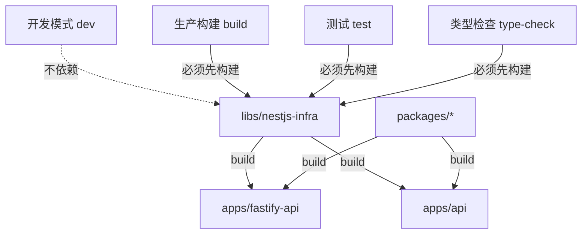

# Turborepo 构建顺序说明

## 📋 任务依赖关系图



## 🎯 任务执行顺序

### 1. `build` - 生产构建

**执行顺序**：

```
1. libs/nestjs-infra (build)
2. packages/* (build)  
3. apps/fastify-api (build)
4. apps/api (build)
```

**依赖配置**：

```json
{
  "dependsOn": ["^build"]  // ^ 表示先构建所有依赖项
}
```

**使用场景**：

- 生产环境部署
- CI/CD 构建
- 创建 Docker 镜像

**执行命令**：

```bash
# 构建所有项目（按依赖顺序）
pnpm turbo build

# 只构建特定应用及其依赖
pnpm turbo build --filter=fastify-api...
```

---

### 2. `build:swc` - SWC 快速构建

**执行顺序**：

```
1. libs/nestjs-infra (build:swc + build)
2. apps/fastify-api (build:swc)
```

**依赖配置**：

```json
{
  "dependsOn": ["^build:swc", "^build"]
}
```

**使用场景**：

- 快速开发构建
- 本地测试编译产物

**执行命令**：

```bash
pnpm turbo build:swc
```

---

### 3. `dev` - 开发模式 ⚡

**执行顺序**：

```
无依赖！直接启动（使用路径别名访问源码）
```

**依赖配置**：

```json
{
  "cache": false,
  "persistent": true,
  "dependsOn": []  // 不依赖任何构建
}
```

**使用场景**：

- 日常开发（推荐）
- 热重载开发
- 调试源码

**执行命令**：

```bash
# 开发 fastify-api（不需要构建 libs）
cd apps/fastify-api && pnpm dev

# 或使用 turbo
pnpm turbo dev --filter=fastify-api
```

**优势**：

- ✅ 无需等待 libs 构建
- ✅ libs 修改自动热重载
- ✅ 完整类型提示和调试

---

### 4. `type-check` - 类型检查

**执行顺序**：

```
1. libs/nestjs-infra (build) - 生成类型声明
2. apps/fastify-api (type-check)
```

**依赖配置**：

```json
{
  "dependsOn": ["^build"],
  "inputs": ["$TURBO_DEFAULT$", "tsconfig.json", "tsconfig.*.json"]
}
```

**使用场景**：

- CI/CD 类型验证
- 提交前检查

**执行命令**：

```bash
pnpm turbo type-check
```

---

### 5. `test` - 单元测试

**执行顺序**：

```
1. libs/nestjs-infra (build) - 生成类型声明
2. apps/fastify-api (test)
```

**依赖配置**：

```json
{
  "dependsOn": ["^build"],
  "inputs": ["$TURBO_DEFAULT$", "jest.config.*"]
}
```

**使用场景**：

- 单元测试
- 集成测试
- CI/CD 测试

**执行命令**：

```bash
# 运行所有测试
pnpm turbo test

# 带覆盖率
pnpm turbo test:cov
```

---

### 6. `test:e2e` - E2E 测试

**执行顺序**：

```
1. libs/nestjs-infra (build)
2. apps/fastify-api (build)
3. apps/fastify-api (test:e2e)
```

**依赖配置**：

```json
{
  "dependsOn": ["^build", "build"]  // 依赖项和自身都要构建
}
```

**使用场景**：

- 端到端测试
- 集成测试

---

### 7. `lint` - 代码检查

**执行顺序**：

```
1. libs/nestjs-infra (build) - 生成类型声明
2. apps/fastify-api (lint)
```

**依赖配置**：

```json
{
  "dependsOn": ["^build"]
}
```

**执行命令**：

```bash
pnpm turbo lint
```

---

## 🔄 完整工作流示例

### 开发流程（推荐）⭐

```bash
# 1. 首次克隆仓库，安装依赖
pnpm install

# 2. 直接启动开发（无需构建）
cd apps/fastify-api
pnpm dev

# 3. 修改 libs/nestjs-infra 源码
# → 应用自动热重载 🔥
```

### CI/CD 流程

```bash
# 1. 安装依赖
pnpm install

# 2. 类型检查（会先构建 libs）
pnpm turbo type-check

# 3. 代码检查（会先构建 libs）
pnpm turbo lint

# 4. 运行测试（会先构建 libs）
pnpm turbo test

# 5. 生产构建（会先构建 libs）
pnpm turbo build
```

### 生产部署流程

```bash
# 1. 安装依赖
pnpm install --frozen-lockfile

# 2. 构建所有项目（自动按依赖顺序）
pnpm turbo build

# 3. 部署
# → dist/ 目录包含完整的编译产物
```

---

## 📊 依赖关系说明

### ^ 符号（依赖项优先）

```json
"dependsOn": ["^build"]
```

- **含义**：先构建所有**依赖项**，再构建当前项目
- **执行顺序**：`libs/nestjs-infra` → `apps/fastify-api`

### 不加 ^ 符号（同级优先）

```json
"dependsOn": ["build"]
```

- **含义**：先构建**当前项目**的 build 任务
- **执行顺序**：当前项目的其他准备工作 → 当前项目的 build

### 组合使用

```json
"dependsOn": ["^build", "build"]
```

- **含义**：先构建依赖项，再构建自己
- **适用于**：E2E 测试（需要依赖项和自身都构建完成）

---

## 🚀 性能优化

### 1. 并行构建

Turborepo 会自动并行构建没有依赖关系的项目：

```bash
# 如果 apps/api 和 apps/fastify-api 没有互相依赖
# 它们会并行构建（在 libs 构建完成后）
pnpm turbo build
```

### 2. 增量构建

只构建变更的项目及其依赖者：

```bash
pnpm turbo build --filter=[HEAD^1]
```

### 3. 缓存

Turborepo 会缓存构建结果：

```bash
# 第一次构建
pnpm turbo build  # 慢

# 无变更再次构建
pnpm turbo build  # 极快（使用缓存）
```

### 4. 远程缓存（可选）

```bash
# 配置远程缓存（团队共享）
pnpm turbo login
pnpm turbo link
```

---

## 🛠️ 常用命令

### 开发相关

```bash
# 开发 fastify-api（推荐，无需构建）
pnpm turbo dev --filter=fastify-api

# 开发多个应用
pnpm turbo dev --filter=fastify-api --filter=web
```

### 构建相关

```bash
# 构建所有项目
pnpm turbo build

# 只构建 fastify-api 及其依赖
pnpm turbo build --filter=fastify-api...

# 只构建依赖 nestjs-infra 的项目
pnpm turbo build --filter=...nestjs-infra
```

### 测试相关

```bash
# 测试所有项目
pnpm turbo test

# 只测试 fastify-api
pnpm turbo test --filter=fastify-api
```

### 清理

```bash
# 清理所有构建产物
pnpm turbo clean

# 清理并重新构建
pnpm turbo clean && pnpm turbo build
```

---

## 📝 最佳实践

### ✅ DO（推荐做法）

1. **开发时使用路径别名**

   ```bash
   pnpm dev  # 直接访问源码，无需构建
   ```

2. **CI/CD 使用完整构建**

   ```bash
   pnpm turbo build  # 生成编译产物
   ```

3. **修改 libs 后**
   - 开发模式：无需操作（自动热重载）
   - 生产构建：重新构建 `pnpm turbo build`

4. **提交前检查**

   ```bash
   pnpm turbo type-check lint test
   ```

### ❌ DON'T（避免的做法）

1. **不要在开发模式依赖构建**

   ```bash
   # ❌ 不需要
   cd libs/nestjs-infra && pnpm build
   cd apps/fastify-api && pnpm dev
   
   # ✅ 直接启动
   cd apps/fastify-api && pnpm dev
   ```

2. **不要忘记依赖顺序（生产构建）**

   ```bash
   # ❌ 错误（apps 可能找不到 libs 的编译产物）
   cd apps/fastify-api && pnpm build
   
   # ✅ 正确（Turborepo 自动处理依赖顺序）
   pnpm turbo build
   ```

3. **不要跳过类型检查**

   ```bash
   # ❌ 跳过类型检查可能导致运行时错误
   pnpm build --no-type-check
   
   # ✅ 使用完整检查
   pnpm turbo type-check && pnpm turbo build
   ```

---

## 🎯 总结

| 场景 | 命令 | 是否需要构建 libs | 时间 |
|------|------|-----------------|------|
| **日常开发** | `pnpm dev` | ❌ 否 | ⚡ 秒级启动 |
| **类型检查** | `pnpm turbo type-check` | ✅ 是 | ~10s |
| **代码检查** | `pnpm turbo lint` | ✅ 是 | ~5s |
| **单元测试** | `pnpm turbo test` | ✅ 是 | ~30s |
| **生产构建** | `pnpm turbo build` | ✅ 是 | ~1min |
| **E2E 测试** | `pnpm turbo test:e2e` | ✅ 是（含自身）| ~2min |

**核心优势**：

- ⚡ 开发模式零等待（路径别名直接访问源码）
- 🔄 自动依赖顺序管理（无需手动构建 libs）
- 🚀 增量构建和缓存（只构建变更部分）
- 📦 生产构建完整可靠（按依赖顺序构建编译产物）
