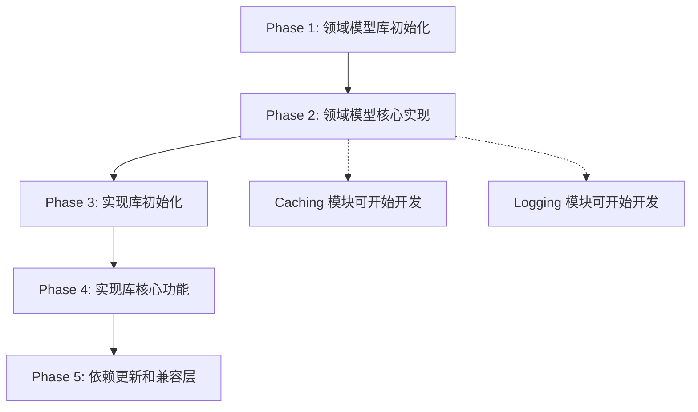

# Tasks: 拆分 Isolation 数据隔离模块为独立库项目（优先）

**Feature**: 拆分 Isolation 数据隔离模块为独立库项目  
**Branch**: `001-hl8-nestjs-enhance`  
**Created**: 2025-10-12  
**Priority**: ⭐ **HIGHEST** - 作为基础设施的基础，必须优先完成  
**Spec**: [spec.md](./spec.md) | **Plan**: [isolation-plan.md](./isolation-plan.md) | **Research**: [isolation-research.md](./isolation-research.md)

## 项目目标

将 `libs/nestjs-infra/src/isolation` 模块拆分为两个独立库项目：

1. **`libs/isolation-model`** (`@hl8/isolation-model`) - 纯领域模型库
   - ✅ 零依赖，框架无关
   - ✅ DDD 充血模型设计
   - ✅ 可被任何 TypeScript 项目引用

2. **`libs/nestjs-isolation`** (`@hl8/nestjs-isolation`) - NestJS 实现库
   - ✅ 依赖领域模型库
   - ✅ 提供中间件、守卫、装饰器
   - ✅ 自动提取隔离上下文

**为什么优先？**

- Caching、Logging、Database 等模块都依赖 Isolation
- 必须先完成领域模型，其他模块才能引用
- 遵循依赖倒置原则，避免循环依赖

---

## 任务概览

**总任务数**: 28  
**预计工期**: 2 周（优先执行）  
**并行机会**: 15+ 任务可并行执行

### 任务分布

| 阶段 | 任务数 | 预计时间 | 描述 |
|------|-------|---------|------|
| Phase 1: 领域模型库初始化 | 4 | 0.5 天 | 创建 isolation-model 项目骨架 |
| Phase 2: 领域模型核心实现 | 10 | 4 天 | 值对象、实体、枚举、接口 |
| Phase 3: 实现库初始化 | 4 | 0.5 天 | 创建 nestjs-isolation 项目骨架 |
| Phase 4: 实现库核心功能 | 7 | 4 天 | 服务、中间件、守卫、装饰器 |
| Phase 5: 依赖更新和兼容层 | 3 | 1 天 | 更新 caching、infra 依赖 |

---

## Phase 1: 领域模型库初始化（isolation-model）

**目标**: 创建纯领域模型库项目骨架，零依赖配置

**预计时间**: 0.5 天  
**关键特性**: 零依赖、框架无关

### T001: 创建领域模型库目录结构

**文件**: `libs/isolation-model/`

```bash
libs/isolation-model/
├── src/
│   ├── entities/
│   ├── value-objects/
│   ├── enums/
│   ├── interfaces/
│   ├── events/
│   ├── errors/
│   └── index.ts
├── package.json
├── tsconfig.json
├── tsconfig.build.json
├── eslint.config.mjs
└── README.md
```

**任务**:

1. 创建所有必需的目录
2. 创建空的 index.ts 文件

**验收标准**:

- 目录结构清晰
- 无多余文件

---

### T002: 配置 package.json（零依赖）

**文件**: `libs/isolation-model/package.json`

**任务**:

1. 创建零依赖的 package.json
2. 配置包名、版本、描述
3. **关键：dependencies 字段为空对象**
4. 配置构建脚本

**内容**:

```json
{
  "name": "@hl8/isolation-model",
  "version": "1.0.0",
  "description": "纯领域模型库 - 多层级数据隔离（零依赖，框架无关）",
  "type": "module",
  "main": "./dist/index.js",
  "types": "./dist/index.d.ts",
  "exports": {
    ".": {
      "types": "./dist/index.d.ts",
      "import": "./dist/index.js"
    }
  },
  "engines": {
    "node": ">=20"
  },
  "scripts": {
    "build": "tsc -p tsconfig.build.json",
    "type-check": "tsc --noEmit",
    "test": "jest",
    "test:watch": "jest --watch",
    "test:cov": "jest --coverage"
  },
  "dependencies": {},
  "devDependencies": {
    "@repo/eslint-config": "workspace:*",
    "@repo/ts-config": "workspace:*",
    "@types/jest": "^30.0.0",
    "@types/node": "^22.15.3",
    "jest": "^30.2.0",
    "typescript": "5.9.2"
  },
  "keywords": [
    "isolation",
    "multi-tenancy",
    "ddd",
    "domain-model",
    "zero-dependency"
  ],
  "author": "HL8 Team",
  "license": "MIT"
}
```

**验收标准**:

- ✅ dependencies 为空对象（零依赖）
- ✅ type: "module" 已设置
- ✅ engines 指定 Node.js >= 20
- ✅ 无 NestJS 相关依赖

---

### T003: 配置 TypeScript [P]

**文件**: `libs/isolation-model/tsconfig.json`, `libs/isolation-model/tsconfig.build.json`

**tsconfig.json**:

```json
{
  "extends": "@repo/ts-config/base.json",
  "compilerOptions": {
    "outDir": "./dist",
    "baseUrl": "./",
    "paths": {
      "@/*": ["./src/*"]
    }
  },
  "include": ["src/**/*"],
  "exclude": ["node_modules", "dist", "**/*.spec.ts"]
}
```

**验收标准**:

- 继承 base.json（而非 nestjs.json）
- module: NodeNext

---

### T004: 配置 ESLint [P]

**文件**: `libs/isolation-model/eslint.config.mjs`

```javascript
import baseConfig from '@repo/eslint-config/base.js';

export default [
  ...baseConfig,
  {
    ignores: ['dist/**', 'coverage/**', 'node_modules/**'],
  },
];
```

**验收标准**:

- 继承 base 配置（而非 nestjs 配置）
- 无框架相关的规则

---

**Phase 1 检查点**: ✅ 领域模型库骨架创建完成，零依赖确认

---

## Phase 2: 领域模型核心实现（isolation-model）

**目标**: 实现纯领域模型的核心组件

**预计时间**: 4 天  
**并行机会**: 高 - 大部分任务可并行

### T005: 实现异常类 [P]

**文件**: `libs/isolation-model/src/errors/isolation-validation.error.ts`

**任务**:

1. 实现 IsolationValidationError 类
2. 继承标准 Error
3. 添加错误代码和上下文

**代码**:

```typescript
/**
 * 隔离验证异常
 * 
 * @description 当隔离上下文或 ID 验证失败时抛出
 * 
 * ## 错误代码
 * 
 * - INVALID_TENANT_ID: 租户 ID 无效
 * - INVALID_ORGANIZATION_ID: 组织 ID 无效
 * - INVALID_DEPARTMENT_ID: 部门 ID 无效
 * - INVALID_USER_ID: 用户 ID 无效
 * - INVALID_ORGANIZATION_CONTEXT: 组织上下文缺少租户
 * - INVALID_DEPARTMENT_CONTEXT: 部门上下文缺少租户或组织
 * 
 * @since 1.0.0
 */
export class IsolationValidationError extends Error {
  constructor(
    message: string,
    /** 错误代码 */
    public readonly code: string,
    /** 上下文信息 */
    public readonly context?: Record<string, any>,
  ) {
    super(message);
    this.name = 'IsolationValidationError';
    
    // 设置原型链（TypeScript 继承 Error 的必需操作）
    Object.setPrototypeOf(this, IsolationValidationError.prototype);
  }
}
```

**验收标准**:

- 继承 Error 正确
- 错误代码完整
- TSDoc 注释完整

---

### T006: 实现枚举 - IsolationLevel 和 SharingLevel [P]

**文件**: `libs/isolation-model/src/enums/isolation-level.enum.ts`, `libs/isolation-model/src/enums/sharing-level.enum.ts`

**任务**:

1. 实现 IsolationLevel 枚举
2. 实现 SharingLevel 枚举
3. 添加 TSDoc 注释

**IsolationLevel**:

```typescript
/**
 * 隔离级别枚举
 * 
 * @description 定义 5 个数据隔离层级
 * 
 * @since 1.0.0
 */
export enum IsolationLevel {
  PLATFORM = 'platform',
  TENANT = 'tenant',
  ORGANIZATION = 'organization',
  DEPARTMENT = 'department',
  USER = 'user',
}
```

**SharingLevel**:

```typescript
/**
 * 共享级别枚举
 * 
 * @description 定义数据的共享范围
 * 
 * @since 1.0.0
 */
export enum SharingLevel {
  PLATFORM = 'platform',
  TENANT = 'tenant',
  ORGANIZATION = 'organization',
  DEPARTMENT = 'department',
  USER = 'user',
}
```

**验收标准**:

- 枚举定义完整
- TSDoc 注释完整

---

### T007: 实现接口定义 [P]

**文件**: `libs/isolation-model/src/interfaces/*.ts`

**任务**:

1. 实现 IIsolationContextProvider 接口
2. 实现 IIsolationValidator 接口
3. 实现 DataAccessContext 接口
4. 添加 TSDoc 注释

**参考**: isolation-data-model.md 中的接口定义

**验收标准**:

- 接口定义清晰
- TSDoc 注释完整
- 无实现代码（仅接口）

---

### T008: 实现 TenantId 值对象（核心） [P]

**文件**: `libs/isolation-model/src/value-objects/tenant-id.vo.ts`

**任务**:

1. 实现 TenantId 值对象类
2. 实现 Flyweight 模式（值对象缓存）
3. 实现验证逻辑（长度、字符限制）
4. 实现 equals()、getValue()、toString() 方法
5. 添加完整的 TSDoc 注释

**关键代码**:

```typescript
export class TenantId {
  private static cache = new Map<string, TenantId>(); // Flyweight 模式
  
  private constructor(private readonly value: string) {
    this.validate();
  }
  
  static create(value: string): TenantId {
    let instance = this.cache.get(value);
    if (!instance) {
      instance = new TenantId(value);
      this.cache.set(value, instance);
    }
    return instance;
  }
  
  private validate(): void {
    if (!this.value || typeof this.value !== 'string') {
      throw new IsolationValidationError('租户 ID 必须是非空字符串', 'INVALID_TENANT_ID');
    }
    
    if (this.value.length > 50) {
      throw new IsolationValidationError('租户 ID 长度不能超过 50 字符', 'TENANT_ID_TOO_LONG');
    }
    
    if (!/^[a-zA-Z0-9_-]+$/.test(this.value)) {
      throw new IsolationValidationError(
        '租户 ID 只能包含字母、数字、下划线和连字符',
        'INVALID_TENANT_ID_FORMAT'
      );
    }
  }
  
  getValue(): string {
    return this.value;
  }
  
  equals(other?: TenantId): boolean {
    if (!other) return false;
    return this.value === other.value;
  }
  
  toString(): string {
    return this.value;
  }
}
```

**验收标准**:

- Flyweight 模式正确实现
- 验证规则完整
- TSDoc 注释完整
- 零依赖（仅使用标准 TypeScript）

**参考**: isolation-research.md 中的值对象设计

---

### T009: 实现 OrganizationId、DepartmentId、UserId 值对象 [P]

**文件**:

- `libs/isolation-model/src/value-objects/organization-id.vo.ts`
- `libs/isolation-model/src/value-objects/department-id.vo.ts`
- `libs/isolation-model/src/value-objects/user-id.vo.ts`

**任务**:

1. 复制 TenantId 的实现模式
2. 修改类名和错误代码
3. 保持相同的验证规则

**验收标准**:

- 所有值对象 API 一致
- Flyweight 模式一致
- 验证规则一致

---

### T010: 单元测试 - TenantId 值对象 [P]

**文件**: `libs/isolation-model/src/value-objects/tenant-id.vo.spec.ts`

**任务**:

1. 测试创建和验证
2. 测试 Flyweight 模式
3. 测试相等性比较
4. 测试边界情况

**测试用例**:

- ✅ create() 创建有效的 TenantId
- ✅ create() 相同值返回相同实例（Flyweight）
- ✅ equals() 相等性比较正确
- ✅ 空字符串抛出异常
- ✅ 过长字符串（> 50）抛出异常
- ✅ 无效字符抛出异常
- ✅ getValue() 返回原始值
- ✅ toString() 返回字符串

**验收标准**:

- 测试覆盖率 >= 95%
- 所有验证规则有测试
- Flyweight 行为有测试

---

### T011: 单元测试 - 其他 ID 值对象 [P]

**文件**: `libs/isolation-model/src/value-objects/*.spec.ts`

**任务**:

1. 为 OrganizationId、DepartmentId、UserId 创建测试
2. 测试用例与 TenantId 相同

**验收标准**:

- 每个值对象测试覆盖率 >= 95%

---

### T012: 实现 IsolationContext 实体（核心）

**文件**: `libs/isolation-model/src/entities/isolation-context.entity.ts`

**任务**:

1. 实现 IsolationContext 实体类
2. 实现静态工厂方法（platform、tenant、organization、department、user）
3. 实现业务逻辑方法：
   - getIsolationLevel()（延迟计算 + 缓存）
   - isEmpty()
   - buildCacheKey()
   - buildLogContext()
   - buildWhereClause()
   - canAccess()（权限验证核心逻辑）
4. 实现上下文验证（validate）
5. 添加完整的 TSDoc 注释

**关键方法（业务逻辑封装）**:

```typescript
/**
 * 隔离上下文实体
 * 
 * @description 封装多层级数据隔离的核心业务逻辑
 * 
 * ## 业务规则（充血模型）
 * 
 * ### 层级判断规则
 * - 有 departmentId → DEPARTMENT 级
 * - 有 organizationId → ORGANIZATION 级  
 * - 有 tenantId → TENANT 级
 * - 有 userId（无租户）→ USER 级
 * - 默认 → PLATFORM 级
 * 
 * ### 验证规则
 * - 组织级必须有租户
 * - 部门级必须有租户和组织
 * 
 * ### 访问权限规则
 * - 平台级可访问所有数据
 * - 非共享数据必须完全匹配
 * - 共享数据检查共享级别
 * 
 * @since 1.0.0
 */
export class IsolationContext {
  private _level?: IsolationLevel; // 延迟计算缓存
  
  private constructor(
    public readonly tenantId?: TenantId,
    public readonly organizationId?: OrganizationId,
    public readonly departmentId?: DepartmentId,
    public readonly userId?: UserId,
  ) {
    this.validate();
  }
  
  static platform(): IsolationContext {
    return new IsolationContext();
  }
  
  static tenant(tenantId: TenantId): IsolationContext {
    return new IsolationContext(tenantId);
  }
  
  static organization(
    tenantId: TenantId, 
    organizationId: OrganizationId
  ): IsolationContext {
    return new IsolationContext(tenantId, organizationId);
  }
  
  static department(
    tenantId: TenantId,
    organizationId: OrganizationId,
    departmentId: DepartmentId,
  ): IsolationContext {
    return new IsolationContext(tenantId, organizationId, departmentId);
  }
  
  static user(userId: UserId, tenantId?: TenantId): IsolationContext {
    return new IsolationContext(tenantId, undefined, undefined, userId);
  }
  
  private validate(): void {
    if (this.organizationId && !this.tenantId) {
      throw new IsolationValidationError(
        '组织级上下文必须包含租户 ID',
        'INVALID_ORGANIZATION_CONTEXT'
      );
    }
    
    if (this.departmentId && (!this.tenantId || !this.organizationId)) {
      throw new IsolationValidationError(
        '部门级上下文必须包含租户 ID 和组织 ID',
        'INVALID_DEPARTMENT_CONTEXT'
      );
    }
  }
  
  getIsolationLevel(): IsolationLevel {
    if (this._level === undefined) {
      if (this.departmentId) this._level = IsolationLevel.DEPARTMENT;
      else if (this.organizationId) this._level = IsolationLevel.ORGANIZATION;
      else if (this.tenantId) this._level = IsolationLevel.TENANT;
      else if (this.userId) this._level = IsolationLevel.USER;
      else this._level = IsolationLevel.PLATFORM;
    }
    return this._level;
  }
  
  isEmpty(): boolean {
    return !this.tenantId && !this.organizationId && !this.departmentId && !this.userId;
  }
  
  buildCacheKey(namespace: string, key: string): string {
    // 参考 isolation-research.md 中的实现
  }
  
  buildLogContext(): Record<string, string> {
    // 参考 isolation-research.md 中的实现
  }
  
  buildWhereClause(): Record<string, string> {
    // 根据隔离级别生成数据库查询条件
  }
  
  canAccess(
    dataContext: IsolationContext,
    isShared: boolean,
    sharingLevel?: SharingLevel,
  ): boolean {
    // 参考 isolation-research.md 中的实现
  }
}
```

**验收标准**:

- 所有静态工厂方法正确
- 业务逻辑方法完整
- 延迟计算和缓存正确
- 验证规则正确
- TSDoc 注释完整，包含业务规则
- 零依赖（无外部导入）

**参考**: isolation-research.md 中的 IsolationContext 设计

---

### T013: 单元测试 - IsolationContext 实体（核心）

**文件**: `libs/isolation-model/src/entities/isolation-context.entity.spec.ts`

**任务**:

1. 测试所有静态工厂方法
2. 测试业务逻辑方法
3. 测试验证规则
4. 测试边界情况

**测试用例（至少 30 个）**:

**创建测试**:

- ✅ platform() 创建平台级上下文
- ✅ tenant() 创建租户级上下文
- ✅ organization() 创建组织级上下文
- ✅ department() 创建部门级上下文
- ✅ user() 创建用户级上下文

**验证测试**:

- ✅ organization() 没有 tenantId 抛出异常
- ✅ department() 没有 tenantId 抛出异常
- ✅ department() 没有 organizationId 抛出异常

**层级判断测试**:

- ✅ getIsolationLevel() 平台级返回 PLATFORM
- ✅ getIsolationLevel() 租户级返回 TENANT
- ✅ getIsolationLevel() 组织级返回 ORGANIZATION
- ✅ getIsolationLevel() 部门级返回 DEPARTMENT
- ✅ getIsolationLevel() 用户级返回 USER
- ✅ isEmpty() 平台级返回 true
- ✅ isEmpty() 其他级别返回 false

**buildCacheKey 测试**:

- ✅ 平台级生成正确的键
- ✅ 租户级生成正确的键
- ✅ 组织级生成正确的键
- ✅ 部门级生成正确的键
- ✅ 用户级生成正确的键

**buildLogContext 测试**:

- ✅ 平台级返回空对象
- ✅ 租户级返回 { tenantId }
- ✅ 组织级返回 { tenantId, organizationId }
- ✅ 部门级返回完整对象

**buildWhereClause 测试**:

- ✅ 各级别生成正确的查询条件

**canAccess 测试**:

- ✅ 平台级上下文可访问所有数据
- ✅ 非共享数据必须完全匹配
- ✅ 租户级共享数据在租户内可访问
- ✅ 组织级共享数据在组织内可访问
- ✅ 部门级共享数据在部门内可访问
- ✅ 跨租户访问被拒绝
- ✅ 跨组织访问被拒绝（非共享数据）

**验收标准**:

- 测试覆盖率 >= 95%
- 所有业务规则有测试
- 边界情况测试完整

---

### T014: 实现领域事件类 [P]

**文件**: `libs/isolation-model/src/events/*.ts`

**任务**:

1. 实现 IsolationContextCreatedEvent
2. 实现 IsolationContextSwitchedEvent
3. 实现 DataAccessDeniedEvent
4. 添加 TSDoc 注释

**参考**: isolation-data-model.md 中的事件定义

**验收标准**:

- 事件类定义完整
- TSDoc 注释包含使用场景
- 纯数据类（无逻辑）

---

### T015: 实现主导出文件

**文件**: `libs/isolation-model/src/index.ts`

**任务**:

1. 导出所有公共 API
2. 添加模块说明注释

**内容**:

```typescript
/**
 * @hl8/isolation-model
 * 
 * 纯领域模型库 - 多层级数据隔离
 * 
 * 特性：
 * - 零依赖，框架无关
 * - DDD 充血模型设计
 * - 可在任何 TypeScript 环境使用
 * 
 * @module @hl8/isolation-model
 * @since 1.0.0
 */

// 实体
export { IsolationContext } from './entities/isolation-context.entity.js';

// 值对象
export { TenantId } from './value-objects/tenant-id.vo.js';
export { OrganizationId } from './value-objects/organization-id.vo.js';
export { DepartmentId } from './value-objects/department-id.vo.js';
export { UserId } from './value-objects/user-id.vo.js';

// 枚举
export { IsolationLevel } from './enums/isolation-level.enum.js';
export { SharingLevel } from './enums/sharing-level.enum.js';

// 接口
export type { IIsolationContextProvider } from './interfaces/isolation-context-provider.interface.js';
export type { IIsolationValidator } from './interfaces/isolation-validator.interface.js';
export type { DataAccessContext } from './interfaces/data-access-context.interface.js';

// 事件
export { IsolationContextCreatedEvent } from './events/context-created.event.js';
export { IsolationContextSwitchedEvent } from './events/context-switched.event.js';
export { DataAccessDeniedEvent } from './events/access-denied.event.js';

// 异常
export { IsolationValidationError } from './errors/isolation-validation.error.js';
```

**验收标准**:

- 所有公共 API 导出
- 注释清晰
- 无遗漏

---

### T016: 验证零依赖

**任务**:

1. 检查 package.json dependencies 为空
2. 检查所有源文件无外部导入
3. 运行构建验证

**验证命令**:

```bash
cd libs/isolation-model
# 检查依赖
cat package.json | grep -A 2 '"dependencies"'
# 应输出: "dependencies": {}

# 检查外部导入
grep -r "from '" src/ | grep -v "from './" | grep -v "from '@/"
# 应无输出

# 构建测试
pnpm build
pnpm type-check
```

**验收标准**:

- dependencies 为空对象
- 无外部导入
- 构建成功
- 类型检查通过

---

**Phase 2 检查点**: ✅ 领域模型库核心实现完成，测试覆盖率 >= 95%，零依赖验证通过

---

## Phase 3: NestJS 实现库初始化（nestjs-isolation）

**目标**: 创建 NestJS 实现库项目骨架

**预计时间**: 0.5 天

### T017: 创建实现库目录结构

**文件**: `libs/nestjs-isolation/`

```bash
libs/nestjs-isolation/
├── src/
│   ├── services/
│   ├── middleware/
│   ├── guards/
│   ├── decorators/
│   ├── strategies/
│   ├── types/
│   └── index.ts
├── __tests__/integration/
├── package.json
├── tsconfig.json
├── eslint.config.mjs
└── README.md
```

---

### T018: 配置 package.json（依赖领域模型）

**文件**: `libs/nestjs-isolation/package.json`

**内容**:

```json
{
  "name": "@hl8/nestjs-isolation",
  "version": "1.0.0",
  "description": "NestJS 数据隔离实现库",
  "type": "module",
  "main": "./dist/index.js",
  "types": "./dist/index.d.ts",
  "peerDependencies": {
    "@nestjs/common": "^11.0.0",
    "@nestjs/core": "^11.0.0"
  },
  "dependencies": {
    "@hl8/isolation-model": "workspace:*",
    "nestjs-cls": "^6.0.1"
  },
  "devDependencies": {
    "@nestjs/testing": "^11.1.6",
    "@repo/eslint-config": "workspace:*",
    "@repo/ts-config": "workspace:*",
    "@types/jest": "^30.0.0",
    "@types/node": "^22.15.3",
    "jest": "^30.2.0",
    "typescript": "5.9.2"
  }
}
```

**验收标准**:

- ✅ 依赖 @hl8/isolation-model
- ✅ peer dependencies 包含 NestJS
- ✅ 依赖最小化

---

### T019: 配置 TypeScript 和 ESLint [P]

**文件**: `libs/nestjs-isolation/tsconfig.json`, `libs/nestjs-isolation/eslint.config.mjs`

**任务**:

1. 继承 nestjs.json 配置（因为是 NestJS 库）
2. 配置 ESLint 继承 nestjs 规则

**验收标准**:

- 继承正确的配置
- 可以导入 NestJS 模块

---

### T020: 创建 README

**文件**: `libs/nestjs-isolation/README.md`

**内容**:

```markdown
# @hl8/nestjs-isolation

NestJS 数据隔离实现库 - 基于 `@hl8/isolation-model` 领域模型。

## 特性

- ✅ 自动从请求头提取隔离上下文
- ✅ 提供装饰器、守卫、中间件
- ✅ 基于 nestjs-cls 实现请求级上下文
- ✅ 支持 Fastify 和 Express

## 安装

```bash
pnpm add @hl8/nestjs-isolation
```

## 使用

参见 [快速开始文档](../../specs/001-hl8-nestjs-enhance/isolation-quickstart.md)

## 依赖

- [@hl8/isolation-model](../isolation-model) - 纯领域模型库
- NestJS >= 11.0
- nestjs-cls >= 6.0

```

**验收标准**:
- 说明清晰
- 链接正确

---

**Phase 3 检查点**: ✅ 实现库骨架创建完成

---

## Phase 4: NestJS 实现库核心功能

**目标**: 实现 NestJS 特定的服务、中间件、守卫、装饰器

**预计时间**: 4 天  
**并行机会**: 中 - 部分任务可并行

### T021: 实现 IsolationContextService

**文件**: `libs/nestjs-isolation/src/services/isolation-context.service.ts`

**任务**:
1. 实现 IIsolationContextProvider 接口
2. 基于 nestjs-cls 存储上下文
3. 实现 get/set 方法
4. 添加 TSDoc 注释

**代码**:

```typescript
import { Injectable } from '@nestjs/common';
import { ClsService } from 'nestjs-cls';
import { IsolationContext, IIsolationContextProvider } from '@hl8/isolation-model';

const ISOLATION_CONTEXT_KEY = 'ISOLATION_CONTEXT';

@Injectable()
export class IsolationContextService implements IIsolationContextProvider {
  constructor(private readonly cls: ClsService) {}
  
  getIsolationContext(): IsolationContext | undefined {
    return this.cls.get(ISOLATION_CONTEXT_KEY);
  }
  
  setIsolationContext(context: IsolationContext): void {
    this.cls.set(ISOLATION_CONTEXT_KEY, context);
  }
  
  getTenantId(): TenantId | undefined {
    return this.getIsolationContext()?.tenantId;
  }
  
  // ... 其他便捷方法
}
```

**验收标准**:

- 实现接口正确
- 基于 nestjs-cls 实现
- TSDoc 注释完整

---

### T022: 实现 MultiLevelIsolationService

**文件**: `libs/nestjs-isolation/src/services/multi-level-isolation.service.ts`

**任务**:

1. 实现 IIsolationValidator 接口
2. 实现隔离级别验证
3. 实现数据访问权限检查
4. 添加 TSDoc 注释

**验收标准**:

- 实现接口正确
- 委托给 IsolationContext 的业务逻辑
- TSDoc 注释完整

---

### T023: 实现上下文提取中间件

**文件**: `libs/nestjs-isolation/src/middleware/isolation-extraction.middleware.ts`

**任务**:

1. 实现 NestMiddleware 接口
2. 从请求头提取隔离标识
3. 创建 IsolationContext 并存储到 CLS
4. 支持 Fastify 和 Express

**代码**:

```typescript
import { Injectable, NestMiddleware } from '@nestjs/common';
import { IsolationContextService } from '../services/isolation-context.service.js';
import { IsolationContext, TenantId, OrganizationId, DepartmentId, UserId } from '@hl8/isolation-model';

@Injectable()
export class IsolationExtractionMiddleware implements NestMiddleware {
  constructor(private readonly contextService: IsolationContextService) {}
  
  use(req: any, res: any, next: () => void) {
    // 提取标识符
    const tenantId = req.headers['x-tenant-id'];
    const orgId = req.headers['x-organization-id'];
    const deptId = req.headers['x-department-id'];
    const userId = req.headers['x-user-id'];
    
    // 创建隔离上下文
    let context: IsolationContext;
    
    if (deptId && orgId && tenantId) {
      context = IsolationContext.department(
        TenantId.create(tenantId),
        OrganizationId.create(orgId),
        DepartmentId.create(deptId)
      );
    } else if (orgId && tenantId) {
      context = IsolationContext.organization(
        TenantId.create(tenantId),
        OrganizationId.create(orgId)
      );
    } else if (tenantId) {
      context = IsolationContext.tenant(TenantId.create(tenantId));
    } else if (userId) {
      context = IsolationContext.user(UserId.create(userId));
    } else {
      context = IsolationContext.platform();
    }
    
    // 存储上下文
    this.contextService.setIsolationContext(context);
    
    next();
  }
}
```

**验收标准**:

- 提取逻辑正确
- 使用领域模型创建上下文
- 支持所有 5 个层级
- 错误处理完整

---

### T024: 实现装饰器 [P]

**文件**: `libs/nestjs-isolation/src/decorators/*.ts`

**任务**:

1. 实现 @RequireTenant 装饰器
2. 实现 @RequireOrganization 装饰器
3. 实现 @RequireDepartment 装饰器
4. 实现 @CurrentContext 参数装饰器

**@RequireTenant 示例**:

```typescript
import { SetMetadata } from '@nestjs/common';
import { IsolationLevel } from '@hl8/isolation-model';

export const REQUIRED_ISOLATION_LEVEL_KEY = 'requiredIsolationLevel';

export const RequireTenant = () => SetMetadata(REQUIRED_ISOLATION_LEVEL_KEY, IsolationLevel.TENANT);
```

**@CurrentContext 示例**:

```typescript
import { createParamDecorator, ExecutionContext } from '@nestjs/common';
import { IsolationContextService } from '../services/isolation-context.service.js';

export const CurrentContext = createParamDecorator(
  (data: unknown, ctx: ExecutionContext) => {
    const request = ctx.switchToHttp().getRequest();
    const service = request.app.get(IsolationContextService);
    return service.getIsolationContext();
  },
);
```

**验收标准**:

- 装饰器正确实现
- 元数据设置正确
- TSDoc 注释完整

---

### T025: 实现 IsolationGuard

**文件**: `libs/nestjs-isolation/src/guards/isolation.guard.ts`

**任务**:

1. 实现 CanActivate 接口
2. 读取元数据（REQUIRED_ISOLATION_LEVEL_KEY）
3. 验证当前隔离级别
4. 返回 true/false

**验收标准**:

- 守卫正确拦截
- 与装饰器配合使用
- 错误信息清晰

---

### T026: 实现 IsolationModule

**文件**: `libs/nestjs-isolation/src/isolation.module.ts`

**任务**:

1. 实现 forRoot() 静态方法
2. 配置 ClsModule
3. 注册所有 providers
4. 实现 NestModule 接口（配置中间件）

**验收标准**:

- 模块配置正确
- ClsModule 正确集成
- 中间件自动注册
- providers 导出正确

---

### T027: 集成测试 - 上下文提取

**文件**: `libs/nestjs-isolation/__tests__/integration/context-extraction.spec.ts`

**任务**:

1. 创建测试模块
2. 模拟 HTTP 请求
3. 测试上下文提取
4. 验证各层级上下文

**测试场景**:

- ✅ 提取平台级上下文
- ✅ 提取租户级上下文
- ✅ 提取组织级上下文
- ✅ 提取部门级上下文
- ✅ 提取用户级上下文
- ✅ 缺少标识符时降级

**验收标准**:

- 使用真实 NestJS 模块
- 测试场景完整
- 中间件集成测试

---

**Phase 4 检查点**: ✅ 实现库核心功能完成，集成测试通过

---

## Phase 5: 依赖更新和兼容层

**目标**: 更新其他模块使用新的领域模型库，创建兼容层

**预计时间**: 1 天

### T028: 更新 Caching 模块依赖

**已完成** ✅

**文件**: `libs/nestjs-caching/package.json`, `libs/nestjs-caching/src/types/isolation-context.type.ts`

**说明**: 已更新为依赖 `@hl8/isolation-model`

---

### T029: 更新 nestjs-infra 依赖

**文件**: `libs/nestjs-infra/package.json`

**任务**:

1. 添加 @hl8/nestjs-isolation 依赖
2. 移除原有的 isolation 相关依赖

**代码**:

```json
{
  "dependencies": {
    "@hl8/nestjs-isolation": "workspace:*"
  }
}
```

---

### T030: 创建 nestjs-infra 兼容层

**文件**: `libs/nestjs-infra/src/isolation/index.ts`

**任务**:

1. 重新导出 @hl8/nestjs-isolation 的所有内容
2. 添加 deprecation 警告

**代码**:

```typescript
/**
 * 数据隔离模块兼容层
 * 
 * @deprecated 请直接使用 @hl8/nestjs-isolation 模块
 * 本兼容层将在 v2.0.0 移除
 * 
 * @example
 * ```typescript
 * // 旧方式（将被弃用）
 * import { IsolationModule } from '@hl8/nestjs-infra';
 * 
 * // 新方式（推荐）
 * import { IsolationModule } from '@hl8/nestjs-isolation';
 * import { IsolationContext } from '@hl8/isolation-model';
 * ```
 */

// 重新导出所有内容
export * from '@hl8/nestjs-isolation';

// 打印迁移提示（仅在开发环境）
if (process.env.NODE_ENV !== 'production') {
  console.warn(
    '[DEPRECATION WARNING] 您正在使用 @hl8/nestjs-infra 的隔离模块兼容层。' +
    '请迁移到 @hl8/nestjs-isolation 和 @hl8/isolation-model。' +
    '兼容层将在 v2.0.0 移除。'
  );
}
```

**验收标准**:

- 所有导出重新导出
- deprecation 警告清晰
- 示例代码完整

---

**Phase 5 检查点**: ✅ 依赖更新完成，兼容层创建完成

---

## 依赖关系图



### 关键依赖

- **Phase 2 是关键路径**: 领域模型完成后，其他模块才能引用
- **Caching 依赖 Phase 2**: 需要 IsolationContext 生成缓存键
- **Logging 依赖 Phase 2**: 需要 IsolationContext 生成日志上下文

---

## 并行执行机会

### Phase 1 并行组

```
T001 (串行) → [T002, T003, T004] (并行)
```

### Phase 2 并行组（高并行度）

```
T005 (串行，异常类) → [T006, T007, T008, T009] (并行，枚举+接口+值对象)
                    → [T010, T011] (并行，值对象测试)
                    → T012 (串行，IsolationContext 实体)
                    → T013 (串行，实体测试)
                    → [T014, T015, T016] (并行，事件+导出+验证)
```

### Phase 3 并行组

```
T017 (串行) → [T018, T019, T020] (并行)
```

### Phase 4 并行组

```
[T021, T022] (并行，服务) → T023 (串行，中间件) → [T024, T025] (并行，装饰器+守卫) → T026 (串行，模块) → T027 (串行，集成测试)
```

---

## 实施策略

### Week 1: 领域模型库（核心）

**Day 1-2**:

- ✅ Phase 1: 项目初始化
- ✅ Phase 2: 值对象和枚举实现（T005-T011）

**Day 3-4**:

- ✅ Phase 2: IsolationContext 实体实现（T012-T013）
- ✅ Phase 2: 事件和导出（T014-T016）

**Week 1 交付物**:

- ✅ @hl8/isolation-model 1.0.0 发布
- ✅ 测试覆盖率 >= 95%
- ✅ 零依赖验证通过
- ✅ 其他模块可以开始引用

### Week 2: NestJS 实现库

**Day 1-2**:

- ✅ Phase 3: 项目初始化（T017-T020）
- ✅ Phase 4: 服务实现（T021-T022）

**Day 3-4**:

- ✅ Phase 4: 中间件、装饰器、守卫（T023-T026）
- ✅ Phase 4: 集成测试（T027）

**Day 5**:

- ✅ Phase 5: 依赖更新和兼容层（T028-T030）

**Week 2 交付物**:

- ✅ @hl8/nestjs-isolation 1.0.0 发布
- ✅ 兼容层完成
- ✅ 迁移指南完成

---

## 验收标准（整体）

### 领域模型库（isolation-model）

- ✅ 零依赖（package.json dependencies 为空）
- ✅ 所有值对象实现 Flyweight 模式
- ✅ IsolationContext 封装所有业务逻辑
- ✅ 单元测试覆盖率 >= 95%
- ✅ 无外部导入
- ✅ 可在任何 TypeScript 环境运行

### 实现库（nestjs-isolation）

- ✅ 依赖领域模型库
- ✅ 中间件自动提取上下文
- ✅ 装饰器和守卫正常工作
- ✅ 集成测试覆盖率 >= 80%
- ✅ 支持 Fastify 和 Express

### 集成验证

- ✅ Caching 模块可以使用 IsolationContext
- ✅ 零框架依赖传递
- ✅ 兼容层保持 API 不变

---

## 关键里程碑

| 里程碑 | 完成标志 | 后续影响 |
|--------|---------|---------|
| **M1: 领域模型库完成** | Phase 2 完成，测试通过 | Caching、Logging 模块可以开始开发 |
| **M2: 实现库完成** | Phase 4 完成，集成测试通过 | NestJS 应用可以使用完整功能 |
| **M3: 兼容层完成** | Phase 5 完成 | 现有代码无需修改 |

---

**任务清单生成时间**: 2025-10-12  
**总任务数**: 28  
**预计工期**: 2 周（优先）  
**状态**: ✅ 任务清单已生成，可以开始实施
