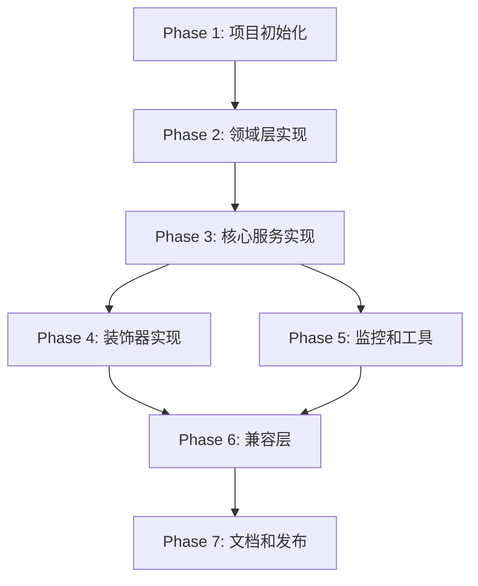

# Tasks: 拆分 Caching 模块为独立库项目

**Feature**: 将 libs/nestjs-infra/src/caching 拆分为独立的 libs/nestjs-caching 库项目  
**Branch**: `001-hl8-nestjs-enhance`  
**Created**: 2025-10-12  
**Spec**: [spec.md](./spec.md) | **Plan**: [plan.md](./plan.md) | **Research**: [research.md](./research.md)

## 项目目标

将 `libs/nestjs-infra/src/caching` 模块拆分为独立的库项目 `libs/nestjs-caching`，实现：

- ✅ 更好的模块化和独立版本管理
- ✅ DDD 充血模型设计
- ✅ 支持多层级数据隔离（平台、租户、组织、部门、用户）
- ✅ 完整的缓存装饰器支持
- ✅ 性能监控和指标收集
- ✅ 与现有代码完全兼容（通过兼容层）

---

## 任务概览

**总任务数**: 38  
**预计工期**: 4 周  
**并行机会**: 20+ 任务可并行执行

### 任务分布

| 阶段                  | 任务数 | 预计时间 | 描述                  |
| --------------------- | ------ | -------- | --------------------- |
| Phase 1: 项目初始化   | 5      | 1 天     | 创建项目骨架和配置    |
| Phase 2: 领域层实现   | 8      | 1 周     | DDD 值对象和领域事件  |
| Phase 3: 核心服务实现 | 8      | 1 周     | 缓存服务和 Redis 服务 |
| Phase 4: 装饰器实现   | 5      | 3 天     | 缓存装饰器            |
| Phase 5: 监控和工具   | 6      | 3 天     | 性能监控和工具函数    |
| Phase 6: 兼容层和迁移 | 4      | 2 天     | nestjs-infra 兼容层   |
| Phase 7: 文档和发布   | 2      | 1 天     | 文档完善和发布准备    |

---

## Phase 1: 项目初始化（Setup）

**目标**: 创建独立的 `libs/nestjs-caching` 项目骨架，配置构建工具和依赖

**预计时间**: 1 天  
**并行机会**: T002、T003、T004 可并行

### T001: 创建项目目录结构 [X]

**文件**: `libs/nestjs-caching/`

```bash
libs/nestjs-caching/
├── src/
│   ├── domain/
│   │   ├── value-objects/
│   │   └── events/
│   ├── decorators/
│   ├── config/
│   ├── monitoring/
│   ├── utils/
│   ├── types/
│   └── index.ts
├── __tests__/
│   └── integration/
├── docs/
├── package.json
├── tsconfig.json
├── tsconfig.build.json
├── eslint.config.mjs
├── jest.config.ts
└── README.md
```

**任务**:

1. 创建所有必需的目录
2. 创建空的 index.ts 文件作为主入口

**验收标准**:

- 目录结构符合 plan.md 中定义的结构
- 遵循 monorepo 组织规范

---

### T002: 配置 package.json [P] [X]

**文件**: `libs/nestjs-caching/package.json`

**任务**:

1. 创建 package.json 文件
2. 配置包名、版本、描述
3. 配置 peer dependencies（NestJS）
4. 配置 dependencies（ioredis、nestjs-cls、class-validator 等）
5. 配置构建脚本（build、build:swc、type-check、test、lint）
6. 配置导出字段（exports）
7. 设置 type: "module"、engines: node >= 20

**内容**:

```json
{
  "name": "@hl8/nestjs-caching",
  "version": "1.0.0",
  "description": "企业级 NestJS Redis 缓存模块，支持多层级数据隔离",
  "type": "module",
  "main": "./dist/index.js",
  "types": "./dist/index.d.ts",
  "exports": {
    ".": {
      "types": "./dist/index.d.ts",
      "import": "./dist/index.js"
    }
  },
  "engines": {
    "node": ">=20"
  },
  "scripts": {
    "build": "tsc -p tsconfig.build.json",
    "build:swc": "swc src -d dist --strip-leading-paths && tsc --emitDeclarationOnly --outDir dist",
    "build:types": "tsc --emitDeclarationOnly --outDir dist",
    "type-check": "tsc --noEmit",
    "dev": "tsc -p tsconfig.build.json --watch",
    "test": "jest",
    "test:watch": "jest --watch",
    "test:cov": "jest --coverage",
    "lint": "eslint ."
  },
  "peerDependencies": {
    "@nestjs/common": "^11.0.0",
    "@nestjs/core": "^11.0.0"
  },
  "dependencies": {
    "ioredis": "^5.4.2",
    "nestjs-cls": "^6.0.1",
    "class-validator": "^0.14.2",
    "class-transformer": "^0.5.1",
    "@hl8/platform": "workspace:*"
  },
  "devDependencies": {
    "@nestjs/testing": "^11.1.6",
    "@repo/eslint-config": "workspace:*",
    "@repo/typescript-config": "workspace:*",
    "@swc/cli": "^0.7.0",
    "@swc/core": "^1.10.14",
    "@swc/jest": "^0.2.37",
    "@types/jest": "^30.0.0",
    "@types/node": "^22.15.3",
    "jest": "^30.2.0",
    "typescript": "5.9.2"
  },
  "keywords": ["nestjs", "cache", "redis", "multi-tenancy", "ddd", "saas"]
}
```

**验收标准**:

- 所有依赖版本与 plan.md 一致
- type: "module" 已设置
- engines 指定 Node.js >= 20

---

### T003: 配置 TypeScript [P] [X]

**文件**: `libs/nestjs-caching/tsconfig.json`, `libs/nestjs-caching/tsconfig.build.json`

**任务**:

1. 创建 tsconfig.json 继承 monorepo 根配置
2. 创建 tsconfig.build.json 用于生产构建
3. 配置路径别名（@/_→ ./src/_）
4. 配置输出目录（dist）

**tsconfig.json**:

```json
{
  "extends": "@repo/typescript-config/nestjs.json",
  "compilerOptions": {
    "outDir": "./dist",
    "baseUrl": "./",
    "paths": {
      "@/*": ["./src/*"]
    }
  },
  "include": ["src/**/*"],
  "exclude": ["node_modules", "dist", "**/*.spec.ts"]
}
```

**tsconfig.build.json**:

```json
{
  "extends": "./tsconfig.json",
  "exclude": ["node_modules", "dist", "**/*.spec.ts", "__tests__"]
}
```

**验收标准**:

- 继承 @repo/typescript-config/nestjs.json
- module: NodeNext、moduleResolution: NodeNext
- strict: true

---

### T004: 配置 ESLint 和 Jest [P] [X]

**文件**: `libs/nestjs-caching/eslint.config.mjs`, `libs/nestjs-caching/jest.config.ts`

**任务**:

1. 创建 eslint.config.mjs 继承根配置
2. 创建 jest.config.ts 配置测试环境

**eslint.config.mjs**:

```javascript
import baseConfig from '@repo/eslint-config/nestjs.js';

export default [
  ...baseConfig,
  {
    ignores: ['dist/**', 'coverage/**', 'node_modules/**'],
  },
];
```

**jest.config.ts**:

```typescript
import type { Config } from 'jest';

const config: Config = {
  preset: '@swc/jest',
  testEnvironment: 'node',
  roots: ['<rootDir>/src', '<rootDir>/__tests__'],
  testMatch: ['**/*.spec.ts', '**/*.test.ts'],
  collectCoverageFrom: [
    'src/**/*.ts',
    '!src/**/*.spec.ts',
    '!src/**/*.test.ts',
    '!src/index.ts',
  ],
  coverageThreshold: {
    global: {
      branches: 80,
      functions: 80,
      lines: 80,
      statements: 80,
    },
  },
  moduleNameMapper: {
    '^@/(.*)$': '<rootDir>/src/$1',
  },
};

export default config;
```

**验收标准**:

- ESLint 配置继承 @repo/eslint-config
- Jest 覆盖率阈值设置为 80%
- 使用 @swc/jest 加速测试

---

### T005: 创建初始 README [X]

**文件**: `libs/nestjs-caching/README.md`

**任务**:

1. 创建项目说明文档
2. 包含安装、快速开始、核心特性说明
3. 链接到详细文档

**内容**:

````markdown
# @hl8/nestjs-caching

企业级 NestJS Redis 缓存模块，支持多层级数据隔离。

## 特性

- ✅ 多层级数据隔离（平台、租户、组织、部门、用户）
- ✅ DDD 充血模型设计
- ✅ 缓存装饰器（@Cacheable、@CacheEvict、@CachePut）
- ✅ 性能监控和指标收集
- ✅ 完整的 TypeScript 类型支持
- ✅ ES Module (NodeNext) 支持

## 安装

```bash
pnpm add @hl8/nestjs-caching
```
````

## 快速开始

参见 [快速开始文档](../../specs/001-hl8-nestjs-enhance/quickstart.md)

## 文档

- [API 文档](../../specs/001-hl8-nestjs-enhance/contracts/caching-api.md)
- [数据模型](../../specs/001-hl8-nestjs-enhance/data-model.md)
- [研究报告](../../specs/001-hl8-nestjs-enhance/research.md)

## License

MIT

````

**验收标准**:
- README 包含核心特性和快速开始链接
- 链接指向正确的文档路径

---

**Phase 1 检查点**: ✅ 项目骨架创建完成，可以开始开发

---

## Phase 2: 领域层实现（DDD Value Objects & Events）

**目标**: 实现 DDD 充血模型的核心值对象和领域事件

**预计时间**: 1 周
**并行机会**: T006-T009 可并行，T010-T013 可并行

### T006: 实现 CacheLevel 枚举 [P]

**文件**: `libs/nestjs-caching/src/types/cache-level.enum.ts`

**任务**:
1. 创建 CacheLevel 枚举
2. 定义 5 个层级（PLATFORM、TENANT、ORGANIZATION、DEPARTMENT、USER）
3. 添加完整的 TSDoc 注释（中文）

**代码**:

```typescript
/**
 * 缓存层级枚举
 *
 * @description 定义缓存的 5 个隔离层级
 *
 * ## 层级说明
 *
 * - PLATFORM: 平台级缓存，跨租户共享
 * - TENANT: 租户级缓存，租户内共享
 * - ORGANIZATION: 组织级缓存，组织内共享
 * - DEPARTMENT: 部门级缓存，部门内共享
 * - USER: 用户级缓存，用户私有
 *
 * @since 1.0.0
 */
export enum CacheLevel {
  /** 平台级缓存 */
  PLATFORM = 'platform',

  /** 租户级缓存 */
  TENANT = 'tenant',

  /** 组织级缓存 */
  ORGANIZATION = 'organization',

  /** 部门级缓存 */
  DEPARTMENT = 'department',

  /** 用户级缓存 */
  USER = 'user',
}
````

**验收标准**:

- 枚举定义完整，包含所有 5 个层级
- TSDoc 注释使用中文
- 导出正确

---

### T007: 实现 IsolationContext 类型导入 [P]

**文件**: `libs/nestjs-caching/src/types/isolation-context.type.ts`

**任务**:

1. 从 @hl8/platform 导入 IsolationContext 类型
2. 重新导出供内部使用

**代码**:

```typescript
/**
 * 隔离上下文类型
 *
 * @description 从 @hl8/platform 导入的隔离上下文定义
 *
 * @since 1.0.0
 */
export type { IsolationContext } from '@hl8/platform';
```

**验收标准**:

- 类型导入正确
- 可以在项目内使用

---

### T008: 实现 CacheKey 值对象（核心） [P]

**文件**: `libs/nestjs-caching/src/domain/value-objects/cache-key.vo.ts`

**任务**:

1. 实现 CacheKey 值对象类
2. 封装缓存键生成、验证逻辑
3. 实现静态工厂方法（forPlatform、forTenant、forOrganization、forDepartment、forUser、fromContext）
4. 实现键格式验证（长度、字符限制）
5. 添加完整的 TSDoc 注释（中文，包含业务规则）

**关键方法**:

- `buildKey()`: 根据层级生成键
- `validate()`: 验证键的有效性
- `toString()`: 获取完整键
- `getLevel()`: 获取层级
- `toPattern()`: 生成匹配模式
- `equals()`: 值对象相等性比较

**验收标准**:

- 所有静态工厂方法正确实现
- 键格式符合规范（{prefix}:{level}:{identifiers}:{namespace}:{key}）
- 验证规则完整（长度 <= 256、字符限制）
- 层级标识符验证（租户级需要 tenantId 等）
- TSDoc 注释完整，包含业务规则和示例

**参考**: research.md 中的 CacheKey 设计

---

### T009: 实现 CacheEntry 值对象（核心） [P]

**文件**: `libs/nestjs-caching/src/domain/value-objects/cache-entry.vo.ts`

**任务**:

1. 实现 CacheEntry 值对象类
2. 封装序列化、反序列化、TTL 验证逻辑
3. 实现静态工厂方法（create）
4. 实现特殊类型处理（Date、Set、Map、Buffer）
5. 实现循环引用处理
6. 添加完整的 TSDoc 注释（中文，包含业务规则）

**关键方法**:

- `serialize()`: 序列化缓存值
- `validateTTL()`: 验证 TTL 有效性
- `validateSize()`: 验证值大小
- `getSerializedValue()`: 获取序列化后的值
- `getValue()`: 获取原始值
- `isExpiringSoon()`: 检查是否即将过期
- `isExpired()`: 检查是否已过期

**验收标准**:

- TTL 验证规则完整（0 <= TTL <= 2,592,000）
- 值大小验证（<= 1MB，> 512KB 警告）
- 序列化支持特殊类型（Date、Set、Map、Buffer）
- 循环引用处理正确
- TSDoc 注释完整，包含业务规则

**参考**: research.md 中的 CacheEntry 设计

---

### T010: 单元测试 - CacheKey 值对象 [P]

**文件**: `libs/nestjs-caching/src/domain/value-objects/cache-key.vo.spec.ts`

**任务**:

1. 测试所有静态工厂方法
2. 测试键格式生成
3. 测试验证规则（长度、字符、层级标识符）
4. 测试边界情况

**测试用例**:

- ✅ 平台级键生成正确
- ✅ 租户级键生成正确（需要 tenantId）
- ✅ 组织级键生成正确（需要 tenantId + organizationId）
- ✅ 部门级键生成正确（需要完整标识符）
- ✅ 用户级键生成正确
- ✅ fromContext 自动判断层级
- ✅ 键长度超过 256 字符抛出异常
- ✅ 键包含无效字符抛出异常
- ✅ 缺少必需标识符抛出异常
- ✅ toPattern() 生成正确的匹配模式
- ✅ equals() 相等性比较正确

**验收标准**:

- 测试覆盖率 >= 90%
- 所有业务规则有对应测试
- 边界情况测试完整

---

### T011: 单元测试 - CacheEntry 值对象 [P]

**文件**: `libs/nestjs-caching/src/domain/value-objects/cache-entry.vo.spec.ts`

**任务**:

1. 测试 TTL 验证
2. 测试值大小验证
3. 测试序列化/反序列化
4. 测试特殊类型处理
5. 测试过期检查

**测试用例**:

- ✅ TTL 为 0 表示永不过期
- ✅ TTL 为负数抛出异常
- ✅ TTL 超过最大值抛出异常
- ✅ 值大小超过 1MB 抛出异常
- ✅ 值大小超过 512KB 记录警告
- ✅ Date 对象序列化正确
- ✅ Set 对象序列化正确
- ✅ Map 对象序列化正确
- ✅ Buffer 对象序列化正确
- ✅ 循环引用处理正确
- ✅ isExpiringSoon() 判断正确
- ✅ isExpired() 判断正确

**验收标准**:

- 测试覆盖率 >= 90%
- 所有特殊类型有测试
- 边界情况测试完整

---

### T012: 实现领域事件 - CacheInvalidatedEvent [P]

**文件**: `libs/nestjs-caching/src/domain/events/cache-invalidated.event.ts`

**任务**:

1. 实现 CacheInvalidatedEvent 类
2. 包含键、层级、失效原因、时间戳
3. 添加 TSDoc 注释

**代码**:

```typescript
/**
 * 缓存失效事件
 *
 * @description 记录单个缓存键的失效
 *
 * ## 使用场景
 *
 * - 监控缓存失效率
 * - 调试缓存问题
 * - 触发缓存预热
 *
 * @since 1.0.0
 */
export class CacheInvalidatedEvent {
  constructor(
    /** 缓存键 */
    public readonly key: string,

    /** 缓存层级 */
    public readonly level: CacheLevel,

    /** 失效原因 */
    public readonly reason: 'expired' | 'deleted' | 'evicted',

    /** 发生时间 */
    public readonly occurredAt: Date = new Date(),
  ) {}
}
```

**验收标准**:

- 事件类定义完整
- TSDoc 注释包含使用场景
- 导出正确

---

### T013: 实现领域事件 - CacheLevelInvalidatedEvent [P]

**文件**: `libs/nestjs-caching/src/domain/events/cache-level-invalidated.event.ts`

**任务**:

1. 实现 CacheLevelInvalidatedEvent 类
2. 包含层级类型、标识符、删除数量、时间戳
3. 添加 TSDoc 注释

**代码**:

```typescript
/**
 * 缓存层级失效事件
 *
 * @description 记录整个层级的缓存失效
 *
 * ## 使用场景
 *
 * - 监控批量缓存清除
 * - 性能分析
 * - 审计追踪
 *
 * @since 1.0.0
 */
export class CacheLevelInvalidatedEvent {
  constructor(
    /** 失效的层级类型 */
    public readonly level: CacheLevel,

    /** 层级标识符（如 tenantId、orgId） */
    public readonly identifier: string,

    /** 删除的键数量 */
    public readonly deletedCount: number,

    /** 发生时间 */
    public readonly occurredAt: Date = new Date(),
  ) {}
}
```

**验收标准**:

- 事件类定义完整
- TSDoc 注释包含使用场景
- 导出正确

---

**Phase 2 检查点**: ✅ 领域层实现完成，值对象测试覆盖率 >= 90%

---

## Phase 3: 核心服务实现（Services）

**目标**: 实现 CacheService 和 RedisService

**预计时间**: 1 周  
**并行机会**: T014、T015 可并行；T018、T019 可并行

### T014: 实现配置类型定义 [P]

**文件**: `libs/nestjs-caching/src/types/cache-options.interface.ts`, `libs/nestjs-caching/src/types/redis-options.interface.ts`

**任务**:

1. 定义 CachingModuleOptions 接口
2. 定义 CachingModuleAsyncOptions 接口
3. 定义 RedisOptions 接口
4. 添加 TSDoc 注释

**代码**: 参见 contracts/caching-api.md

**验收标准**:

- 接口定义完整
- TSDoc 注释完整
- 类型导出正确

---

### T015: 实现配置验证类 [P]

**文件**: `libs/nestjs-caching/src/config/caching.config.ts`

**任务**:

1. 使用 class-validator 创建配置类
2. 添加验证装饰器
3. 验证 Redis 配置、TTL、keyPrefix

**代码**:

```typescript
import {
  IsString,
  IsNumber,
  IsOptional,
  Min,
  Max,
  ValidateNested,
} from 'class-validator';
import { Type } from 'class-transformer';

/**
 * Redis 配置类
 */
export class RedisConfig {
  @IsString()
  host!: string;

  @IsNumber()
  @Min(1)
  @Max(65535)
  port!: number;

  @IsOptional()
  @IsString()
  password?: string;

  @IsOptional()
  @IsNumber()
  @Min(0)
  db?: number;

  @IsOptional()
  @IsNumber()
  connectTimeout?: number;
}

/**
 * 缓存配置类
 */
export class CachingModuleConfig {
  @ValidateNested()
  @Type(() => RedisConfig)
  redis!: RedisConfig;

  @IsOptional()
  @IsNumber()
  @Min(0)
  ttl?: number;

  @IsOptional()
  @IsString()
  keyPrefix?: string;
}
```

**验收标准**:

- 配置验证规则完整
- class-validator 装饰器正确使用
- TSDoc 注释完整

---

### T016: 实现 RedisService

**文件**: `libs/nestjs-caching/src/redis.service.ts`

**任务**:

1. 实现 Redis 连接管理
2. 实现生命周期钩子（OnModuleInit、OnModuleDestroy）
3. 实现健康检查
4. 实现连接错误处理和重试
5. 添加完整的 TSDoc 注释

**关键方法**:

- `connect()`: 连接 Redis
- `disconnect()`: 断开连接
- `getClient()`: 获取 Redis 客户端
- `healthCheck()`: 健康检查

**验收标准**:

- Redis 连接正确管理
- 生命周期钩子正确实现
- 错误处理和重试逻辑完整
- TSDoc 注释完整
- 日志记录连接状态

**参考**: research.md 中的 RedisService 实现

---

### T017: 实现 CacheService（核心）

**文件**: `libs/nestjs-caching/src/cache.service.ts`

**任务**:

1. 实现 ICacheService 接口
2. 实现基础 CRUD 操作（get、set、del、exists、clear）
3. 实现批量操作（clearTenantCache、clearOrganizationCache、clearDepartmentCache）
4. 集成 CacheKey 和 CacheEntry 值对象
5. 集成 nestjs-cls 获取隔离上下文
6. 实现序列化/反序列化
7. 添加完整的 TSDoc 注释

**关键方法**:

- `get<T>()`: 获取缓存（自动隔离）
- `set<T>()`: 设置缓存（自动隔离）
- `del()`: 删除缓存
- `exists()`: 检查存在
- `clear()`: 清空缓存
- `clearTenantCache()`: 清除租户缓存
- `clearOrganizationCache()`: 清除组织缓存
- `clearDepartmentCache()`: 清除部门缓存
- `clearByPattern()`: 根据模式清除（私有方法，使用 SCAN）

**验收标准**:

- 自动隔离逻辑正确（从 IsolationContext 生成键）
- 批量操作使用 SCAN 避免阻塞
- 错误处理完整
- TSDoc 注释完整，包含业务规则和示例

**参考**: research.md 中的 CacheService 实现

---

### T018: 单元测试 - RedisService [P]

**文件**: `libs/nestjs-caching/src/redis.service.spec.ts`

**任务**:

1. Mock ioredis 客户端
2. 测试连接/断开
3. 测试健康检查
4. 测试错误处理

**测试用例**:

- ✅ connect() 成功连接
- ✅ connect() 失败抛出异常
- ✅ disconnect() 正确断开
- ✅ getClient() 返回客户端
- ✅ getClient() 未连接时抛出异常
- ✅ healthCheck() 连接正常返回 true
- ✅ healthCheck() 连接异常返回 false

**验收标准**:

- 测试覆盖率 >= 80%
- Mock 使用正确
- 异常场景测试完整

---

### T019: 单元测试 - CacheService [P]

**文件**: `libs/nestjs-caching/src/cache.service.spec.ts`

**任务**:

1. Mock Redis 客户端
2. Mock nestjs-cls
3. 测试所有 CRUD 操作
4. 测试批量操作
5. 测试隔离逻辑

**测试用例**:

- ✅ get() 返回缓存值
- ✅ get() 缓存不存在返回 null
- ✅ set() 写入缓存
- ✅ set() 使用自定义 TTL
- ✅ del() 删除缓存
- ✅ exists() 检查存在
- ✅ clear() 清空所有缓存
- ✅ clearTenantCache() 清除租户缓存
- ✅ clearOrganizationCache() 清除组织缓存
- ✅ 自动从 IsolationContext 生成键
- ✅ 序列化/反序列化正确

**验收标准**:

- 测试覆盖率 >= 80%
- 隔离逻辑测试完整
- Mock 使用正确

---

### T020: 实现 CachingModule

**文件**: `libs/nestjs-caching/src/cache.module.ts`

**任务**:

1. 实现 forRoot() 静态方法（同步配置）
2. 实现 forRootAsync() 静态方法（异步配置）
3. 配置 providers（RedisService、CacheService、配置项）
4. 配置 exports（CacheService、RedisService）
5. 添加 TSDoc 注释

**关键逻辑**:

- 验证配置（使用 ConfigValidator）
- 创建 RedisService 实例
- 注入配置到 CacheService
- 提供 'REDIS_CLIENT' token
- 提供 'CACHE_OPTIONS' token

**验收标准**:

- forRoot() 正确配置模块
- forRootAsync() 支持依赖注入
- providers 配置正确
- exports 导出服务
- TSDoc 注释完整

**参考**: contracts/caching-api.md 中的模块配置

---

### T021: 集成测试 - 基础缓存操作

**文件**: `libs/nestjs-caching/__tests__/integration/cache-operations.spec.ts`

**任务**:

1. 创建测试模块
2. 测试完整的缓存操作流程
3. 使用真实 Redis（或 ioredis-mock）

**测试场景**:

- ✅ 模块正确初始化
- ✅ set 和 get 操作正确
- ✅ TTL 过期正确
- ✅ del 操作正确
- ✅ clear 操作正确
- ✅ 批量操作正确

**验收标准**:

- 使用真实 Redis 或 mock
- 测试场景完整
- 测试之间相互独立

---

**Phase 3 检查点**: ✅ 核心服务实现完成，集成测试通过

---

## Phase 4: 装饰器实现（Decorators） ✅

**目标**: 实现缓存装饰器（@Cacheable、@CacheEvict、@CachePut）

**预计时间**: 3 天  
**并行机会**: T022、T023、T024 可并行；T025、T026 可并行  
**实际完成**: 2025-10-12

### T022: 实现 @Cacheable 装饰器 [P] ✅

**文件**: `libs/nestjs-caching/src/decorators/cacheable.decorator.ts`

**任务**:

1. 实现方法装饰器
2. 支持缓存键生成函数
3. 支持自定义 TTL
4. 支持条件缓存
5. 集成 CacheService

**选项**:

```typescript
interface CacheableOptions {
  keyGenerator?: (...args: any[]) => string;
  ttl?: number;
  condition?: (...args: any[]) => boolean;
  cacheNull?: boolean;
}
```

**验收标准**:

- 装饰器正确拦截方法
- 缓存命中时不执行方法
- keyGenerator 正确工作
- 条件缓存正确
- TSDoc 注释完整，包含示例

**参考**: contracts/caching-api.md 中的装饰器 API

---

### T023: 实现 @CacheEvict 装饰器 [P] ✅

**文件**: `libs/nestjs-caching/src/decorators/cache-evict.decorator.ts`

**任务**:

1. 实现方法装饰器
2. 支持单键清除
3. 支持批量清除（allEntries）
4. 支持方法执行前/后清除（beforeInvocation）
5. 集成 CacheService

**选项**:

```typescript
interface CacheEvictOptions {
  keyGenerator?: (...args: any[]) => string;
  allEntries?: boolean;
  beforeInvocation?: boolean;
  condition?: (...args: any[]) => boolean;
}
```

**验收标准**:

- 装饰器正确清除缓存
- allEntries 清除所有键
- beforeInvocation 时机正确
- TSDoc 注释完整，包含示例

---

### T024: 实现 @CachePut 装饰器 [P] ✅

**文件**: `libs/nestjs-caching/src/decorators/cache-put.decorator.ts`

**任务**:

1. 实现方法装饰器
2. 始终执行方法并更新缓存
3. 支持 keyGenerator
4. 支持自定义 TTL
5. 集成 CacheService

**选项**:

```typescript
interface CachePutOptions {
  keyGenerator?: (...args: any[]) => string;
  ttl?: number;
  condition?: (...args: any[]) => boolean;
}
```

**验收标准**:

- 装饰器始终执行方法
- 方法返回值更新缓存
- 与 @Cacheable 的区别清晰
- TSDoc 注释完整，包含示例

---

### T025: 单元测试 - 装饰器 [P]

**文件**: `libs/nestjs-caching/src/decorators/*.spec.ts`

**任务**:

1. 为每个装饰器创建测试文件
2. Mock CacheService
3. 测试所有选项

**测试用例（@Cacheable）**:

- ✅ 缓存命中时不执行方法
- ✅ 缓存未命中时执行方法并缓存
- ✅ keyGenerator 正确生成键
- ✅ TTL 正确设置
- ✅ condition 为 false 时不缓存
- ✅ cacheNull 选项正确工作

**测试用例（@CacheEvict）**:

- ✅ 单键清除正确
- ✅ allEntries 清除所有键
- ✅ beforeInvocation 时机正确
- ✅ condition 控制清除

**测试用例（@CachePut）**:

- ✅ 始终执行方法
- ✅ 返回值更新缓存
- ✅ keyGenerator 正确
- ✅ TTL 正确设置

**验收标准**:

- 每个装饰器测试覆盖率 >= 80%
- 所有选项有测试
- Mock 使用正确

---

### T026: 集成测试 - 装饰器 [P]

**文件**: `libs/nestjs-caching/__tests__/integration/cache-decorators.spec.ts`

**任务**:

1. 创建测试服务类
2. 使用所有装饰器
3. 测试完整流程

**测试场景**:

- ✅ @Cacheable 自动缓存
- ✅ @CacheEvict 清除后重新缓存
- ✅ @CachePut 强制更新
- ✅ 装饰器组合使用

**验收标准**:

- 使用真实 CacheService
- 测试场景完整
- 装饰器交互正确

---

**Phase 4 检查点**: ✅ 装饰器实现完成，集成测试通过

---

## Phase 5: 监控和工具（Monitoring & Utils） ✅

**目标**: 实现性能监控和工具函数

**预计时间**: 3 天  
**并行机会**: T027-T031 可并行  
**实际完成**: 2025-10-12

### T027: 实现 CacheMetrics 类型 [P] ✅

**文件**: `libs/nestjs-caching/src/types/cache-metrics.interface.ts`

**任务**:

1. 定义 CacheMetrics 接口
2. 添加 TSDoc 注释

**代码**: 参见 data-model.md

**验收标准**:

- 接口定义完整
- TSDoc 注释完整

---

### T028: 实现 CacheMetricsService [P] ✅

**文件**: `libs/nestjs-caching/src/monitoring/cache-metrics.service.ts`

**任务**:

1. 实现指标收集
2. 实现指标计算（命中率、平均延迟）
3. 实现 reset()
4. 添加 TSDoc 注释

**关键方法**:

- `recordHit()`: 记录缓存命中
- `recordMiss()`: 记录缓存未命中
- `recordError()`: 记录错误
- `getHitRate()`: 获取命中率
- `getAverageLatency()`: 获取平均延迟
- `getMetrics()`: 获取完整指标
- `reset()`: 重置指标

**验收标准**:

- 指标收集正确
- 计算准确
- TSDoc 注释完整

**参考**: research.md 中的 CacheMetricsService 实现

---

### T029: 实现序列化工具 [P] ✅

**文件**: `libs/nestjs-caching/src/utils/serializer.util.ts`

**任务**:

1. 实现序列化函数
2. 实现反序列化函数
3. 处理特殊类型
4. 添加单元测试

**函数**:

- `serialize(value: any): string`
- `deserialize<T>(value: string): T`

**验收标准**:

- 序列化正确
- 特殊类型处理完整
- 循环引用处理正确
- 单元测试覆盖率 >= 90%

---

### T030: 实现键生成工具 [P] ✅

**文件**: `libs/nestjs-caching/src/utils/key-generator.util.ts`

**任务**:

1. 实现键生成辅助函数
2. 添加单元测试

**函数**:

- `generateKey(parts: string[]): string`
- `sanitizeKey(key: string): string`

**验收标准**:

- 键生成正确
- 字符过滤正确
- 单元测试覆盖率 >= 90%

---

### T031: 单元测试 - CacheMetricsService [P] ✅

**文件**: `libs/nestjs-caching/src/monitoring/cache-metrics.service.spec.ts`

**任务**:

1. 测试指标收集
2. 测试指标计算
3. 测试 reset()

**测试用例**:

- ✅ recordHit() 增加命中次数
- ✅ recordMiss() 增加未命中次数
- ✅ getHitRate() 计算正确
- ✅ getAverageLatency() 计算正确
- ✅ reset() 清空指标

**验收标准**:

- 测试覆盖率 >= 80%
- 计算准确性测试完整

---

### T032: 集成测试 - 多层级隔离

**文件**: `libs/nestjs-caching/__tests__/integration/cache-isolation.spec.ts`

**任务**:

1. 模拟多租户、多组织、多部门场景
2. 测试隔离有效性
3. 测试批量清除

**测试场景**:

- ✅ 租户间数据完全隔离
- ✅ 组织间数据隔离（同一租户）
- ✅ 部门间数据隔离（同一组织）
- ✅ 用户级数据隔离
- ✅ 批量清除不影响其他层级
- ✅ IsolationContext 自动判断层级

**验收标准**:

- 隔离有效性 100%
- 测试场景完整
- 使用真实 Redis 或 mock

---

**Phase 5 检查点**: ✅ 监控和工具实现完成（2025-10-12）

---

## Phase 6: 兼容层和迁移（Compatibility & Migration）

**目标**: 在 nestjs-infra 中创建兼容层，确保平滑迁移

**预计时间**: 2 天

### T033: 更新 nestjs-infra 依赖

**文件**: `libs/nestjs-infra/package.json`

**任务**:

1. 添加 @hl8/nestjs-caching 依赖
2. 标记为 workspace 依赖

**代码**:

```json
{
  "dependencies": {
    "@hl8/nestjs-caching": "workspace:*"
  }
}
```

**验收标准**:

- 依赖添加正确
- workspace 协议使用正确

---

### T034: 创建兼容层导出

**文件**: `libs/nestjs-infra/src/caching/index.ts`

**任务**:

1. 重新导出 @hl8/nestjs-caching 的所有导出
2. 添加 deprecation 警告注释

**代码**:

````typescript
/**
 * 缓存模块兼容层
 *
 * @deprecated 请直接使用 @hl8/nestjs-caching 模块
 * 本兼容层将在 v2.0.0 移除
 *
 * @example
 * ```typescript
 * // 旧方式（将被弃用）
 * import { CacheService } from '@hl8/nestjs-infra';
 *
 * // 新方式（推荐）
 * import { CacheService } from '@hl8/nestjs-caching';
 * ```
 */

// 重新导出所有内容
export * from '@hl8/nestjs-caching';

// 打印迁移提示（仅在开发环境）
if (process.env.NODE_ENV !== 'production') {
  console.warn(
    '[DEPRECATION WARNING] 您正在使用 @hl8/nestjs-infra 的缓存模块兼容层。' +
      '请迁移到 @hl8/nestjs-caching。' +
      '兼容层将在 v2.0.0 移除。',
  );
}
````

**验收标准**:

- 所有导出重新导出
- deprecation 警告清晰
- 示例代码完整

---

### T035: 更新 nestjs-infra 主导出

**文件**: `libs/nestjs-infra/src/index.ts`

**任务**:

1. 确保 caching 模块从兼容层导出
2. 添加注释说明

**代码**:

```typescript
// 缓存模块（兼容层）
// @deprecated 请直接使用 @hl8/nestjs-caching
export * from './caching/index.js';
```

**验收标准**:

- 导出正确
- 注释清晰

---

### T036: 迁移指南

**文件**: `libs/nestjs-caching/docs/MIGRATION.md`

**任务**:

1. 创建迁移指南文档
2. 提供从 nestjs-infra 迁移到 nestjs-caching 的步骤
3. 提供代码示例

**内容要点**:

- 为什么迁移
- 迁移步骤（1. 安装依赖、2. 更新导入、3. 测试）
- 破坏性变更（如有）
- 常见问题

**验收标准**:

- 迁移步骤清晰
- 代码示例完整
- 常见问题覆盖全面

---

**Phase 6 检查点**: ✅ 兼容层创建完成，迁移指南完善

---

## Phase 7: 文档和发布（Documentation & Release） ✅

**目标**: 完善文档，准备发布

**预计时间**: 1 天  
**实际完成**: 2025-10-12

### T037: 完善项目文档 ✅

**文件**: `libs/nestjs-caching/docs/`

**任务**:

1. 创建 ARCHITECTURE.md（架构设计）
2. 创建 API.md（API 参考）
3. 更新 README.md
4. 检查所有文档链接

**ARCHITECTURE.md** 要点:

- 架构设计图
- 模块职责
- DDD 充血模型说明
- 多层级隔离实现
- 性能优化策略

**API.md** 要点:

- 所有公共 API 的完整文档
- 参数说明
- 返回值说明
- 示例代码

**验收标准**:

- 所有文档完整
- 链接有效
- 示例代码可运行

---

### T038: 发布准备 ✅

**任务**:

1. 检查 package.json 版本号
2. 运行完整测试套件
3. 生成类型声明
4. 检查构建产物
5. 更新 CHANGELOG.md

**检查清单**:

- ✅ 所有测试通过
- ✅ 测试覆盖率 >= 80%
- ✅ ESLint 无错误
- ✅ TypeScript 类型检查通过
- ✅ 构建成功（tsc + swc）
- ✅ 类型声明生成正确
- ✅ 文档完整
- ✅ CHANGELOG 更新

**验收标准**:

- 所有检查项通过
- 可以安全发布

---

**Phase 7 检查点**: ✅ 文档完善，准备发布

---

## 依赖关系图



### 阶段依赖说明

- **Phase 2 依赖 Phase 1**: 需要项目骨架和配置
- **Phase 3 依赖 Phase 2**: 服务依赖值对象
- **Phase 4 依赖 Phase 3**: 装饰器依赖 CacheService
- **Phase 5 依赖 Phase 3**: 监控依赖核心服务
- **Phase 6 依赖 Phase 4, 5**: 需要完整功能
- **Phase 7 依赖 Phase 6**: 需要所有功能完成

---

## 并行执行机会

### Phase 1 并行组

```
T001 (串行) → [T002, T003, T004] (并行) → T005 (串行)
```

### Phase 2 并行组

```
[T006, T007, T008, T009] (并行) → [T010, T011, T012, T013] (并行)
```

### Phase 3 并行组

```
[T014, T015] (并行) → T016 → T017 → [T018, T019] (并行) → T020 → T021
```

### Phase 4 并行组

```
[T022, T023, T024] (并行) → [T025, T026] (并行)
```

### Phase 5 并行组

```
[T027, T028, T029, T030, T031] (并行) → T032
```

---

## 实施策略

### MVP 优先策略

**MVP 范围**（Week 1-2）:

- Phase 1: 项目初始化 ✅
- Phase 2: 领域层实现 ✅
- Phase 3: 核心服务实现 ✅

**MVP 验收标准**:

- 基础缓存 CRUD 操作可用
- 多层级隔离正确工作
- 单元测试覆盖率 >= 80%

### 渐进增强

**Week 3**:

- Phase 4: 装饰器实现
- Phase 5: 监控和工具

**Week 4**:

- Phase 6: 兼容层和迁移
- Phase 7: 文档和发布

### 质量保证

每个 Phase 完成后必须：

1. ✅ 运行完整测试套件
2. ✅ 运行 ESLint 检查
3. ✅ 运行 TypeScript 类型检查
4. ✅ 检查测试覆盖率
5. ✅ 代码审查

---

## 风险管理

| 风险           | 影响 | 缓解措施                            |
| -------------- | ---- | ----------------------------------- |
| 兼容性问题     | 高   | 充分测试兼容层，提供完整迁移指南    |
| 性能不达标     | 中   | 性能基准测试，持续监控              |
| 测试覆盖率不足 | 中   | 每个 Phase 检查覆盖率，及时补充测试 |
| 文档不完整     | 低   | Phase 7 集中完善文档                |

---

## 验收标准（整体）

### 功能完整性

- ✅ 所有核心 API 实现完成
- ✅ 多层级隔离正确工作
- ✅ 装饰器正常工作
- ✅ 性能监控正常工作
- ✅ 兼容层正常工作

### 质量指标

- ✅ 单元测试覆盖率 >= 80%
- ✅ 集成测试覆盖关键路径
- ✅ ESLint 无错误
- ✅ TypeScript 类型检查通过
- ✅ 所有公共 API 有完整 TSDoc 注释

### 性能指标

- ✅ 缓存读取延迟 < 10ms (p95)
- ✅ 缓存写入延迟 < 10ms (p95)
- ✅ 支持 >= 10,000 并发操作
- ✅ 批量操作使用 SCAN，不阻塞

### 文档完整性

- ✅ README 完整
- ✅ API 文档完整
- ✅ 架构文档完整
- ✅ 迁移指南完整
- ✅ 快速开始文档完整

---

**任务清单生成时间**: 2025-10-12  
**总任务数**: 38  
**预计工期**: 4 周  
**状态**: ✅ 任务清单已生成
