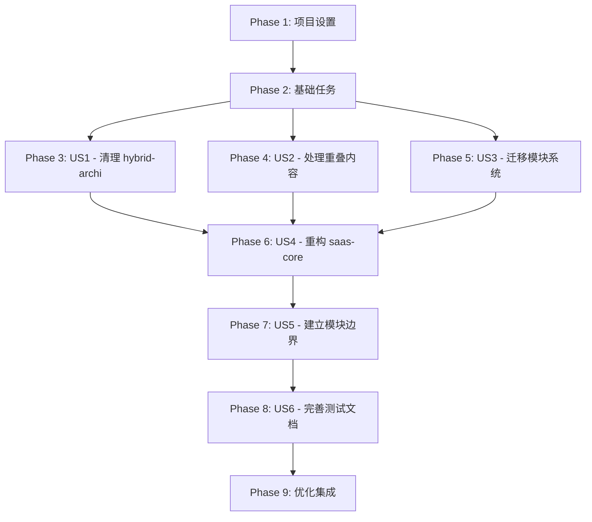

# 任务规划: SAAS 平台核心模块重构

**Feature**: SAAS 平台核心模块重构  
**Branch**: `005-specify-memory-constitution` | **Date**: 2025-01-27  
**Spec**: `/specs/005-specify-memory-constitution/spec.md`

## 任务概览

- **总任务数**: 42 个任务
- **用户故事数**: 6 个用户故事
- **并行机会**: 每个用户故事内部有多个并行任务
- **MVP 范围**: User Story 1 (清理 hybrid-archi 架构基础库)

## 依赖关系图



## Phase 1: 项目设置

### T001: 创建项目备份 ✅ 已完成
**文件**: `backup/` 目录  
**描述**: 创建重构前的完整项目备份，包括所有源代码、配置文件和文档

### T002: 复制模块到 libs 目录 ✅ 已完成
**文件**: `libs/hybrid-archi/`, `libs/saas-core/`  
**描述**: 将重构目标模块从 forks 目录复制到 libs 目录，准备进行重构

### T003: 设置开发环境
**文件**: `libs/hybrid-archi/`, `libs/saas-core/`  
**描述**: 配置开发环境，包括 ESLint、Prettier、TypeScript 配置

### T004: 初始化测试框架
**文件**: `libs/hybrid-archi/__tests__/`, `libs/saas-core/__tests__/`  
**描述**: 设置 Jest 测试框架和测试目录结构

## Phase 2: 基础任务 (所有用户故事的前提条件)

### T005: 分析现有代码结构
**文件**: `libs/hybrid-archi/`, `libs/saas-core/`  
**描述**: 详细分析现有代码结构，识别所有业务特定组件和通用架构组件

### T006: 创建重叠内容分析工具
**文件**: `tools/analyze-overlap.js`  
**描述**: 创建工具来分析 hybrid-archi 和 isolation-model 之间的重叠内容

### T007: 设置新的基础设施模块
**文件**: `libs/database/`, `libs/caching/`, `libs/nestjs-fastify/logging/`, `libs/nestjs-isolation/`, `libs/exceptions/`  
**描述**: 确保所有新的基础设施模块已就绪并可被其他模块引用

## Phase 3: User Story 1 - 清理 hybrid-archi 架构基础库

**目标**: 清理 hybrid-archi 模块中的业务特定组件，确保其作为纯粹的架构基础库

**独立测试**: 创建测试项目引用 hybrid-archi，验证能够成功导入和使用通用架构组件

### T007 [US1]: 识别业务特定组件
**文件**: `libs/hybrid-archi/src/`  
**描述**: 识别并列出所有业务特定组件（如 TenantStatus、OrganizationStatus）

### T008 [US1] [P]: 移除业务特定组件
**文件**: `libs/hybrid-archi/src/domain/`  
**描述**: 从 hybrid-archi 中移除所有业务特定组件

### T009 [US1] [P]: 更新 hybrid-archi 导出
**文件**: `libs/hybrid-archi/src/index.ts`  
**描述**: 更新 index.ts 文件，移除业务特定组件的导出

### T010 [US1] [P]: 创建通用架构组件
**文件**: `libs/hybrid-archi/src/domain/`  
**描述**: 确保所有通用架构组件（BaseEntity、BaseAggregateRoot、CQRS 组件）完整

### T011 [US1]: 验证架构基础库完整性
**文件**: `libs/hybrid-archi/`  
**描述**: 验证 hybrid-archi 只包含通用架构组件，不包含任何业务特定组件

**检查点**: User Story 1 完成 - hybrid-archi 已成为纯粹的架构基础库

## Phase 4: User Story 2 - 处理 libs/isolation-model 模块重叠内容

**目标**: 分析和处理 isolation-model 与 hybrid-archi domain 层的重叠内容

**独立测试**: 验证处理后的模块边界清晰且无冲突

### T012 [US2]: 对比分析重叠内容
**文件**: `libs/isolation-model/`, `libs/hybrid-archi/src/domain/`  
**描述**: 详细对比两个模块的代码，识别所有重叠的具体内容

### T013 [US2]: 制定重叠内容处理策略
**文件**: `docs/overlap-resolution-strategy.md`  
**描述**: 为每个重叠部分制定明确的归属决定（保留、迁移或重构）

### T014 [US2] [P]: 执行重叠内容处理
**文件**: `libs/isolation-model/`, `libs/hybrid-archi/src/domain/`  
**描述**: 根据策略执行重叠内容的处理（保留、迁移或重构）

### T015 [US2] [P]: 更新模块依赖关系
**文件**: `libs/isolation-model/package.json`, `libs/hybrid-archi/package.json`  
**描述**: 更新两个模块的依赖关系，确保没有循环依赖

### T016 [US2]: 验证模块边界清晰
**文件**: `libs/isolation-model/`, `libs/hybrid-archi/`  
**描述**: 验证两个模块的边界清晰，职责明确，无冲突

**检查点**: User Story 2 完成 - 重叠内容已处理，模块边界清晰

## Phase 5: User Story 3 - 迁移 CommonJS 到 NodeNext 模块系统

**目标**: 将旧代码从 CommonJS 模块系统迁移到 NodeNext 模块系统

**独立测试**: 验证所有模块能够正常编译、运行和测试

### T017 [US3]: 更新 hybrid-archi package.json
**文件**: `libs/hybrid-archi/package.json`  
**描述**: 添加 `"type": "module"` 配置，更新模块系统为 NodeNext

### T018 [US3] [P]: 更新 saas-core package.json
**文件**: `libs/saas-core/package.json`  
**描述**: 添加 `"type": "module"` 配置，更新模块系统为 NodeNext

### T019 [US3] [P]: 更新 isolation-model package.json
**文件**: `libs/isolation-model/package.json`  
**描述**: 添加 `"type": "module"` 配置，更新模块系统为 NodeNext

### T020 [US3]: 更新 hybrid-archi tsconfig.json
**文件**: `libs/hybrid-archi/tsconfig.json`  
**描述**: 配置 TypeScript 使用 NodeNext 模块系统

### T021 [US3] [P]: 更新 saas-core tsconfig.json
**文件**: `libs/saas-core/tsconfig.json`  
**描述**: 配置 TypeScript 使用 NodeNext 模块系统

### T022 [US3] [P]: 更新 isolation-model tsconfig.json
**文件**: `libs/isolation-model/tsconfig.json`  
**描述**: 配置 TypeScript 使用 NodeNext 模块系统

### T023 [US3]: 迁移 hybrid-archi 导入导出语法
**文件**: `libs/hybrid-archi/src/`  
**描述**: 将所有 `require()/module.exports` 更新为 `import/export` 语法

### T024 [US3] [P]: 迁移 saas-core 导入导出语法
**文件**: `libs/saas-core/src/`  
**描述**: 将所有 `require()/module.exports` 更新为 `import/export` 语法

### T025 [US3] [P]: 迁移 isolation-model 导入导出语法
**文件**: `libs/isolation-model/src/`  
**描述**: 将所有 `require()/module.exports` 更新为 `import/export` 语法

### T026 [US3]: 验证模块系统迁移
**文件**: `libs/hybrid-archi/`, `libs/saas-core/`, `libs/isolation-model/`  
**描述**: 运行构建和测试，验证所有模块能够正常编译、运行和测试

**检查点**: User Story 3 完成 - 所有模块已迁移到 NodeNext 模块系统

## Phase 6: User Story 4 - 重构 saas-core 业务模块

**目标**: 重构 saas-core 模块，使其适配新的基础设施模块

**独立测试**: 验证所有核心功能（租户管理、用户管理、组织架构、角色权限）正常工作

### T027 [US4]: 更新 saas-core 依赖配置
**文件**: `libs/saas-core/package.json`  
**描述**: 将旧的基础设施模块替换为新的基础设施模块

### T028 [US4] [P]: 迁移业务特定组件到 saas-core
**文件**: `libs/saas-core/src/domain/`  
**描述**: 将从 hybrid-archi 移除的业务特定组件迁移到 saas-core

### T029 [US4] [P]: 重构租户管理功能
**文件**: `libs/saas-core/src/domain/tenant/`  
**描述**: 使用新基础设施模块重构租户管理功能

### T030 [US4] [P]: 重构用户管理功能
**文件**: `libs/saas-core/src/domain/user/`  
**描述**: 使用新基础设施模块重构用户管理功能

### T031 [US4] [P]: 重构组织管理功能
**文件**: `libs/saas-core/src/domain/organization/`  
**描述**: 使用新基础设施模块重构组织管理功能

### T032 [US4] [P]: 重构部门管理功能
**文件**: `libs/saas-core/src/domain/department/`  
**描述**: 使用新基础设施模块重构部门管理功能

### T033 [US4] [P]: 重构角色权限功能
**文件**: `libs/saas-core/src/domain/role/`  
**描述**: 使用新基础设施模块重构角色权限功能

### T034 [US4]: 更新 saas-core 应用层用例
**文件**: `libs/saas-core/src/application/`  
**描述**: 更新应用层用例，确保以用例为核心的组织结构

### T035 [US4]: 验证业务功能完整性
**文件**: `libs/saas-core/__tests__/`  
**描述**: 运行完整的业务功能测试，验证所有核心功能正常工作

**检查点**: User Story 4 完成 - saas-core 已适配新基础设施模块

## Phase 7: User Story 5 - 建立清晰的模块边界

**目标**: 建立清晰的模块边界，确保职责明确，依赖关系清晰

**独立测试**: 验证模块边界清晰且符合 Clean Architecture 原则

### T036 [US5]: 检查 hybrid-archi 导出内容
**文件**: `libs/hybrid-archi/src/index.ts`  
**描述**: 检查 hybrid-archi 只导出属于自己职责的内容

### T037 [US5] [P]: 检查 saas-core 导出内容
**文件**: `libs/saas-core/src/index.ts`  
**描述**: 检查 saas-core 只导出属于自己职责的内容

### T038 [US5] [P]: 检查 isolation-model 导出内容
**文件**: `libs/isolation-model/src/index.ts`  
**描述**: 检查 isolation-model 只导出属于自己职责的内容

### T039 [US5]: 验证依赖关系方向
**文件**: `libs/hybrid-archi/package.json`, `libs/saas-core/package.json`  
**描述**: 验证依赖关系符合 Clean Architecture 原则

### T040 [US5]: 创建模块依赖关系图
**文件**: `docs/module-dependencies.md`  
**描述**: 创建清晰的模块依赖关系图，展示模块间的依赖方向

**检查点**: User Story 5 完成 - 模块边界清晰，依赖关系符合架构原则

## Phase 8: User Story 6 - 完善测试覆盖和文档

**目标**: 完善重构后的测试覆盖和文档，确保代码质量和可维护性

**独立测试**: 验证测试覆盖率达标，文档完整性，示例代码可运行

### T041 [US6]: 运行完整测试套件
**文件**: `libs/hybrid-archi/__tests__/`, `libs/saas-core/__tests__/`  
**描述**: 运行单元测试、集成测试、E2E 测试，检查测试覆盖率

### T042 [US6] [P]: 完善公共 API 文档
**文件**: `libs/hybrid-archi/`, `libs/saas-core/`, `libs/isolation-model/`  
**描述**: 为所有公共 API 添加完整的 TSDoc 注释

### T043 [US6] [P]: 创建示例代码
**文件**: `examples/`  
**描述**: 创建完整的示例代码，展示如何使用重构后的模块

**检查点**: User Story 6 完成 - 测试覆盖和文档完善

## Phase 9: 优化集成

### T044: 性能优化
**文件**: `libs/hybrid-archi/`, `libs/saas-core/`  
**描述**: 优化重构后代码的性能，确保符合性能目标

### T045: 最终集成测试
**文件**: `__tests__/integration/`  
**描述**: 运行完整的集成测试，验证整个系统正常工作

### T046: 生成重构报告
**文件**: `docs/refactoring-report.md`  
**描述**: 生成完整的重构报告，记录所有变更和改进

## 并行执行示例

### User Story 1 并行任务
```bash
# 并行执行 T008, T009, T010
pnpm --filter @hl8/hybrid-archi run clean-business-components &
pnpm --filter @hl8/hybrid-archi run update-exports &
pnpm --filter @hl8/hybrid-archi run create-architecture-components &
wait
```

### User Story 3 并行任务
```bash
# 并行执行 T018, T019, T021, T022
pnpm --filter @hl8/saas-core run update-package-json &
pnpm --filter @hl8/isolation-model run update-package-json &
pnpm --filter @hl8/saas-core run update-tsconfig &
pnpm --filter @hl8/isolation-model run update-tsconfig &
wait
```

### User Story 4 并行任务
```bash
# 并行执行 T028, T029, T030, T031, T032, T033
pnpm --filter @hl8/saas-core run migrate-business-components &
pnpm --filter @hl8/saas-core run refactor-tenant &
pnpm --filter @hl8/saas-core run refactor-user &
pnpm --filter @hl8/saas-core run refactor-organization &
pnpm --filter @hl8/saas-core run refactor-department &
pnpm --filter @hl8/saas-core run refactor-role &
wait
```

## 实施策略

### MVP 范围
- **第一阶段**: User Story 1 (清理 hybrid-archi 架构基础库)
- **第二阶段**: User Story 3 (迁移模块系统)
- **第三阶段**: User Story 4 (重构 saas-core)
- **第四阶段**: User Story 2, 5, 6 (处理重叠内容、建立边界、完善测试)

### 增量交付
1. **Week 1**: 完成 Phase 1-3 (项目设置、基础任务、清理 hybrid-archi)
2. **Week 2**: 完成 Phase 4-5 (处理重叠内容、迁移模块系统)
3. **Week 3**: 完成 Phase 6 (重构 saas-core)
4. **Week 4**: 完成 Phase 7-9 (建立边界、完善测试、优化集成)

### 风险缓解
- **代码备份**: 每个阶段开始前创建备份
- **渐进式迁移**: 分模块逐步迁移，降低风险
- **完整测试**: 每个阶段完成后运行完整测试
- **回滚准备**: 准备快速回滚方案

## 任务完成标准

每个任务完成后必须满足：
1. **代码质量**: 通过 ESLint 检查，无 TypeScript 错误
2. **测试通过**: 相关测试用例全部通过
3. **文档更新**: 相关文档已更新
4. **依赖检查**: 模块依赖关系正确
5. **构建成功**: 模块能够成功构建

## 总结

本任务规划包含 46 个具体任务，按 6 个用户故事组织，支持并行执行。每个任务都有明确的文件路径和完成标准，确保重构过程的可控性和质量。MVP 范围建议从 User Story 1 开始，逐步完成所有重构工作。
