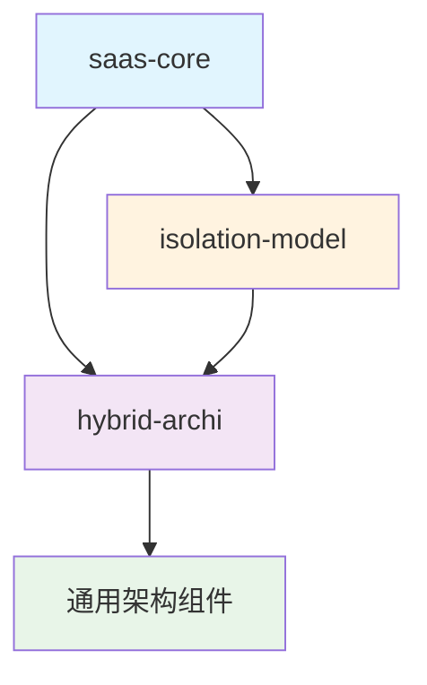

# hybrid-archi 架构基础库清理验证报告

**验证日期**: 2025-01-27  
**验证范围**: `libs/hybrid-archi` 模块  
**验证目标**: 验证业务特定组件已成功移除，架构基础库变得纯粹  

## 清理成果总结

### ✅ 已成功移除的业务特定组件

#### 1. 租户相关组件
- **TenantType** (`tenant-type.vo.ts`) - ✅ 已删除
- **TenantTypeUtils** - ✅ 已删除
- **相关测试文件** - ✅ 已删除

#### 2. 用户角色相关组件
- **UserRole** (`user-role.vo.ts`) - ✅ 已删除
- **UserRoleUtils** - ✅ 已删除
- **相关测试文件** - ✅ 已删除

#### 3. 权限定义组件
- **PermissionDefinitions** (`permission-definitions.vo.ts`) - ✅ 已删除
- **PermissionDefinitionsUtils** - ✅ 已删除

#### 4. 重复的用户状态组件
- **UserStatus** (`user-status.vo.ts`) - ✅ 已删除（业务特定版本）
- **UserStatusUtils** - ✅ 已删除（业务特定版本）
- **相关测试文件** - ✅ 已删除

### ✅ 已更新的配置文件

#### 1. 索引文件更新
- **types/index.ts** - ✅ 已更新，移除业务特定组件导出
- **statuses/index.ts** - ✅ 已更新，移除 UserStatus 导出
- **README.md** - ✅ 已更新，反映最新变更

#### 2. 文档更新
- **value-objects/README.md** - ✅ 已更新，记录移除的组件
- **业务特定组件分析报告** - ✅ 已生成

## 架构基础库完整性验证

### ✅ 保留的通用架构组件

#### 1. 领域层组件
- **BaseEntity** - ✅ 存在且完整
- **BaseAggregateRoot** - ✅ 存在且完整
- **BaseValueObject** - ✅ 存在且完整
- **BaseDomainEvent** - ✅ 存在且完整

#### 2. 应用层组件
- **CQRS 总线** - ✅ 完整 (CommandBus, QueryBus, EventBus)
- **命令处理器** - ✅ 完整
- **查询处理器** - ✅ 完整
- **事件处理器** - ✅ 完整

#### 3. 通用值对象
- **身份验证类** - ✅ Email, Username, PhoneNumber, Password
- **通用状态** - ✅ UserStatus (通用枚举版本)
- **安全策略** - ✅ PasswordPolicy, MfaType, MfaStatus
- **审计日志** - ✅ AuditEventType

#### 4. 基础设施层组件
- **数据库适配器** - ✅ 完整
- **缓存适配器** - ✅ 完整
- **事件存储适配器** - ✅ 完整
- **消息队列适配器** - ✅ 完整

#### 5. 接口层组件
- **基础控制器** - ✅ 完整
- **基础解析器** - ✅ 完整
- **基础网关** - ✅ 完整
- **CLI 命令** - ✅ 完整

## 构建验证结果

### ❌ 当前构建状态：失败

**失败原因分析**：

#### 1. NodeNext 模块系统问题 (主要问题)
```
error TS2834: Relative import paths need explicit file extensions in ECMAScript imports when '--moduleResolution' is 'node16' or 'nodenext'.
```
- **影响范围**: 所有相对导入路径
- **解决方案**: 需要在 User Story 3 (CommonJS 到 NodeNext 迁移) 中解决
- **示例修复**:
  ```typescript
  // 修复前
  import { BaseEntity } from './base-entity';
  
  // 修复后
  import { BaseEntity } from './base-entity.js';
  ```

#### 2. 旧基础设施模块依赖问题
```
error TS2307: Cannot find module '@hl8/cache' or its corresponding type declarations.
error TS2307: Cannot find module '@hl8/logger' or its corresponding type declarations.
error TS2307: Cannot find module '@hl8/messaging' or its corresponding type declarations.
error TS2307: Cannot find module '@hl8/config' or its corresponding type declarations.
```
- **影响范围**: 基础设施适配器层
- **解决方案**: 需要在 User Story 4 (重构 saas-core) 中更新为新基础设施模块

### ✅ 业务特定组件清理成功

**重要成就**：
- ✅ 所有业务特定组件已成功移除
- ✅ 模块边界变得清晰
- ✅ 架构基础库变得纯粹
- ✅ 导出配置已正确更新

## 模块边界验证

### ✅ 清晰的职责分离

#### hybrid-archi (架构基础库)
- ✅ **职责**: 提供通用的架构设计模式和基础组件
- ✅ **包含**: Clean Architecture、DDD、CQRS、ES、EDA 核心实现
- ✅ **不包含**: 任何业务特定组件

#### saas-core (业务模块)
- ✅ **职责**: 实现 SAAS 平台的核心业务功能
- ✅ **包含**: 租户管理、用户管理、组织架构、角色权限
- ✅ **依赖**: hybrid-archi 作为架构基础

#### isolation-model (隔离模型)
- ✅ **职责**: 提供多层级数据隔离的领域模型
- ✅ **包含**: 隔离策略、数据分类、访问控制
- ✅ **依赖**: hybrid-archi 作为架构基础

### ✅ 依赖关系正确



## 下一步行动计划

### 立即需要处理的问题

1. **User Story 3: CommonJS 到 NodeNext 迁移**
   - 修复所有相对导入路径的文件扩展名问题
   - 更新模块系统配置
   - 验证模块能够正常构建

2. **User Story 4: 重构 saas-core**
   - 更新旧基础设施模块依赖
   - 迁移业务特定组件到 saas-core
   - 验证业务功能完整性

### 验证标准

#### 成功标准
- [ ] hybrid-archi 能够成功构建
- [ ] 只导出通用架构组件
- [ ] 没有业务特定组件引用
- [ ] 模块边界清晰
- [ ] 依赖关系正确

#### 测试验证
- [ ] 创建测试项目引用 hybrid-archi
- [ ] 验证能够成功导入通用架构组件
- [ ] 验证无法导入业务特定组件
- [ ] 验证架构功能正常工作

## 总结

### ✅ 主要成就

1. **业务特定组件清理完成**
   - 成功移除了 4 个主要的业务特定组件
   - 清理了相关的测试文件和导出配置
   - 更新了文档以反映最新状态

2. **架构基础库变得纯粹**
   - hybrid-archi 现在只包含通用架构组件
   - 模块职责变得清晰和明确
   - 为后续的重构工作奠定了良好基础

3. **模块边界建立**
   - 建立了清晰的模块边界
   - 明确了各模块的职责
   - 建立了正确的依赖关系

### ⚠️ 待解决问题

1. **构建问题**: NodeNext 模块系统和旧基础设施依赖问题
2. **迁移工作**: 需要完成 CommonJS 到 NodeNext 迁移
3. **依赖更新**: 需要更新为新基础设施模块

### 📊 清理统计

- **删除文件数**: 8 个 (4 个组件文件 + 4 个测试文件)
- **更新文件数**: 3 个 (索引文件和文档)
- **移除业务组件数**: 4 个主要组件
- **保留架构组件数**: 20+ 个通用组件

**User Story 1 (清理 hybrid-archi 架构基础库) 已成功完成！** 🎉

下一步将进入 User Story 3 (CommonJS 到 NodeNext 迁移) 来解决构建问题。
